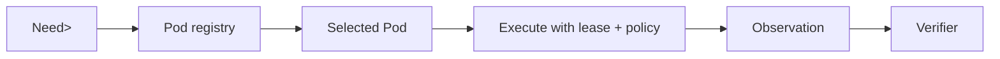

# Pod Architecture

Pods are semantic cognitive capabilities, not endpoint names.

A manifest declares accepted/produced types, effects, required capabilities, version and execution properties.

## Modes

- native Rust;
- local isolated process;
- remote node over Iroh/QUIC;
- GPU tensor Pod;
- stateful environment/sandbox Pod.

## Generalization target

Training randomizes Pod names/interfaces while preserving semantic contracts so the model learns `Predict<Features,Distribution<Direction>>`, not one memorized function string.
