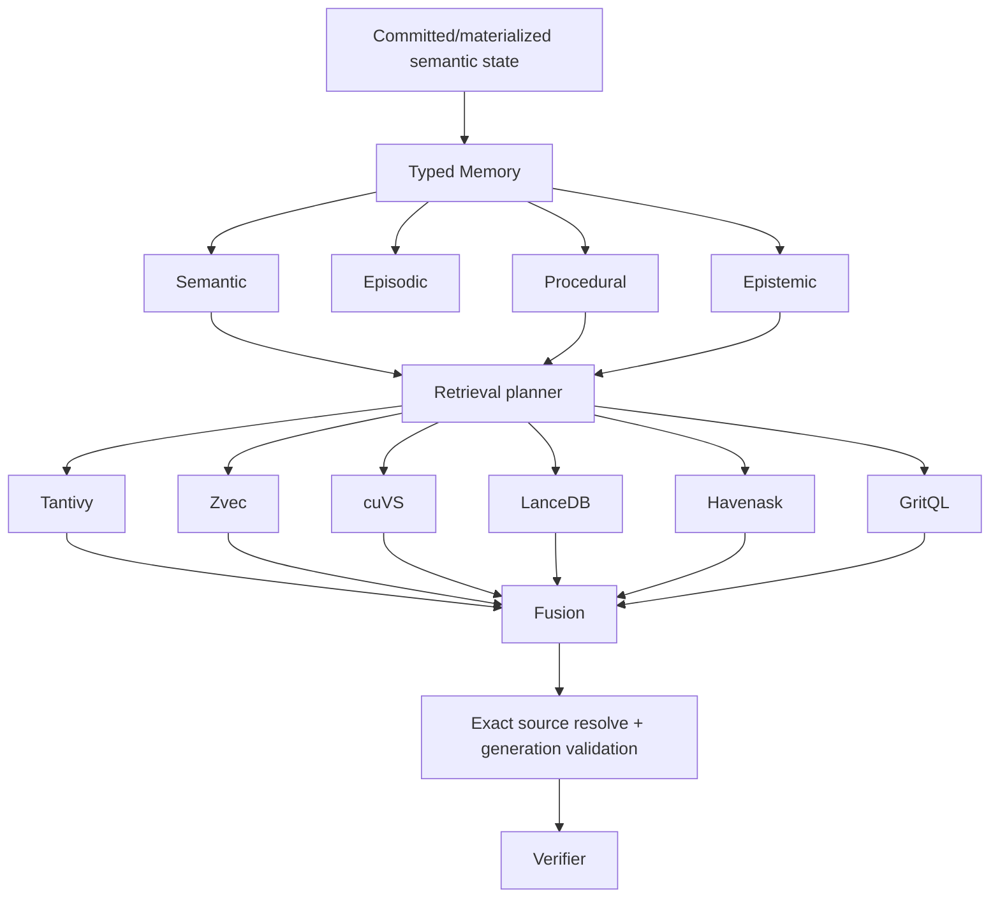

# Memory & Search Architecture

## Memory classes

- semantic: facts, entities, constraints, relations;
- episodic: what happened in an interaction/environment;
- procedural: verified reusable solution procedures;
- epistemic: known/unknown/hypothesis/distribution/conflict state.

## SemanticCapsule

A capsule is lifecycle managed and contains generation, provenance, validity and typed claims. It is not a vector chunk.

## Retrieval

Search engines are projections. A result is `PossibleEvidence` until the exact source/generation is resolved and verified.

## Roles under evaluation

Tantivy, Zvec, cuVS, LanceDB, Havenask and GritQL occupy different retrieval roles. The planner may compose them rather than choosing a single universal store.
