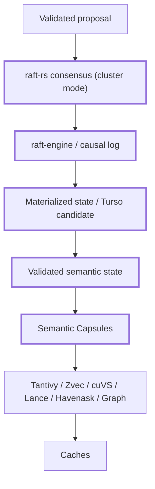

# Consensus, Causal Ledger & Materialized State

## Cluster mode

`raft-rs` is the current consensus candidate. `raft-engine` is the durable log candidate. They are separate responsibilities.

## Standalone mode

The same ledger/state contracts run locally without distributed consensus, preserving testability and a single semantic architecture.

## Commit path

Validated proposal → consensus/commit → durable log → state-machine apply → materialized state → semantic memory/index projections.

## Revocation

Revocation is a durable barrier. Index/caches may lag, but generation validation must reject stale content.

## Compaction

Compaction requires:
- validated snapshot covers range;
- materializers/consumers passed the range;
- no unresolved lifecycle dependency;
- generation safety remains provable.
