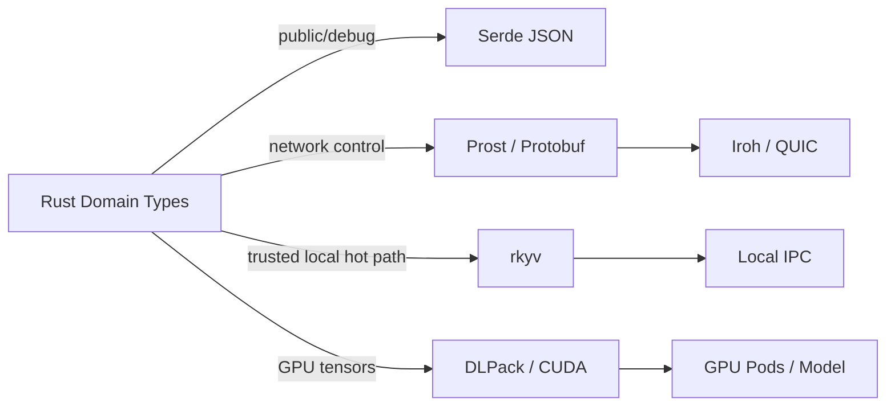

# Network & Protocol Architecture

## Separation

PodWire defines semantics. Prost/Protobuf is a network encoding candidate. Iroh/QUIC is a transport candidate. rkyv is a trusted local data-plane candidate. DLPack carries tensors.

## ALPN design

One ALPN per protocol, because two protocols on one ALPN is how a request meant for
one gets parsed by the other.

Spoken today:
- `ptr-raft/1` — raft traffic between cluster members (`31-cluster-integrity.md`)
- `ptr-podwire/1` — Pod access (`33-pod-wire.md`)
- `ptr-exec/1` — execution requests and receipts (`32-execution-wire.md`)

Declared and not yet spoken:
- `ptr-model/1`
- `ptr-blob/1`
- `ptr-events/1`

## Validation

Network decode is followed by semantic validation into PTR domain types. Network retries use idempotency keys for operations that could be duplicated.
