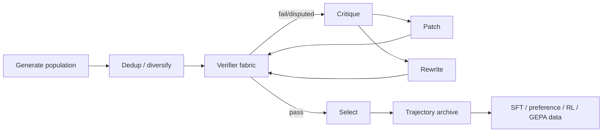

# Verifier & Feedback Architecture

## Verifier order

Prefer deterministic/executable evidence:
1. type/capability/generation checks;
2. compiler/tests/solver/source verification;
3. statistical/calibration checks;
4. learned semantic verifier.

A learned judge cannot override a deterministic contradiction.

## Feedback

Candidate trajectories retain failure, critique, repair and selection evidence. They support test-time repair and later SFT/preference/RL/verifier training.

## Selection

Selection is multi-objective: task success, hard validity, semantic preservation, calibration, latency/compute and token/tool efficiency.
