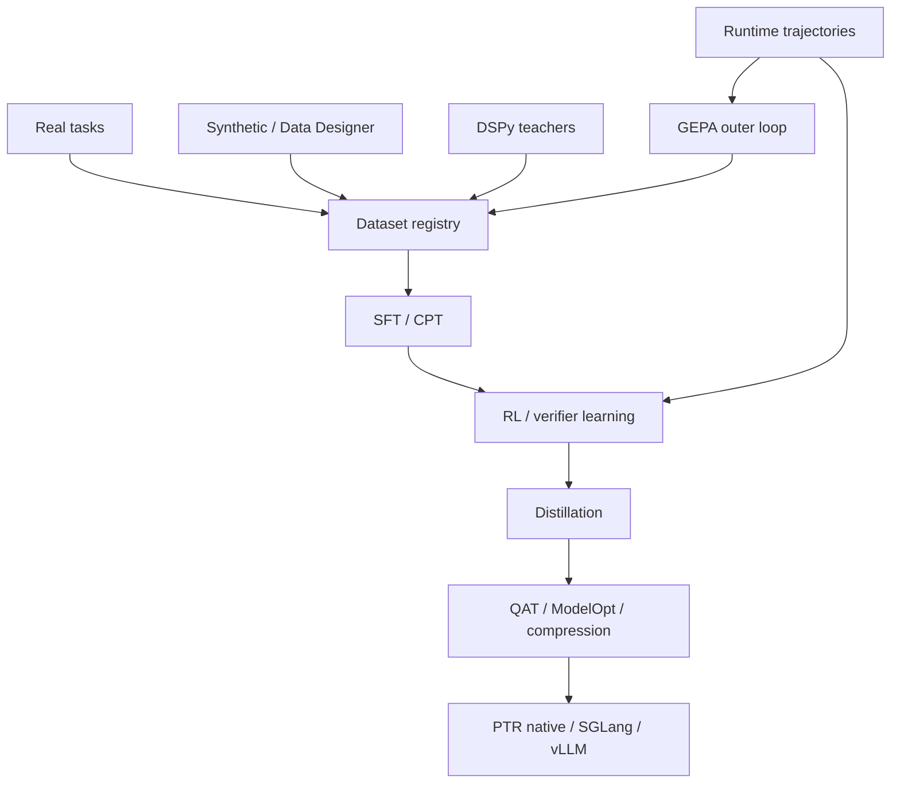

# Training Architecture

## Stages

1. semantic typing and raw↔typed corruption detection;
2. PodWire / ActionIR native protocol;
3. epistemic calibration and Unknown behavior;
4. reasoning-operator routing;
5. verifier/repair training;
6. environment RL and long-horizon tasks;
7. distillation/quantization.

## Data

All datasets have provenance, schema, split and contamination metadata. OOD sets include unseen nominal types, unseen Pod names, long-horizon state, lifecycle mutation and subtle semantic corruption.

## Loops

- **inner loop:** weights/adapters/verifier models;
- **outer loop:** GEPA/DSPy teacher/system-policy search.

Hard invariants are excluded from learnable optimization.
