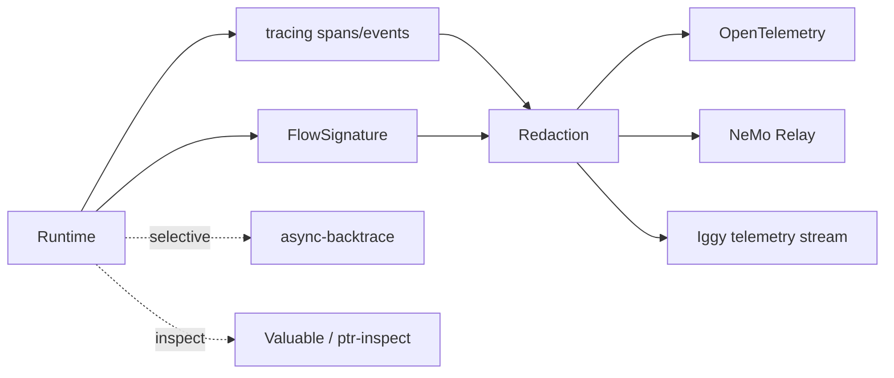

# Observability & Introspection

`tracing` is the default structured telemetry substrate. PTR standardizes request/project/revision/generation/candidate/Pod/capability/effect/commit fields.

## Three views

- **FlowSignature:** semantic plan/operators.
- **Tracing tree:** actual runtime execution.
- **Async backtrace:** selective hang/debug stack.

Comparing plan and execution detects missing or unexpected operator paths without persisting private natural-language chain-of-thought.

`valuable`/ptr-inspect provides structured state inspection with mandatory secret/private redaction.
