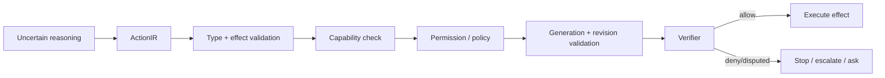

# Security Architecture

Security is split into:
- semantic trust/provenance;
- runtime capability/effect authorization;
- infrastructure identity/storage/secrets.

## Effect classes

`Pure < Read < Mutation < External < Irreversible` is a useful ordering for policy strictness, though concrete policy is domain-specific.

## Context trust

External text, tools, retrieved documents and agent-generated state are evidence with source/trust metadata, not authority.

## Redaction

Secret/private types are non-rendering by default across tracing, valuable-based introspection and debug exports.
