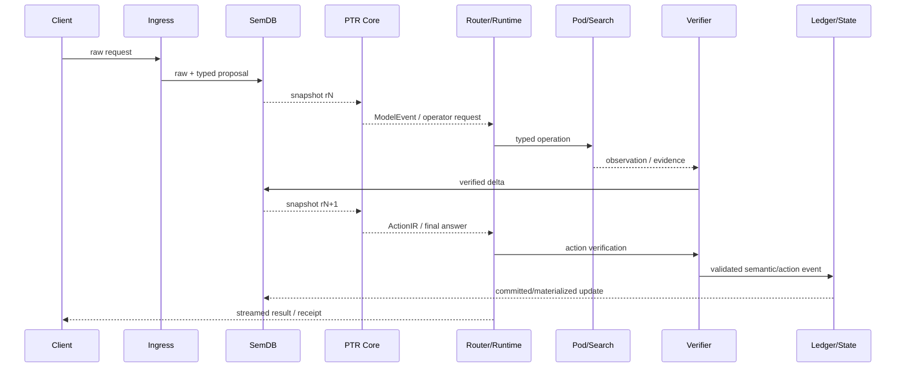

# End-to-End Request Lifecycle

The key loop is **reason → need observation → execute → verify → commit/update SemDB → resume**. A request may therefore span several semantic revisions while each reasoning segment remains snapshot-isolated.

External effects occur only after ActionIR verification. A response can be streamed independently from authoritative semantic commits, but user-visible claims should retain their evidence/verification status.
