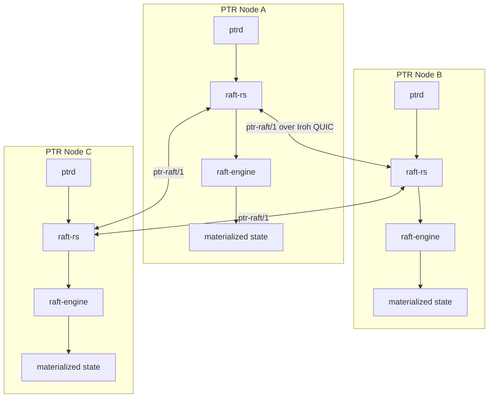

# Deployment Topologies

## Developer / single-node

`ptrd`, local ledger/state, local model backend or remote vLLM/SGLang, local vector/lexical indexes.

## Multi-GPU workstation

Runtime remains one authority process while model/embedding/vector Pods use separate GPUs/processes. Tensor payloads prefer DLPack/IPC rather than serialization through JSON.

## Cluster

Consensus covers authoritative semantic state, not every cache/index operation. Retrieval remains local/replicated according to performance requirements.

## Enterprise/federated

Raw private memory remains local by default. Model/verifier adapter updates may use a federated-learning layer when explicitly configured.
