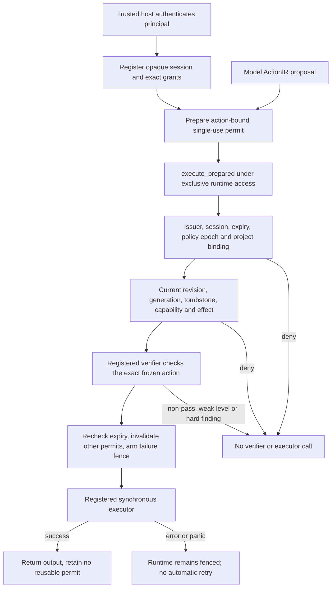

# P0.1 — Scoped synchronous execution authority

Implementation owner: `ptr-runtime::execution`.
Reviewed baseline: main `076e021cfdc5acec54b8bdb90c517bf47c4c45e3`.
This is one bounded P0 implementation step, not completion of issue #15.

## Problem and implemented contract

`authorization_decision` and `authorize_action` inspect current policy and return
ordinary diagnostic values. Their results do not bind a future effect to a
principal, a particular action payload, or a required verifier. They must not be
used as bearer execution permission.

The new path binds those coordinates in one process-local object and invokes the
registered executor itself. An inference caller cannot supply another action,
verifier, executor or project during dispatch.

## Ownership and trust

The embedding host is the administrative trust root. It authenticates the real
caller and registers a principal's session with its grants and trusted adapters.
`register_execution_session` is deliberately documented as privileged. It is NOT
an authenticator for a user-supplied name, an OIDC implementation, or an HTTP
endpoint. Model APIs receive none of this administrative state.

An `ActionScope` matches project, capsule-backed target, operation, capability,
input type and effect by equality, never by prefix or wildcard. The runtime also
checks the actual committed capsule-to-project binding. Procedure/constraint or
unregistered targets without that binding are rejected. Broader resource classes
need their own typed ownership model; this step does not infer one from strings.

The owning grant retains both the required verifier and executor. A caller may
request an action within an existing grant, but cannot choose a weaker verifier
at dispatch. `RequiredVerification` permits only FullSemantic or Deterministic;
Pass with an insufficient level, any other status, or a hard finding is rejected.
A probability score alone never authorizes the effect.

## Lifecycle and ordering

Sessions carry opaque issuer identity plus a non-reused checked session number.
Permits bind the session, an immutable copy of every ActionIR field (including
bytes), the selected grant, an epoch identity and a monotonic-time deadline.
Neither permits nor dispatch capabilities implement Clone or serialization.
Debug output for handles/permits omits identity and action payload.

Permissions access conservatively invalidates pending permits, even when the
host removes and then restores the same capability (the ABA case). Every valid
commit attempt invalidates pending permits before its first durable write. An
ambiguous commit error/panic leaves execution fenced; later commits cannot clear
that fence. A rejected pre-append lifecycle transition does not fence the runtime.
Semantic revision changes are independently rechecked at dispatch.

Session revocation removes its grants; re-registering the same principal creates
a different session. Runtime replay/open creates fresh issuer identity and no
sessions, grants or permits. An old process-local permit is therefore unusable
against the replacement runtime even when its lifecycle state looks identical.

`execute_prepared` consumes its permit on every path. Exclusive `&mut PtrRuntime`
is held across validation, verification and synchronous executor invocation, so
safe local code cannot mutate this runtime's permissions or lifecycle in between.
The final expiry check runs after verification. A successful effect invalidates
other already prepared permits because the effect may change external state.
An executor error/panic fences this runtime rather than retrying an uncertain effect.

This uses Rust's [exclusive mutable borrowing](https://doc.rust-lang.org/book/ch04-02-references-and-borrowing.html)
and [Arc allocation identity](https://doc.rust-lang.org/std/sync/struct.Arc.html#method.ptr_eq).
These mechanisms do not authenticate a remote principal, provide a cryptographic
wire token, or protect against malicious code/unsafe memory access in the host.

## Executable evidence

`crates/ptr-runtime/tests/execution_authority.rs` uses a recording executor and a
controllable verifier, shared through `tests/common/mod.rs`. The positive path
checks the actual dispatched principal, project and complete action. Negatives
check exact scope coordinates, mismatched project ownership, other principals
and sessions, revocation, replay, revision changes, capability ABA, research
switches, all non-passing/insufficient verifier outcomes, hard findings, uncertain
executor errors/panics, and invalid/duplicate host grants. Counters establish that
denied cases never reach the executor and pre-verification denials call neither.

Unit tests exercise session-ID exhaustion without wrapping, expired sessions and
expired permits without sleeping. Compile-fail doctests reject dispatch forgery,
receipt-to-permit promotion, permit cloning and moving a permit into dispatch twice.
Test files establish coverage intent; exact-commit executed CI establishes results.

## Compatibility and limits

No dependency, lockfile, cargo-deny policy or neural model is changed. Existing
unscoped authorization methods remain diagnostics and existing Pure/Read Pod paths
remain unchanged; those paths must not be presented as principal-scoped access.
The new gateway is additive and supports registered synchronous adapters only.

The guarantee is single-use *per permit*, within the trusted reference process.
It is not exactly-once effect delivery: a newly authenticated request could ask
for the same action again, and this step does not persist an execution/idempotency
journal. Before reopening after an ambiguous external result, the host must
reconcile that result; reconstructing the runtime alone is not reconciliation.
Network fencing, crash recovery and durable audit must be added before production
execution is exposed. Detached executor work is outside the synchronous contract.

Session/grant limits bound registry size (1024 live sessions; 64 grants per
session). Expired sessions are removed before registration; counters fail closed
on exhaustion. Permits are caller-owned and are not retained in a server queue.

## Follow-up components

[P0.2 semantic payload/dependency/revision reconstruction](22-durable-semantic-state.md)
is now implemented in the reference journal path. Real semantic commits invalidate
pending permits; validated no-ops do not. Execution authority remains process-local.

[P0.3 checked frames and replay-backed recovery snapshots](23-persistence-integrity.md)
now verify persisted history against explicit trusted anchors. Issue #15 remains
open for independently stored/authenticated anchors and neural-checkpoint admission
before persistent execution receipts or remote dispatch rely on restored state. Scoped Pod/network admission, durable
effect reconciliation, hard neural validity masks/codebook and real cluster
composition remain separate subsequent gates.
