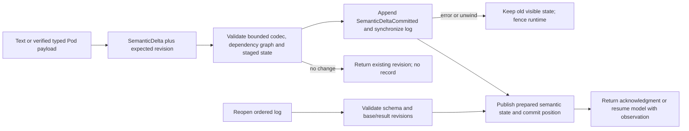

# P0.2 — Durable semantic transactions

Owners: `ptr-semdb` (values, delta codec, dependency/revision semantics),
`ptr-ledger` (ordered opaque records), `ptr-runtime::semantic` (publication and
replay), `ptr-state` (commit position, not a second semantic payload store).
Baseline: `b6f91994535268f1a51a8ae8b9827ac9e822ec89`. One bounded step from issue #15.

## Defects addressed

Previously `ingest_text` wrote only to an in-memory SemanticHost. `open_durable`
replayed lifecycle records into a fresh, empty semantic host. Pod results recorded
only an output-type string, so different result bytes with the same type could
share a revision. Dependency edits were exposed outside revisioned transactions.
The affected-closure calculation reported invalidation but did not remove stored
stale derivations. These are data-path defects, not evidence about model quality.

## Publication path

`apply_semantic_delta(expected_revision, delta)` checks optimistic concurrency,
stages a complete validated update, then appends one record containing the base
revision, result revision and canonical encoded delta. Publication occurs only
after successful append. Generic `commit` cannot bypass semantic validation;
replay validates the same transition before materializing it. An invalid schema,
revision jump, wrong base or encoded no-op record fails closed.

A no-op through the high-level API writes no record and preserves pending P0.1
permits. Real semantic commits invalidate the same authority epoch as other
commits. An append error/panic keeps the existing ambiguity fence. No model call,
Pod observation acknowledgment or continuation is emitted as successful when its
semantic publication failed. `ingest_text` now returns `Result<Revision,
RuntimeError>`; its repository callers explicitly propagate or assert success.

## Value and dependency contract

`SemanticValue` distinguishes Text from a typed payload containing the exact
`TypeId`, source identity and bytes. This source field is provenance data, not a
verifier certificate or principal authorization. Binary bytes need not be UTF-8.
All three payload coordinates participate in equality and revision changes.

`SemanticDelta.dependencies` replaces the complete input set for each named
derivation. Omission preserves the old set; an explicit empty set removes it.
Dependency-only changes advance revision and invalidate existing derivations.
Changes invalidate the union of old/new transitive dependency closures. Affected
stored derivations are removed unless explicitly upserted in the same transaction
as recomputed values. Such upserts must have all their declared inputs present in
the final state. Ground-state dependency cycles are rejected, without recursive
stack traversal. This does not prohibit cycles in a future reasoning model.

Dependency metadata for invalidated derivations remains so an accidental later
upsert cannot silently ignore a missing source. Explicit source removal also
removes that source's own input declaration; descendants retain their dependency
references. The trusted producer is responsible for complete dependency capture
and honest recomputation. The runtime cannot infer dependencies omitted by a
producer, nor validate the truth of an arbitrary replacement value.

`prepare_delta` publishes nothing; `apply_prepared` checks host identity and base
revision. Snapshot identity is host-bound in addition to its revision. A foreign
or pre-restart snapshot does not become current because the revision number
matches; overwriting its public revision cannot repair stale admission. Historical
snapshots remain immutable/readable and are not remote revocation mechanisms.
`PtrRuntime::snapshot_is_current` checks semantic identity and the execution fence
only; it is NOT lifecycle, neural-checkpoint or effect authorization.

## Codec and compatibility

Semantic delta version 1 starts with `PTRSD001`, then sorted length-prefixed
upserts, removals and dependency replacements. Text and payload values have
separate tags. Bounds: 4 MiB per delta, 16,384 entries per collection and 4,096
UTF-8 bytes per nonempty key/type/source identifier. Counts do not drive unchecked
allocation. Duplicate keys, noncanonical ordering, invalid UTF-8 text, unknown
versions/tags, conflicting operations, trailing bytes and truncation are rejected.
Revisions use checked increment, never wraparound.

`LedgerEvent::SemanticDeltaCommitted` uses new event tag 8; tags 0–7 retain their
existing encoding. The ledger does not depend on the semantic crate: it preserves
opaque transaction bytes, while runtime replay validates their meaning. The
materialized lifecycle store tracks `semdb:revision` and commit position; it does
not duplicate semantic payload ownership. Existing Raft/storage adapters retain
the event codec, but this step does not connect them into a production cluster.

Legacy lifecycle-only logs remain readable. Contents never journaled by older
versions cannot be reconstructed retroactively: re-ingest them from the original
sources. This is an explicit format/API migration in the research prototype,
not an assurance of recovering previously lost data.

## Pod observation path

Both existing Pod loops now publish complete typed results. Observation keys use
length-delimited request/Pod components, rather than concatenated ambiguous IDs.
Each result depends on its request's raw input. Changing/removing that input
invalidates its old results. Changing result bytes with an unchanged type advances
revision; identical bytes/type/source and dependencies are a no-op. The original
Pure/Read Pod execution and verification trust boundaries remain unchanged.

## Tests and evidence

The semdb transaction tests retain the original local-closure regression and add
staged atomicity, host/revision identity, binary roundtrips, typed payload changes,
cycle/missing-input rejection, dependency replacement, transitive eviction,
canonical-codec controls, hostile lengths/counts and 500 seeded delta roundtrips.
Runtime tests compare exact contents, dependencies, revisions and lifecycle state
across file reopen and in-memory replay. They exercise actual Pod invoke/verify/
resume, same-type changed bytes, no-ops, invalid complete records and all cut
positions of a simulated unacknowledged semantic tail. A real child process exits
without Rust destructors after durable append and before runtime materialization;
reopen reconstructs that complete transaction. Ledger roundtrip tests include the
new opaque record. P0.1 tests retain deny-before-executor coverage and add no-op
permit preservation. None of these are hardware power-loss tests or neural tests.

Source test definitions are coverage intent; exact-commit CI is the execution
record. No benchmark numbers are inferred from these correctness fixtures.

## Boundaries still open

The reference host clones state during staging/snapshot creation; latency and
memory efficiency need measurement, not assumptions about the 5% project target.
Logical deletion evicts current values; old plaintext bytes remain in append-only
history and old snapshots. This is NOT secure erasure or neural unlearning.
Authenticated/checksummed framing, rollback detection, complete snapshot/compaction
protocols and independent replication are still required. A valid-looking changed
record is not detected cryptographically by this codec.

Neural weights, KV caches and opaque backend checkpoints are neither persisted nor
admitted here. Execution sessions/permits remain process-local and are not replayed.
Scoped network/Pod access, durable effect reconciliation/audit, hard neural validity
masks and a shared cognitive codebook remain separate issue #15 gates. No dependency,
license-policy or neural-model changes are required for this step.
