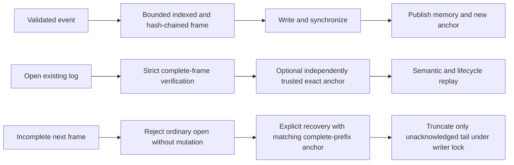

# P0.3 — Checked records and verified recovery snapshots

Baseline: `c904c8eff0f3196c8c3d05448f8648ff61875b7b`.
Owners: `ptr-ledger::{integrity, FileLedger}` and `ptr-runtime::persistence`.
This closes the bounded reference-path record-integrity and recovery-snapshot
step. It does not assert completion of issue #15 or the research Definition of Done.

## Record contract

New files start with `PTRLOG02`. Every record has an 84-byte header (magic,
monotonic index, payload length, previous record digest, header SHA-256), the
existing event payload, and a 40-byte trailer (record SHA-256 and final marker).
Header and record hashes use distinct domain prefixes. The first previous digest
is SHA-256 of the file magic. Event tags 0–8 remain unchanged inside the new frame.
Hashes use pinned RustCrypto `sha2 = 0.11.0`, already present in the root lockfile;
no package version, scanner rule or license allowance is changed.

Bounds are 8 MiB per event payload, 128 MiB per reference log and 100,000 records.
The scanner validates header/order/length before payload decoding and allocation
based on input counts. Partial known header coordinates must agree with the next
expected record. Complete bad hashes, unknown versions, invalid encodings, broken
chains, reordered/duplicated records and trailing garbage fail closed.

Ordinary `FileLedger::open` NEVER truncates or implicitly migrates an existing
file. New files are created with create-new semantics and synchronized. Empty
existing files are rejected rather than mistaken for fresh logs. `open_at`
requires an existing file and exact independently retained `LogAnchor`.

`recover_unacknowledged_tail` is an explicit administrative repair. It requires
that the verified complete prefix exactly matches the supplied trusted anchor.
It cannot discard a complete extra record or repair a complete bad digest. It
holds the writer lock throughout inspection/truncation/synchronization. A bad
anchor or rejected corruption leaves file bytes unchanged. A repair I/O failure
is an error, never a clean recovery report.

## Why the anchor is required

A file alone cannot distinguish deletion of its last acknowledged record from
an unacknowledged partial append. Nor does a self-contained hash chain identify a
malicious rewrite if the attacker recalculates every hash. The host must retain
its latest acknowledged anchor in an independent trusted system and pass it to
checked reopen/recovery. Trusting an anchor read from the same suspect artifact
invalidates this protection. `LogAnchor`/`SnapshotAnchor` are ordinary data, not
cryptographic authentication or permission types.

Without an external anchor, strict open detects malformed/corrupt complete frames
but cannot detect a valid whole-log replacement or a cut at a complete boundary.
The implementation does not conceal this distinction or claim a remote witness.
Anchors are returned only from healthy runtime/ledger state. Ambiguous writes or
external effects retain the existing P0.1 failure fence and cannot export a new
trusted runtime anchor or snapshot.

## Writer ownership

A private non-clonable RAII file guard explicitly unlocks on drop before closing.
`flock` ownership can otherwise survive in a descriptor briefly inherited during
another thread's process spawn. Tests reproduced intermittent reopen failures
under parallel subprocess activity; explicit unlock fixes the resource lifetime,
without sleeps, retries, disabled tests or global test serialization. A focused
duplicate-descriptor regression and the existing process-level exclusion test
cover both release and exclusion. Arbitrary unsafe host code/fork-without-exec
or an uncooperative file editor remains outside the trusted reference process.

## Recovery snapshot contract

`PTRSN001` contains semantic revision, commit index, complete checked journal
length/digest, the complete journal bytes, and a final SHA-256 over the header
and journal. Maximum size is 128 MiB + 96 bytes. Export returns immutable bytes
and a `SnapshotAnchor`. Retain the latter independently.

`restore_recovery_snapshot` checks the external digest/coordinates and every
inner record, then performs normal lifecycle/semantic replay. The reconstructed
revision and commit position must match the snapshot metadata before returning
state. Invalid future revisions, bad lifecycle transitions and malformed semantic
deltas cannot be legitimized merely by recomputing the snapshot checksum.

`restore_durable_snapshot` completes ALL validation before creating its target
with create-new semantics. Existing files, including active logs, are never
replaced. `write_new` likewise publishes immutable snapshot files without
overwriting. Readers bound file size and verify complete bytes; a failed write
may leave an invalid new file that strict reads reject. Source artifacts remain
untouched. Unix file creation additionally synchronizes the parent directory;
other platforms have file synchronization only, not a portable directory-flush
or hardware power-loss guarantee.

These are complete **replay-backed recovery snapshots**, not compacted
materialized snapshots or a faster restore path. They reconstruct exact journaled
contents (including typed binary values), dependencies even for absent derived
values, revisions, lifecycle tombstones and the next append position. They carry
history and therefore provide no secure erasure or compaction savings.

Configuration comes from the trusted caller and is validated anew. Permissions,
sessions, permits, verifier/executor registrations, transient telemetry and neural
weights/KV/checkpoints are NOT restored. Old snapshot/session identities remain
foreign even when restored values/revisions are identical. Reconstructing history
is not reconciliation of an uncertain external effect.

## Explicit legacy migration

The old length-prefixed v1 format has no automatic fallback: a damaged v2 header
must not downgrade to unchecked parsing. `migrate_legacy_log` explicitly opens and
locks the old source, validates every complete bounded record and all lifecycle/
semantic transitions, then creates a separate v2 file. The source guard remains
held until destination publication; the source itself is not rewritten/deleted.
Missing bytes and partial legacy tails fail. No hash can prove the provenance of
old unchecked data retroactively. Host-controlled cutover and independent anchor
retention are explicit deployment responsibilities.

## Evidence and scope

Tests include all single-bit mutations of the reference log and recovery snapshot,
every snapshot truncation, every partial next-frame cut, complete suffix rollback,
rehashed alternate histories, order/duplicate/version/length errors, unchanged
rejected files, create-new overwrite rejection, explicit legacy migration and
source locking, independent Python hashlib golden framing, exact snapshot/reopen/
append equivalence, stale authority rejection and fenced export denial. Existing
semantic child-exit and writer exclusion tests remain active. Historical v1
recovery tests/harnesses now require explicit fixture anchors for v2 tails; this
strengthens the contract instead of retaining silent corruption-as-crash repair.

Local unit/integration/Clippy and repeated parallel suites are supporting evidence;
exact-commit Linux/Windows, Rust 1.85, feature/failpoint, Rustdoc, security and policy
CI must pass before merge. No checkpoint-performance or model-quality number is
inferred. Temporary source/tool export helpers are removed before integration.

After this correctness checkpoint, continue the existing minimal semantic-value/
codebook and model integration sequence. Independent authenticated anchor storage,
compacted snapshots/retention, network/cluster consensus, scoped remote effects,
neural-state admission and full erasure remain explicit production/research gates,
not reasons to label a local learning experiment a finished product.

## Primary references

- RustCrypto SHA-2 manifest/MSRV: https://docs.rs/crate/sha2/0.11.0/source/Cargo.toml.orig
- File synchronization: https://doc.rust-lang.org/std/fs/struct.File.html#method.sync_all
- Open-file-description lock inheritance: https://man7.org/linux/man-pages/man2/flock.2.html
