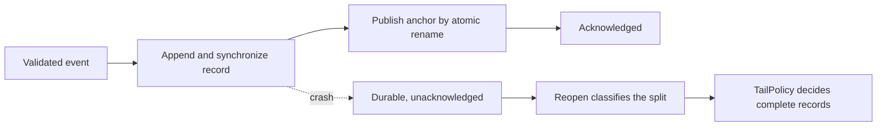
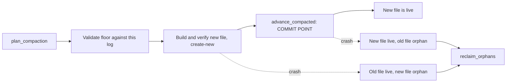

# P0.4 — Protected anchors and the acknowledgment protocol

Baseline: `069d4b01ba2f301e025a781ad2baa6bb2b4b1c4b`.
Owners: `ptr-ledger::{anchor, acknowledged, RecoverableLog}`.

P0.3 established that a log cannot vouch for itself: detecting a wholesale
rewrite or a cut at a complete record boundary requires an expected `LogAnchor`
retained somewhere the log cannot influence, and it left the retention of that
value entirely to the embedding host. This step implements that store and the
protocol that keeps it in step with the log.

It does not close issue #15. Compaction, retention and trusted cutover are the
remaining half of that gate and are specified in [the compaction section](#compaction-and-retention)
once implemented; cluster, network, neural-state and erasure gates are separate.

## Why the anchor needs authentication, not just a checksum

A hash chain is verifiable by anyone, which is the problem. An attacker who
rewrites the log recomputes every digest and produces a chain that verifies
perfectly. P0.3's answer was to compare the result against an expected anchor —
but an expected anchor stored as plain bytes beside the log is equally
rewritable, so the check reduces to comparing a forgery against itself.

`PTRANC01` therefore authenticates the expected value under a key the host holds
and the log does not:

```text
offset size field
0      8    magic "PTRANC01"
8      8    epoch                  monotonic advancement counter
16     8    index                  acknowledged commit index
24     32   digest                 acknowledged record digest
56     32   origin                 digest of commit index 1
88     8    base_index             compaction floor
96     32   base_digest            chain digest at the floor
128    8    flags                  reserved, must be zero
136    32   mac                    HMAC-SHA256(key, "PTRANC01-MAC" || bytes[0..136])
= 168 bytes
```

HMAC-SHA256 is implemented in `ptr-ledger::anchor` over the already-pinned
`sha2 = 0.11.0` and verified against RFC 4231 test cases 1, 2, 3 and 6; case 6
covers the key-longer-than-block path. No package, vendor patch, scanner rule or
license allowance changes. The MAC is compared without an early exit. The key is
redacted in `Debug` output (global invariant 13) and overwritten on drop on a
best-effort basis, which Rust cannot make a guarantee.

The record is fixed-length, so a short or extended file is rejected before it is
parsed and a partial write can never authenticate.

### What authentication still does not give

Authenticity is not freshness. An older record produced by the same key carries a
valid MAC and is therefore indistinguishable from the current one by inspection
alone. `AnchorStore::open_expecting` closes this by rejecting an epoch below a
`minimum_epoch` the host retains in a monotonic counter outside the file — a
sealed counter, a secret manager, a replicated register. Reading that bound back
out of the anchor being checked would make the check vacuous, which is the same
mistake as trusting a log's own checksum to prove the log was not replaced.
`AnchorStore::open` exists for hosts where anchor rollback is genuinely out of
scope, and is documented as such rather than as the safe default.

Protection also ends at the key. An attacker holding the key can author any
history. This is a local single-node artifact: `rename` orders writers on one
filesystem and says nothing about another node.

## Atomic publication

Every mutation writes a complete replacement record to `<path>.publishing`,
synchronizes it, installs it with `rename`, and on Unix synchronizes the parent
directory. A reader therefore observes the previous record or the next one, never
a blend. A crash before the rename leaves the previous record authoritative and a
scratch file that the next publication overwrites; a crash after it leaves the new
record. No cleanup step has to be remembered, because the rename consumes the
scratch name. Non-Unix platforms synchronize the file only, and no hardware
power-loss guarantee is claimed on any platform.

`initialize` refuses to replace an existing anchor, so a lost key cannot be
papered over by re-initializing. Its existence check is not a concurrency
primitive; callers serialize through the log's single-writer lock.

Advancement is monotonic in three respects, checked on the private commit path:
the epoch strictly increases, the covered index never decreases, and restating a
covered index is accepted only at an identical digest — so an alternative history
of the same length is refused. An established origin is carried forward and
cannot be rebound.

## Acknowledgment ordering

A record is *durable* when `FileLedger::append_durable` returns and
*acknowledged* when the anchor covering it is installed. `AcknowledgedLedger`
performs these in that order, never the reverse:



Log-first ordering means a crash in the window produces a log that is *ahead* of
its anchor. Anchor-first ordering would produce a log *behind* its anchor, which
is unrecoverable, in exchange for nothing.

If anchor publication fails, the record stays durable and the ledger fences
itself: further appends are refused until a reopen classifies the pair, because
stacking more unacknowledged records onto an anchor that is already behind
widens the window without making anything safer.

## Split outcomes and their recovery

`RecoverableLog` holds the single-writer lock while the pair is classified, so
the verdict cannot go stale before the repair acting on it. `classify` is pure:
trusted anchor in, verdict out, no bytes written.

| Split | Condition | Recovery |
|---|---|---|
| `Aligned` | anchor covers the log's complete tail, no partial frame | open |
| `Unacknowledged` | complete records and/or one partial frame above the anchor | `TailPolicy` |
| `LostSuffix` | anchor covers more than the log holds | refuse |
| `Diverged` | covered index absent at that digest, log no longer | refuse |
| `OriginMismatch` | first record disagrees with the anchor's origin | refuse |
| `BaseMismatch` | compaction floors disagree | refuse |

The asymmetry is the contract. A log ahead of its anchor has lost nothing, so
recovery may proceed. A log behind its anchor has lost committed history, and no
local evidence reconstructs it; presenting such a log as healthy is exactly the
resurrection global invariant 3 forbids. All four refusing outcomes leave every
byte in place.

`TailPolicy` governs only *complete* records above the anchor:

- `Acknowledge` (default) keeps them and advances the anchor. Nothing durable is
  discarded, so an appended-but-unacknowledged revocation stays in force.
- `Discard` removes them. This destroys durably committed records and is correct
  only for a host that can prove nothing observed them.
- `Refuse` opens nothing and leaves the files untouched for out-of-band handling.

An incomplete trailing frame is truncated under every policy. It was a partial
write, not a record, and is never counted as one.

The origin is the digest of commit index 1, which distinguishes an anchor
belonging to a different log from a rollback of this one. After compaction
discards that record the origin exists only in the anchor and is carried forward;
re-deriving it from whichever record now happens to be first would let a
substituted log name itself.

## Executed evidence

`crates/ptr-ledger/tests/protected_anchor.rs`, 14 integration tests, plus 4
unit tests in `ptr-ledger::anchor`:

- RFC 4231 HMAC known answers; constant-time comparison; redacted key `Debug`;
  reserved-flag and base-range rejection.
- Single-shot initialization and authenticated round trip.
- Absent anchor, wrong key, **every single-bit mutation of all 168 bytes**, and
  every truncation/extension length rejected.
- Stale-witness rollback: authentic under `open`, rejected under
  `open_expecting`, and reported as a recoverable tail by the acknowledgment
  layer rather than as health.
- Interrupted publication: previous record stays authoritative, next publication
  consumes the scratch name.
- Aligned appends across reopen, with one epoch per acknowledged append.
- Durable unacknowledged tail kept by default; discarded only on explicit
  policy, with the resulting file byte-identical to the shorter encoded log;
  refused without mutation.
- Incomplete frame removed under every policy and never counted as a record.
- `LostSuffix` refused under all three policies with bytes unchanged.
- A rehashed alternative suffix whose chain verifies cleanly, refused as
  `Diverged`.
- An anchor presented beside another log, refused as `OriginMismatch`.
- Failed acknowledgment fences the writer, leaves the record durable, and the
  following reopen recovers it exactly.
- Monotonicity of epoch, index and digest, and refusal to rebind an origin.
- Pair creation never adopts an existing log or an existing anchor.

## Compaction and retention

Owner: `ptr-ledger::compaction`.

### Why the floor is in the file name

Compaction discards a prefix of committed history, so the design is decided by
what a crash mid-cutover leaves behind. Renaming a newly built log over the live
one cannot answer that: afterwards the file either starts at index 1 or above the
floor, and with a single fixed path both states produce the same
`PTR_LOG_CHAIN_OR_ORDER` error and neither can be distinguished from corruption.

So `LogPaths` puts the floor in the name — `<stem>-<base:020>.log`, with the
anchor at the fixed `<stem>.anchor` — and the protected anchor is the only thing
that says which file is live. This is the same trust direction as everything else
here: the floor is trusted input, never read from the artifact being validated.

### The cutover



The anchor advance is the commit point and the only step that changes which file
is live. Everything before it is validated and create-new, so a failure leaves the
previous log authoritative and the half-built artifact an orphan. Both
interruption sides are unambiguous, nothing is overwritten, and nothing is
deleted implicitly.

`reclaim_orphans` deletes only log files the anchor does not name, and carries an
explicit precondition: **it must run only on a ledger opened with a witnessed
epoch.** Under a rolled-back anchor the live file is the one that looks like an
orphan, and reclamation would delete exactly the history the anchor exists to
protect.

### What bounds the floor

`plan_compaction` returns `Retain`, `Blocked(barrier)` or `Compact(plan)`.
`RetentionPolicy::keep_records` proposes a floor, and two things bound it:

- `CompactionBarrier::snapshot_covers` caps it. Discarding records no snapshot
  covers destroys the only description of the state they produced, so the cap is
  a correctness requirement rather than a tuning knob.
- An unsafe barrier blocks outright. A consumer that has not caught up still
  needs the records, and an unresolved revocation must not have its evidence
  removed while it is still in force (global invariant 3).

A `CompactionPlan` is therefore not permission on its own; it is only reachable
through a barrier that already allows it. A cutover revalidates the plan against
the live state and refuses a stale tail, a non-advancing floor, a floor above the
tail, a floor that is not a record boundary of this log, and an existing
destination — each without touching anything.

### Executed evidence

`crates/ptr-ledger/tests/compaction.rs`, 11 integration tests:

- Retention holds below and exactly at the keep count, and proposes the expected
  floor above it.
- An unsafe barrier blocks for both a lagging consumer and an unresolved
  revocation.
- The floor is capped by snapshot coverage, and coverage at or below the current
  floor blocks.
- A cutover reconstructs exactly the retained suffix at its original indices,
  leaves the tail unmoved, keeps the superseded file, continues appending on the
  same chain, and reopens to the identical history.
- A compacted log is rejected by `decode_log` and `FileLedger::open` and verifies
  only against its floor from anchor storage.
- Interruption before the commit point: old log live, new file reported as an
  orphan, reclaimed, retry succeeds.
- Interruption after the commit point: new log live, old file reclaimable,
  reopen exact.
- Stale, non-advancing, above-tail and wrong-digest plans each refused with the
  ledger unchanged, then the valid plan still succeeds.
- An existing destination is never overwritten, byte-for-byte.
- The origin survives discarding index 1: the log can no longer derive it, the
  anchor carries it, and later appends preserve it.
- `LostSuffix` and unacknowledged-tail recovery still apply above a compacted
  floor.

### Not yet covered

`snapshot_covers` is an input the caller must justify. `ptr-runtime` cannot yet
produce a snapshot that covers a floor and restores from a compacted log:
`RecoverySnapshot` retains the complete journal by construction and is documented
as not being a compacted materialized snapshot. Until that exists, a host can
only compact up to a coverage bound it establishes by other means, and
**exact compacted-state reconstruction at the runtime level remains open** —
the last item of this gate.

## Explicitly out of scope here

Multi-node partitions, leadership and fencing belong to the cluster gate: a file
lock does not fence a distributed writer. Authenticated network admission,
durable execution audit and idempotency belong to the execution/network gate.
Neural and checkpoint state admission, and erasure across retained history,
remain separate gates in issue #15. Nothing here is evidence about model quality.
