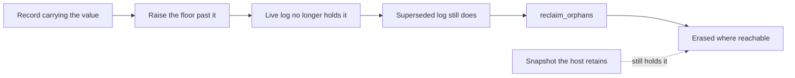

# P0.5 — Erasure and retention across retained state

Baseline: `3b557a194340d0eb63a72b04352c51397b12fdc0`.
Owner: `ptr-ledger::retention`.

Issue #15 states the requirement and, in the same breath, the trap: *"Logical
current-value deletion does not erase history. No declaration of 'all state
deleted' until these requirements are implemented and measured."* This step
implements what can be implemented, measures it, and names what remains
unreachable — rather than shipping an `erase()` that would have to lie.

## Deletion and erasure are different operations

PTR has no `erase(key)`. Removing a semantic value **commits a removal record**:
the value stops being current, and the record that carried it stays in the log
exactly where it was. That is not a defect — it is global invariant 14
(replayability) and invariant 5 (committed causal state is authoritative) working
as designed. But it means a system that reported "deleted" after a removal would
be wrong about the only question that matters for erasure.

`crates/ptr-ledger/tests/erasure.rs::logical_deletion_does_not_erase_history`
asserts exactly this: after the value is superseded, the newest semantic
transaction carries the replacement, and the original plaintext is still sitting
in the live log.

## Erasure is achieved by not retaining

The only mechanism offered is removal of the artifacts that hold the bytes:

Both steps are required and neither is sufficient. Compaction moves the value out
of the *live* log; the superseded file keeps it until reclamation. The audit reports
each stage distinctly, so "I compacted" cannot be mistaken for "it is gone".

**Overwriting in place is deliberately not offered.** On a copy-on-write
filesystem, a wear-levelling SSD, or a storage layer taking its own snapshots,
writing zeros over a file does not destroy the blocks that held the old contents.
A guarantee that cannot be kept is worse than an absent one, so PTR does not
provide the call rather than providing one that misleads.

## The audit measures presence, not intent

There are two entry points, and the split is forced by a platform fact rather than
convenience:

| Entry point | When | How the live log is read |
|---|---|---|
| `AcknowledgedLedger::audit_erasure(plaintext)` | a ledger is open | through the handle that holds it |
| `LogPaths::audit_erasure(plaintext, live_base)` | no ledger is open | through an independent handle |

Windows advisory locks are mandatory for I/O, so an independent handle cannot read
a log a writer holds — auditing a *running* system through `LogPaths` fails there
while succeeding on Unix, which is the worst kind of difference. Reading through
the owner works on every platform and is strictly better besides: it sees an
unacknowledged or partially written trailing frame, which the committed event list
cannot, and that frame can hold bytes the audit is looking for.

Reading through the writer's own handle moves its file position, so
`FileLedger::retained_bytes` restores the append position before returning. A test
appends immediately after an audit and re-verifies the log to prove a following
record does not land on top of committed bytes.

Superseded logs are always read directly: no one holds them, which is precisely
why they are still retaining anything at all.

Two further choices decide whether the result can be trusted:

**It is a byte search, not a record scan.** Erasure asks whether the bytes are
present at all. A record scan that failed to recognize an encoding would report
erasure that did not happen; a byte search can only err toward "still retained",
which is the safe direction. Framing matches and coincidental matches are
therefore features, not noise.

**`live_base` comes from protected anchor storage**, so the audit describes the same
live log a reader would open rather than guessing from the directory.

`ErasureAudit::erased_where_reachable()` is deliberately not called `erased`. The
three boundaries in `OutOfReach` are returned by **every** audit, never as a
situational caveat:

| Boundary | Why it is permanent |
|---|---|
| `PTR_ERASURE_HOST_RETAINED_ARTIFACTS` | Recovery snapshots, compacted snapshots, backups and replicas live outside the path set. Nothing can discover them, so each is folded in explicitly with `with_retained_elsewhere`. |
| `PTR_ERASURE_STORAGE_RESIDUE` | Absence from a file is not absence from the medium. Removing or rewriting a file says nothing about the blocks it occupied. |
| `PTR_ERASURE_MODEL_DERIVED_STATE` | Model, KV and checkpoint state is not implemented in PTR, so nothing here can speak to it either way. |

Making the host's own artifacts a *parameter* is the point: a recovery snapshot
embeds the whole journal by construction, so a host that keeps one has not erased
anything no matter how far the floor has moved.

## Destroying the anchor key is not erasure

Tempting and wrong. The anchor key authenticates the expected `LogAnchor`; it does
not encrypt anything. Destroy it and the log becomes unverifiable while remaining
completely readable — `destroying_the_anchor_key_is_not_erasure` removes the anchor,
shows the ledger can no longer be opened, and then decodes all four records
straight out of the file. A key protects integrity, never confidentiality;
treating its loss as erasure would be a category error.

The anchor record itself holds no payload, only digests, an epoch and indices. A
digest is not the plaintext, but it does confirm a guess about a low-entropy value,
which is a correlation property worth stating rather than a disclosure.

## Executed evidence

`crates/ptr-ledger/tests/erasure.rs`, 7 integration tests over a journal whose
record 1 carries a distinctive plaintext that a later transaction supersedes:

- Logical deletion leaves the plaintext in the live log, and the audit says so.
- Erasure needs **both** the floor past the record and the orphan reclaimed; the
  audit distinguishes those two states, and unrelated committed data survives
  while the remaining log still verifies against its floor.
- An unreclaimed orphan keeps retaining across a second cutover; reclamation then
  clears both.
- A snapshot the host retains defeats erasure, is invisible to the audit until
  folded in, and an artifact that does not contain the value is not reported.
- Destroying the anchor key removes verifiability and nothing else.
- The byte search errs toward "still retained" and an empty needle never matches.
- Every boundary carries a stable code.
- Reading the live log through the owning handle leaves the append position at the
  end: the next record extends the log instead of overwriting it, and the extended
  log still verifies against its floor.

## What this does not close

Issue #15's *Deletion across retained state* gate also requires erasure "under the
full lifecycle contract" for model-derived state, and measurement of the storage
layer. Neither is delivered:

- **Model-derived state does not exist yet.** When it does, its admission must be
  bound to the lifecycle (a separate gate), and only then can its erasure be
  specified.
- **Storage residue is unmeasured and unmeasurable from here.** Establishing it
  requires device-level evidence, not a byte search.
- **Durable snapshot lifecycle is not implemented.** `ptr-runtime` snapshots are
  host-retained artifacts; PTR does not track, enumerate or reclaim them, which is
  why they appear as a declared boundary instead of a search path.
- No retention *schedule* or policy engine exists. `RetentionPolicy` bounds how far
  a floor may rise; it does not express "erase subject X after N days".

Accordingly **no "all state deleted" declaration is available**, and none of this
is evidence about model quality or the research Definition of Done.
