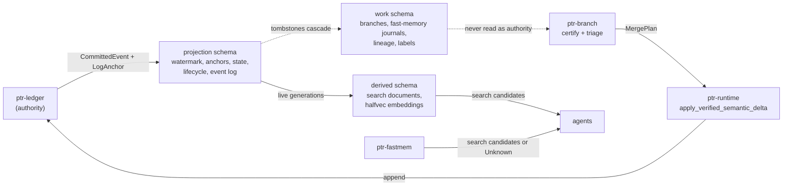

# 35 — Agentic substrate: a PostgreSQL projection, certified branches and revocable fast memory

Status: **prototype implemented** for the PostgreSQL substrate (`ptr-pg`, feature
`postgres-backend`), certified branches and their arbiter (`ptr-branch`), the
fast-weight working memory (`ptr-fastmem`), adapter lineage (`ptr-lineage`), weak
supervision (`ptr-labeling`) and the statistics kernel (`ptr-analytics`). Every
claim beyond the tests cited here is an **experiment**, listed at the end with
its falsification rule. Nothing in this document changes the authority order of
ADR-0002: the ledger stays the only authority.

Decisions: [ADR-0016](../../research/decisions/ADR-0016-postgres-projection-substrate.md),
[ADR-0017](../../research/decisions/ADR-0017-certified-agent-branches.md),
[ADR-0018](../../research/decisions/ADR-0018-revocable-fast-weight-memory.md),
[ADR-0019](../../research/decisions/ADR-0019-adapter-lineage-and-weak-supervision.md).

## What this revises, and why each part changed

The starting point was a proposal for a "Rust/Postgres agentic data platform" with
five layers: a working-memory projector holding one `vector(768)` per agent (L5), a
causal delta fabric of agents, branches, deltas and merge decisions (L4), a chain
of LoRA deltas with a forgetting-curve replay query, search and labeling tables
(L3), a business/ERP data model of SeaORM entities standing in for Odoo (L2), and
storage engines (L1): PostgreSQL with pgvector, Lance files on object storage for ML
datasets and Apache Iggy for events, with analytics through `pg_mooncake` and
DataFusion; all in nine crates. The ambition is right — one operationally simple
database for an agent platform — and every layer had a defect that would have made
it either a second authority or quietly wrong. The table below revises the main
defects; every other idea the proposal named is decided, one row each, at the end
of §7.

| Proposal | Defect | Revision | Where |
|---|---|---|---|
| Everything in one Postgres, no authority order | Postgres becomes a second authority; a restored backup or a rolled-back ledger tail is silently kept | Three schema classes; the projection verifies every record against the ledger's own anchor and is rebuilt by replay | `ptr-pg`, ADR-0016 |
| Working memory: one vector updated by a "delta rule" | A single vector is not an associative memory, and the dot product mixed key and value spaces; nothing could be revoked | Multi-head matrix state under the gated delta rule; every write attributed to one input generation; admission at every read; exact revocation by refold | `ptr-fastmem`, ADR-0018 |
| Branches, deltas and merge decisions over `entity_table`/`entity_id` | Polymorphic rows address business tables directly; merges decided by free weights; no notion of a stale read | Branches over immutable snapshots, certified against value, range and lifecycle digests; merged only as one verified semantic delta | `ptr-branch`, ADR-0017 |
| Merge "reputation" weights | An uncalibrated score can auto-merge anything | Verifier-bounded eligibility, a uniform calibration slice, finite-sample thresholds and off-policy evaluation | `ptr-branch` arbiter |
| LoRA delta chain constrained to "the null space of the sum of previous updates" | The null space of a sum is not the intersection of null spaces; chains grow without bound | Principal-angle interference per layer against its chance level; a gated lifecycle; TIES consolidation | `ptr-lineage`, ADR-0019 |
| Replay by `ORDER BY weight LIMIT n` | Deterministic, starves strata and moderately forgotten samples | FSRS-4.5 forgetting model on the training clock; stratified Gumbel-top-k sampling without replacement; held-out samples excluded by type | `ptr-lineage` |
| Label tables | Majority votes; verifier results outvotable; no calibration | Dawid-Skene with verifier vetoes, `Unknown` and `Disputed` outcomes, uniform-versus-active gold | `ptr-labeling`, ADR-0019 |
| `pg_mooncake`, DataFusion, Iggy, `ort` in the core build | MSRV and licence exposure for optional analytics | One metric vocabulary compiled per backend; mirrors and brokers are evaluation slots | `ptr-analytics`, `ptr-events` |

## Authority map



## 1. PostgreSQL in three schema classes (`ptr-pg`)

A substrate instance is three schemas derived from one prefix (`<prefix>_projection`,
`<prefix>_derived`, `<prefix>_work`). `connect_with` refuses any other set of names
(`InvalidSchemaSet`), so the three are distinct and two instances either are one or
share no schema: a rebuild never drops, and a projector never writes, another
instance's schema, and the migration lock, keyed by the projection schema's name,
covers all three (`a_schema_set_is_accepted_only_as_the_three_schemas_of_one_prefix`,
`a_schema_set_not_made_from_one_prefix_is_refused_before_it_connects`). `drop_all`,
for tests and decommissioning, drops the three schemas without taking the lock, so
its caller keeps every other session of the instance away. Each class has its own checksummed migration
catalog, its own `schema_migration` table and its own contract. Migrations run under
an advisory lock; an applied migration whose checksum changed (`MigrationDrift`) or
that this build does not know (`UnknownMigration`) is refused. Checksums are taken
over LF-normalised SQL, so a Windows checkout does not change a migration's
identity (`.gitattributes` also pins `*.sql` to LF). Covered by
`migrations_apply_once_and_record_their_checksums` and
`an_edited_migration_is_refused_as_drift`. The lock is held by a session of its own,
opened to the same checked loopback target, while the migrations run on the
substrate's session: a migration or rebuild whose future is cancelled or unwinds
releases the lock when that session closes, rather than leaving it with a session
that stays open, and a retry takes it afresh instead of re-entering it
(`a_migration_cancelled_while_holding_the_lock_does_not_block_the_next_migrator`,
`a_migration_retried_after_a_cancellation_completes_and_leaves_no_lock_held`,
`a_rebuild_cancelled_while_holding_the_lock_releases_it_and_keeps_the_schemas`).
The lock is taken with `pg_try_advisory_lock`, retried while another session holds
it, so no statement waits on it: a migration cancelled while it waits leaves no
session queued on the lock
(`a_migration_cancelled_while_waiting_for_the_lock_leaves_no_session_behind`). The
lock's session turns `idle_session_timeout` off, since it is idle while the
migrations run, and every migration and the rebuild's drop commit only after that
session has confirmed it still holds the lock; a lock lost to a terminated session
rolls the change back with `MigrationLockLost` rather than letting a second migrator
run beside it
(`the_migration_lock_outlives_an_idle_session_timeout_while_a_migration_runs`,
`a_migration_whose_lock_session_ends_rolls_back_instead_of_committing_unlocked`,
`a_rebuild_whose_lock_session_ends_keeps_the_schemas_it_was_dropping`).

### Projection: one verified commit per transaction

The projector is the only writer. For each record it:

1. locks the watermark row `FOR UPDATE` and asks `ptr_state::classify_next` whether
   the index is the next one, a duplicate, out of order or beyond a gap — the same
   function the reference materializer and the Turso backend use;
2. for the next index, recomputes the record's anchor from the stored one with
   `ptr_ledger::integrity::chain_anchors` and compares it with the anchor the ledger
   supplied. A mismatch means the record is not the ledger's or the projection's
   prefix is not, and it is refused as `ForeignHistory`;
3. writes exactly `ptr_state::projection_entries` for the event, so no backend can
   project an event differently;
4. applies the lifecycle change keyed exactly as the runtime keys it (a capsule id,
   `constraint:<key>`, `procedure:<id>`): a new live generation, an entry in the
   append-only tombstone set, or a revision;
5. appends one row to the projection event log, records the anchor in
   `applied_commit`, advances the watermark and sends `NOTIFY` — delivered on commit
   only.

A re-delivered record is accepted as a duplicate only when its anchor equals the one
stored for its index. A revocation never changes the live generation: a generation
is admissible only when it is live **and** not tombstoned, as in the runtime.

- `replay_projects_state_and_lifecycle_exactly_as_the_reference_does` replays a log
  with every lifecycle change and compares every entry with `MaterializedState`.
- `a_redelivered_record_is_a_duplicate_and_a_different_one_is_foreign_history` and
  `a_record_that_does_not_chain_from_the_stored_anchor_is_refused` cover re-delivery
  and divergent histories.
- `a_projection_ahead_of_or_beside_the_ledger_is_refused` covers a projection ahead
  of the ledger (a discarded tail, a later backup) and one at the same index with a
  different anchor.
- `a_read_fenced_beyond_the_watermark_is_refused`: reads name a commit fence and are
  refused, not served stale, when the projection is behind.
- `append_only_tables_refuse_rewrites`: the event log, the anchors and the tombstone
  set refuse `UPDATE` and `DELETE` in the database itself.
- `consumer_offsets_only_move_forward_and_never_past_the_watermark`.
- `rebuild_drops_projection_and_derived_caches_but_keeps_working_state`: rebuild is
  drop-and-replay and reaches the same anchor.

### Derived: only live generations are ever indexed

Search documents are computed outside any projection transaction (capsule content is
not in the ledger) and keyed by capsule and generation. A writer holds the capsule's
lifecycle row `FOR SHARE` for its transaction and re-checks the tombstone set in a
statement taken after the lock; the projector updates that row before it deletes a
superseded or revoked generation's document in the same transaction. The two cannot
interleave: the write lands before the delete or sees the new generation and is
refused as `NotLive`. `a_derived_write_holding_the_lifecycle_row_is_ordered_before_the_supersede`
holds the lock from a second connection and shows the projector waiting and then
deleting the late row; `only_live_generations_are_indexed_and_superseding_drops_the_old_document`
covers the refusals.

The ordering needs every statement to take a fresh snapshot after the locks it waited
for were released, which is read committed. The projector, the cache writer, journal
appends and checkpoint stores therefore start their transactions at an explicit
`READ COMMITTED` instead of inheriting `default_transaction_isolation`: under an
operator's repeatable-read default the projector's delete would otherwise miss a row
committed while it waited
(`the_lock_ordering_holds_when_sessions_default_to_repeatable_read`).

Retrieval runs in one read-only repeatable-read snapshot:

- **Lexical:** built-in full text over a stored `tsvector` with the language-neutral
  `simple` configuration. It is the baseline, not BM25. BM25 extensions are probed
  and evaluated, never assumed: `pg_textsearch` (PostgreSQL licence) and ParadeDB
  `pg_search` (AGPL-3.0) are candidates in the lexical-search evaluation.
- **Dense:** embeddings are stored as `halfvec` (a 768-dimensional vector is 1,544
  bytes and stays inline). Each registered embedding space gets a partial HNSW index
  over the column cast to its fixed dimension, `WHERE space = '<id>'`, so one table
  holds any number of spaces. The query orders by the indexed expression alone, so
  the planner uses the index. An HNSW scan otherwise stops at `hnsw.ef_search` rows
  (40 by default) whatever the limit, so every query sets iterative scans in strict
  order and an `ef_search` of at least its limit; pgvector 0.8 is therefore the
  minimum (`vector_search_is_not_truncated_at_the_default_candidate_list`). A vector
  that is zero once rounded to half precision is refused, since it has no cosine
  distance. Registering a different definition under an existing space is refused
  (`SpaceConflict`).
- **Liveness:** every hit is joined to the lifecycle catalog of the same snapshot.
- **Fusion:** weighted reciprocal rank fusion keyed by capsule **and** generation, so
  a stale generation can never borrow the live one's rank
  (`two_generations_of_one_capsule_are_never_merged`).

`hybrid_search_returns_live_candidates_fused_by_capsule_and_generation` checks that
both modes return candidates at the lowest evidence stage and that a revocation
removes a document from both modes in the commit that revokes it.

### Work: non-authoritative state with database-enforced shape

Sealed branches with every dependency and operation, one immutable triage row per
branch, and append-only outcomes; fast-memory journals and checkpoints; the adapter catalog, its
data manifest and the replay pool; the weak-supervision store. None of it is derived
from the ledger, none of it is dropped by a rebuild, none of it is read as authority.
The database enforces the invariants a row can express: a calibration-slice branch is
an escalated eligible branch, an ineligible branch has propensity zero, a logged
triage or an outcome is never updated or deleted on its own (it goes only when its
whole branch is erased), a branch is adjudicated once, a held-out sample cannot enter
the replay pool, a consolidated
adapter has sources rather than a parent, a label schema has at least two classes, a
triage row logged since policies are recorded cites a recorded policy, a policy and
its calibration set are never rewritten and the set is complete when the policy
commits (a sample appended later is refused), a branch one was calibrated on cannot
be deleted, only a model labeling function names an adapter, and an adapter has at
most one interference report, which is complete when it commits, stays within
`[0, 1]` and is never rewritten. The size of a calibration set and of an
interference report is checked by counting it once, at commit for its header row
and at the end of each statement that adds to it, so recording a set of N rows in
one statement reads O(N) rows rather than a count per row.
A touched key's input-set digest is a whole digest; a branch stored
before input sets were recorded has none, and loading it is refused because it cannot
be certified and must be re-run.
Covered by `a_sealed_branch_round_trips_with_every_dependency_and_op`,
`touched_input_sets_survive_a_round_trip_and_a_branch_sealed_before_them_is_refused`,
`triage_logs_and_outcomes_feed_the_platform_metrics`,
`working_state_constraints_hold_in_the_database`,
`triage_policies_record_their_calibration_and_hold_out_everything_else`,
`a_calibration_set_is_complete_when_its_policy_commits_and_never_grows`,
`a_calibration_set_and_an_interference_report_are_counted_once_not_once_per_row`,
`policy_rows_that_break_a_rule_level_or_size_constraint_are_refused`,
`a_work_schema_holding_triage_rows_upgrades_and_keeps_their_unrecorded_policies`,
`a_labeling_function_names_an_adapter_only_as_a_model`,
`interference_reports_are_stored_once_as_measured` and
`an_empty_interference_report_or_one_for_an_unknown_adapter_stores_nothing`.

### Boundary rules

- Driver types never leave the adapters module; every refusal is a `PgError` with a
  stable code.
- The connection string is referenced by the name of an environment variable, never
  stored in a config file.
- The build links no TLS connector, so a non-loopback target is refused rather than
  sent credentials in the clear (`a_non_loopback_host_is_refused_without_a_tls_connector`).
  Every `hostaddr` is checked as well as every `host`, because the driver connects to
  `hostaddr` and uses `host` only as a name
  (`a_hostaddr_that_is_not_loopback_is_refused_whatever_the_host`).
- A string PostgreSQL `text` cannot hold (one containing NUL) is refused with
  `InvalidText` before anything is written. A ledger record carrying one is refused as
  `InvalidRecord`, and the PostgreSQL projection stops at it while the ledger and the
  other backends continue
  (`strings_postgresql_text_cannot_hold_are_refused_before_anything_is_written`).
- Migrations bound their DDL with `SET LOCAL lock_timeout`, so the timeout never
  leaks into the session the projector uses; a rebuild drops and recreates under the
  migration lock, so a failed lock wait never leaves the schemas dropped.
- Schema and space names are `Identifier`s (`[a-z][a-z0-9_]{0,39}`, never a keyword
  PostgreSQL 16 to 18 reserves), so everything interpolated into DDL needs no quoting
  (`keywords_postgresql_reserves_are_refused_as_identifiers`,
  `every_keyword_the_server_reserves_is_refused_as_an_identifier`).
- The substrate never creates an extension: installing one is an operator's decision.

## 2. Certified agent branches (`ptr-branch`)

A branch is a private overlay on one immutable `SemanticSnapshot`. It declares what
its conclusions depend on: a **value digest** of every key it read (the canonical
journal bytes `ptr_semdb::canonical_input_bytes`, the same bytes neural-state
admission digests), a **range digest** of every prefix it scanned, an **input-set
digest** of every key it touches (which keys its dependency entry names, the empty
set included), and every **lifecycle generation** it relied on — one per target:
relying on a second generation of a target is refused when declared, since two are
never live together and keeping only the later one would certify conclusions drawn
from a superseded one
(`a_second_generation_of_a_relied_on_target_is_refused_when_declared`). `Put` and
`Remove` are accepted only for keys the branch read; counter additions and set
insertions and removals commute and are rebased onto whatever the key holds at merge
time. An operation is checked before anything is recorded, so a refused one leaves no
read of its key's inputs behind to refuse the branch later
(`a_refused_commutative_operation_leaves_no_read_of_its_inputs_behind`), and a set
the journal cannot carry is refused rather than encoded with truncated lengths
(`a_set_the_journal_cannot_carry_is_refused_rather_than_truncated`).
`request:` and `pod-output:` are reserved to ingress.

Certification against a newer snapshot refuses a changed read
(`a_value_the_branch_read_that_changed_is_a_conflict_and_nothing_merges`), a phantom
under a scanned prefix (`a_key_inserted_under_a_scanned_prefix_refuses_certification`),
a touched key whose input set changed even though every value it read is unchanged
(`a_touched_key_whose_input_set_changed_conflicts_even_when_every_value_it_read_is_unchanged`):
a merge keeps the target's dependency set, so a value must not stand under inputs it
was not computed from; and a revoked or superseded relied-on generation
(`a_revoked_or_superseded_relied_on_generation_refuses_certification`). A
`SealedBranch` has public fields and is rebuilt from storage, so certification
rechecks what staging guarantees rather than trusting it: a `Put` or `Remove` of a
key the branch did not read, which would merge as a blind overwrite, a touched key
with no recorded base value, which could not tell `Rebased` from `Clean`, and an
unread input of a touched key are refused
(`a_sealed_branch_that_breaks_what_staging_guarantees_is_refused_at_certification`).
Otherwise it returns `Clean` or `Rebased` with one `MergePlan`: an ordinary
`SemanticDelta` and the revision it was certified against. Concurrent counter additions both survive
(`two_concurrent_counter_additions_both_survive`).

A plan is committed through `Runtime::apply_verified_semantic_delta`, which
prepares the delta, hands the verifier a view of the post-state, its values and its
dependency sets (`a_verifier_sees_and_can_refuse_the_dependency_set_a_delta_would_install`),
and appends only on a `Pass` at the required level with no hard finding
(`a_certified_and_verified_branch_reaches_semantic_state_only_through_the_runtime`,
`no_score_or_shallow_level_or_hard_finding_gets_a_delta_past_verification`). A plan
certified before another commit is refused by the runtime's revision check
(`a_plan_certified_before_another_commit_is_refused_by_the_runtime`,
`a_verified_delta_against_a_moved_revision_is_refused_before_verification`).
`Runtime::generation_validity` reads a revoked generation as `Revoked` even while it
is still the live one (`a_revoked_generation_is_revoked_although_it_is_still_the_live_generation`).

Using that path is the caller's obligation, not a type-level guarantee: a `MergePlan`
exposes its delta, and the runtime's unverified `apply_semantic_delta` is public, so
nothing stops a caller from committing a plan without verification. Closing that gap
(a plan consumable only by a verifying entry point) is listed in §7.

### The arbiter: verification first, calibration second

Triage decides whether a certified plan is proposed automatically, escalated to a
person or discarded. It can move a branch towards more review, never past
verification:

- Only a `Pass` at full-semantic or deterministic level with no hard finding is
  **eligible**. A failure is discarded whatever the score
  (`a_failed_verification_discards_whatever_the_score`); disputed, unknown or shallow
  verification escalates (`disputed_unknown_or_shallow_verification_escalates_whatever_the_score`).
- A uniform **calibration slice** of eligible branches — a deterministic per-branch
  draw — is escalated for adjudication irrespective of score. Outcomes of
  auto-proposed branches are observed only through later reverts, so only this slice
  is an exchangeable sample of what the threshold decides about
  (`the_calibration_slice_escalates_high_scores_and_only_it_can_be_adjudicated`).
- The threshold is chosen on a fixed grid by conformal risk control,
  `n/(n+1) · R̂(t) + 1/(n+1) ≤ α`, which bounds the expected joint probability that
  the next eligible branch is auto-proposed and harmful
  (`a_threshold_calibrated_from_adjudicated_slices_is_used_by_the_next_policy`); or —
  recommended — by Learn-then-Test fixed-sequence testing with one-sided
  Clopper-Pearson bounds, which bounds the harm rate among auto-proposed branches with
  probability `1 − δ` (`learn_then_test_certifies_the_clean_region_and_bounds_the_harm_rate`,
  `a_certified_threshold_bounds_the_harm_rate_among_what_the_next_policy_proposes`).
  The sequence starts at the first threshold its own bound can pass with no harm,
  a choice made on the scores alone
  (`learn_then_test_starts_where_its_own_bound_can_first_pass`).
- A threshold is a finite score in `[0, 1]` in every policy, one rebuilt from storage
  included: NaN would never auto-propose and a negative threshold always would, so
  either is refused
  (`a_threshold_outside_the_unit_interval_is_refused_wherever_a_policy_is_built`).
- Logged propensities make IPS, SNIPS and doubly robust **off-policy evaluation** of
  a new threshold possible; a threshold below anything the log explored is refused as
  a positivity violation, a log with a nonfinite reward or a propensity so small that
  its importance weight is infinite is refused rather than estimated, and an estimate
  is never returned unless it is finite: SNIPS and the effective sample size are
  computed on weights divided by the largest, and the doubly robust estimate on
  weights divided by the largest and residuals halved and divided by the log's
  length before they are multiplied, so large finite weights do not overflow them,
  and whatever still overflows is refused
  (`a_lower_threshold_than_the_log_ever_explored_is_refused_as_a_positivity_violation`,
  `evaluating_the_logging_policy_on_its_own_log_returns_its_mean_reward`,
  `a_nonfinite_logged_reward_is_refused_by_every_off_policy_estimate`,
  `off_policy_estimates_of_extreme_but_valid_logs_are_finite`,
  `an_infinite_importance_weight_or_a_nonfinite_estimate_is_refused`,
  `doubly_robust_scales_before_it_multiplies_so_a_finite_estimate_is_returned`).
- The slice's harm rate is estimated with a self-normalised Horvitz-Thompson rate and
  a Wilson interval on the Kish effective sample size
  (`a_calibration_slice_reweighted_by_its_rate_estimates_the_population_rate`).
- Every policy is **recorded** with its version, its rule and levels, and exactly
  which adjudicated calibration-slice branches chose its threshold; triage rows logged
  from work version 5 on cite it by a foreign key, which is not validated against
  older rows: those keep the versions they named, which no table recorded
  (`a_work_schema_holding_triage_rows_upgrades_and_keeps_their_unrecorded_policies`).
  A policy's harm rate may only be estimated on adjudications it was not calibrated on
  (`PolicyRecord::held_out`), the disjointness F003 needs. Disjointness is not
  sufficient: the calibration subset, rule and levels must be fixed before the
  held-out outcomes are looked at, as F003's pre-registration requires, and nothing
  in the record can check that. A policy calibrated on a branch nobody adjudicated, or
  whose rule, rerun on the stored adjudications of its calibration branches, chooses
  another threshold, is refused
  (`a_recorded_policy_names_its_calibration_branches_and_holds_out_the_rest`,
  `a_recorded_policy_refuses_what_would_make_its_evaluation_dishonest`,
  `triage_policies_record_their_calibration_and_hold_out_everything_else`,
  `a_policy_is_recorded_only_when_its_rule_on_the_stored_adjudications_chooses_it`).

## 3. Fast-weight working memory (`ptr-fastmem`)

The state is `heads` matrices `S_h ∈ R^{d_k × d_v}` updated by the gated delta rule in
its Kimi Delta Attention form and read by `o_h = S_hᵀ q_h`:

```text
S_h ← (I − β k kᵀ) · Diag(α) · S_h + β k vᵀ      k unit per head, β ∈ (0, 1]
```

`α` is a scalar (Gated DeltaNet, the default), one factor per key channel (KDA, an
ablation — random projections give channels no meaning) or absent. Gates are
journaled and must be pure functions of the write, never of the state, so a refold
without a revoked write replays exactly the gates that still apply.

A key head is divided by its largest magnitude before its norm is taken, so no square
underflows or overflows `f32` at any scale: every head that is not all zero is stored
with unit norm, and an all-zero head is refused
(`a_head_normalises_to_the_same_unit_key_at_every_power_of_two_scale`). With value
cells bounded by `MAX_VALUE_MAGNITUDE` at admission, every fold of admitted writes
stays finite and decodable
(`keys_whose_squares_underflow_fold_to_a_finite_decodable_state_in_every_refold`).

Keys come from a frozen embedding through a seeded projection whose rows are
orthonormalised with modified Gram-Schmidt in `f64` (bit-identical on every
platform); each coordinate is summed in `f64` and rounded once, and one beyond `f32`'s
range is refused rather than returned infinite
(`a_projection_beyond_f32_is_refused_and_one_whose_partial_sums_overflow_is_not`).
Values are seeded, nearly orthogonal identifier codes of the facts written. A readout
is decoded against the codes of the facts actually written into named capsules at the
lowest evidence stage, or into `Unknown` when no fact reaches the minimum score or the
best does not lead the runner-up by the minimum margin
(`an_unrelated_cue_is_unknown_rather_than_a_guess`,
`an_update_under_the_same_cue_recalls_the_newer_fact`).

Every write names its semantic input, generation and input digest. A read is admitted
only if every source is admissible according to the caller's lifecycle view when the
read is made (`a_read_is_denied_while_the_state_still_depends_on_a_revoked_input`).
The decision is only as current as that view: a revocation that commits after it was
taken is not seen (an external authority can only be consulted before a synchronous
read), so decoded candidates must still pass the lifecycle check at use. Revoking a
source removes its writes and refolds from the last checkpoint before the first
removed write (`the_refold_restarts_from_the_last_checkpoint_before_the_revoked_write`);
because the fold is deterministic `f32` arithmetic, the result is bit-identical to a
memory that never saw the writes
(`revoking_a_source_leaves_exactly_the_state_that_never_saw_it`).

A restore needs the writes **as composed**, before key normalisation: re-admitting a
normalised key normalises it again and can change its bits. The in-process journal
(`FastMemory::writes`) holds admitted, normalised writes and is not such a journal;
the storage keeps each `WriteRequest` instead
(`a_restored_journal_folds_to_the_same_state_as_the_live_memory` restores from the
requests themselves).

In PostgreSQL the journal stores each `WriteRequest` as `f32` bit patterns, so a
restore re-admits the same bits. A tombstone deletes the revoked generation's writes,
and a supersession every other generation's, together with every checkpoint that
folded one of them, in the projector's transaction; an append from an inadmissible
source is refused under the same row lock as a search document
(`a_revocation_deletes_exactly_the_revoked_writes_and_the_checkpoints_that_folded_them`
restores from the stored journal and compares bits,
`superseding_a_source_removes_its_fast_memory_writes`,
`a_write_from_an_inadmissible_source_or_out_of_sequence_is_refused`). An append locks
the memory row and reads the journal in a statement after that lock, so two
concurrent appends cannot both pass the sequence and capacity checks
(`an_append_that_waited_for_another_sees_its_write`).

A checkpoint is bound to `binding_digest_of` the writes it claims to fold — their
sequence numbers, source keys, generations and input digests; the digest binds which
writes were folded, not their key and value bits. `put_checkpoint` recomputes it from
the stored journal prefix, holding those rows `FOR SHARE`, and refuses a mismatch;
`latest_checkpoint` recomputes it again and skips any checkpoint whose binding no longer
matches the stored prefix, so a checkpoint whose binding names a revoked write is never
handed out (`a_checkpoint_that_does_not_fold_the_stored_journal_is_refused_or_skipped`).
Neither refolds the journal to check the state cells: that they are the fold of the
bound writes is the writer's obligation, met by storing `FastMemory::state` with
`FastMemory::binding_digest` of the same memory. A digest recomputed from the stored
journal beside a state folded before a revocation would pass both checks.

This is **exact revocation, not erasure**: copies of a deleted write may survive in
dead tuples, WAL and backups until the storage's own erasure obligations
([25](25-erasure-and-retention.md)) remove them.

## 4. Adapter lineage (`ptr-lineage`)

An adapter is a sealed, content-addressed checkpoint bound to one exact base model
and revision, with a data manifest. Registration always yields a candidate; only a
passing forgetting gate — thresholds on average and per-task forgetting, backward
transfer and public-suite regression — lets it serve (`only_a_passing_gate_lets_an_adapter_serve`).
Those summaries never overflow for finite scores: each is infinite only when its
exact value exceeds `f64::MAX`, never NaN
(`summaries_of_extreme_finite_scores_do_not_overflow`).
Revoking a training input names every adapter, descendant and consolidation that
depends on it (`revoking_one_input_names_its_adapter_every_descendant_and_every_consolidation`).

Interference is the principal-angle overlap `‖Q_iᵀ Q_j‖²_F / min(r_i, r_j)` of the
column and row spaces of `ΔW = B A`, layer by layer, reported against the overlap two
random subspaces of those ranks would have. The bases are those of the product,
computed from the factors without forming it (`B A = Q M` with `Q` a basis of `col(B)`
and `M = QᵀB A`): taking `col(B)` and `row(A)` instead overstates the rank of
rank-deficient factors and can understate overlap
(`a_rank_deficient_update_is_measured_on_its_product_not_its_factors`,
`adapters_on_orthogonal_subspaces_do_not_interfere`,
`sharing_an_output_direction_is_full_output_overlap_and_names_the_culprit`). Bases,
norms and interference ratios do not depend on the scale of the factors, and are
computed on factors divided by powers of two: finite updates of any magnitude are
measured, and only a product entry or ratio that is itself beyond `f64::MAX` is
refused (`update_subspaces_are_measured_whatever_the_scale_of_the_factors`,
`activation_interference_does_not_depend_on_the_scale_of_updates_or_inputs`). When a
lineage grows too deep or too entangled, the next step is a TIES merge of the full
updates into one consolidated adapter
(`consolidation_resets_depth_and_is_due_past_the_policy_limits`); consolidation is
also due when an overlap cannot be compared with the limit, and a report holding a NaN
overlap is within no limit
(`consolidation_is_due_when_an_overlap_or_its_limit_cannot_be_compared`,
`a_report_with_a_nan_overlap_is_not_within_any_limit`). A merge of finite updates is
finite: the sign election and the mean are computed without an overflowing running
sum (`ties_merges_entries_near_the_largest_finite_value_without_overflow`,
`the_elected_sign_is_that_of_the_true_sum_when_a_running_sum_would_overflow`). A report
names the candidate it was measured for
(`a_report_names_the_candidate_it_was_measured_for`). It is stored
with the candidate, one row per layer under one header row per adapter, so a promotion
or consolidation decision can be audited against the evidence it was made on; a report
measured for another adapter, a second report for the adapter (rather than merged into
the first) and an empty one are refused, the first and the last before anything is
written (`interference_reports_are_stored_once_as_measured`,
`an_empty_interference_report_or_one_for_an_unknown_adapter_stores_nothing`,
`an_interference_report_measured_for_another_adapter_is_refused_before_anything_is_written`).

Replay samples carry an FSRS-4.5 memory state updated from probe losses on the
training clock, not wall time; priority grows with forgetting and difficulty, and
draws are stratified and without replacement by Gumbel-top-k
(`forgotten_samples_are_drawn_far_more_often_than_retained_ones`). Probes, draws and
priorities refuse a nonfinite model time, at which every sample would look retained
(`a_draw_or_priority_at_a_nonfinite_model_time_is_refused`). A held-out sample
can never be pooled (`a_held_out_sample_can_never_enter_the_pool`), in Rust and by a
column constraint in PostgreSQL.

Until adapter promotion is a committed ledger event admitted through checkpoint
binding, no registry row decides which adapter serves.

## 5. Weak supervision (`ptr-labeling`)

Labeling functions vote a class or abstain. Verifier-backed functions only veto: they
rule classes out and are never outvoted, and a verifier class vote is refused
(`a_verifier_casting_a_class_vote_is_refused`). A Dawid-Skene model estimates each
modelled function's confusion matrix by expectation maximisation
(`the_label_model_recovers_function_accuracies_and_beats_majority_vote`) and warns
when fewer than three functions make it unidentifiable
(`fewer_than_three_modelled_functions_are_reported_as_unidentifiable`). Its smoothing
keeps every prior and confusion probability positive: a smoothing too small for that
at the number of items is refused, and one up to `f64::MAX` is normalized without
overflow, so every fitted probability is finite
(`a_smoothing_too_small_to_keep_every_probability_positive_is_refused`,
`a_smoothing_near_the_largest_finite_value_fits_finite_uniform_probabilities`). An item
resolves to `Determined` (every other class vetoed), `Estimated` at or above the
required probability, `Unknown`, or `Disputed` when every class is vetoed
(`a_verifier_veto_overrides_a_confident_model_and_vetoing_everything_is_a_dispute`).
A posterior that is not a probability distribution over the schema is refused before
anything is resolved or scored
(`resolution_refuses_a_posterior_that_is_not_a_distribution_over_the_schema`,
`evaluation_refuses_a_posterior_that_is_not_a_distribution_whatever_the_sampling`).
Annotation ranking puts disputed items first and never proposes a determined one;
posteriors and outcomes of different lengths are refused rather than paired up to the
shorter list, which would drop items
(`annotation_ranking_refuses_posteriors_and_outcomes_of_different_lengths`).
Gold labels record their source and whether they were sampled uniformly or
actively. An evaluation set holds one resolved gold label per item
(`an_evaluation_set_holds_one_gold_label_per_item`), and a gold class outside the
schema is refused before anything is scored
(`a_gold_class_outside_the_schema_is_refused_before_any_vote_is_scored`).
Only uniform gold estimates population accuracy and calibration; on active
gold the evaluation reports accuracy on the sampled items only and withholds
calibration. Calibration (Brier, ECE) comes from `ptr-analytics`, which also provides
Krippendorff's α for multi-annotator gold; the labeling crate does not compute
agreement yet. A model labeling function can name the adapter that produced its votes
(refused on any other kind, in Rust and by a column constraint), and each function's
class votes, never its abstentions or vetoes, are scored against uniform gold with a
Wilson interval, so labeling quality is measured per adapter
(`only_a_model_function_may_be_attributed_to_an_adapter`,
`per_function_accuracy_is_attributed_to_the_adapter_and_brackets_the_truth`,
`per_function_accuracy_scores_only_class_votes_on_the_gold_items_it_names`).

## 6. Metrics and change distribution

`ptr-analytics` defines each platform metric once, as a proportion over working
records, and computes its interval
(`a_metric_row_turns_into_an_interval_that_contains_its_point`); `ptr-pg` compiles
the definition to SQL over the work schema only. `RevertShare` counts merged branches
later reverted; it is a descriptive operational signal, not a harm rate (reverts are
decided by people who noticed something), and the calibrated harm rate remains
`AdjudicatedHarmRate`. Any metric can be restricted to the last so many days. Each
counts a branch once and is windowed on one timestamp per branch, that of the record
that puts the branch into its denominator: the triage for `AutoProposeShare` and
`EscalationShare`; the first recorded outcome for `ConflictRate`, whose numerator
counts those branches with a conflict among their outcomes, so a branch that
conflicted before the window and was discarded inside it is in neither count; the
adjudication for `AdjudicatedHarmRate`; and the merge for `RevertShare`, whose
numerator counts those merges reverted by the time of the query whenever the revert
was stamped
(`every_metric_windows_a_branch_once_on_the_record_that_enters_its_denominator`,
`revert_share_counts_merged_branches_later_reverted_within_a_window`). A columnar
mirror (`pg_duckdb`, an Iceberg mirror, DataFusion) is an evaluation slot and never
feeds back into state.

The projection event log is the substrate's change feed: written in the transaction
that advances the watermark, read in commit order up to the watermark, with
per-consumer offsets that only move forward. `ptr-events` defines the bus contract —
at-least-once delivery (`an_uncommitted_record_is_delivered_again`) and backpressure
instead of loss (`a_slow_consumer_blocks_producers_instead_of_losing_records`) —
with Apache Iggy, NATS and Kafka as candidates behind it.

## 7. Deliberately not implemented

- **A PostgreSQL effect applier for business tables.** The runtime's action executor
  is synchronous and a verified dispatch carries no attempt index to use as an
  idempotency key; business tables stay behind the effect boundary (ADR-0012) until
  both exist.
- **Platform read routes in `ptr-server`.** They would expose working state without
  authentication.
- **TLS, separate projector/reader/migrator roles, row-level security, pooling and a
  logical-replication consumer.** Until TLS exists the substrate refuses remote hosts.
- **A merge plan that can only be committed through verification.** Today it is the
  caller's obligation (§2): `MergePlan` exposes its delta and the runtime's unverified
  `apply_semantic_delta` is public.
- **Strings containing NUL in the PostgreSQL substrate.** PostgreSQL `text` cannot
  hold them; they are refused with a typed error, and the PostgreSQL projection stops
  at a ledger record carrying one.
- **Adapters for the rest of the lineage catalog and for the labeling tables.**
  Interference reports have one (§4); for the adapter catalog, its sources and data
  manifest, the replay pool and the weak-supervision store the schema and its
  constraints exist and are tested, and the Rust models are in-memory working models.
- **`pg_mooncake`, DataFusion, the Iggy SDK and `ort` as dependencies.** None is
  needed by a projection, and each would raise the MSRV or the licence surface of the
  core build.
- **Erasure of storage copies.** See §3.

### Every other idea of the proposal, decided

The revision table at the top covers the proposal's main defects. Every other idea
it named is decided here, one row each, so that nothing is assumed to be covered.
**adopt-now** is implemented and tested; **adopt-later** is decided and waits for its
trigger, and where a component will own it, that component lists it as missing or as
a next milestone; **defer** stays undecided until its trigger; **reject** stands
unless its trigger holds; **replaced** names what PTR does instead. Rows refer to one
another by idea.

| Idea | Decision | What is decided and where it lives, or why not | Reopen when |
|---|---|---|---|
| **L1, L2, the ORM and the causal graph** | | | |
| Consolidate every earlier building block | replaced | Replaced by the revision table and this table. What the revision table does not cover (the L2 business model, Lance datasets from L1, UCDG and the Turbopuffer principles) is decided here rather than assumed covered; LanceDB appears elsewhere only as a search-store candidate (`TECH_STACK.md`). | An idea of the proposal turns up with no row here. |
| UCDG inside L4 | defer | The text that defined UCDG is not available: the proposal names it only in its layer diagram, and its L4 schema has no UCDG table. The layer that held it is replaced by certified branches (ADR-0017), and causal order stays with the ledger (`ptr-pg` lists it as a non-responsibility). What a graph over PTR's causal structures may be is the next row. | The definition is recovered and names a relation those structures do not express. |
| UCDG as a causal graph of deltas | defer | Four structures record causality: the ledger's chain of `SemanticDeltaCommitted` records, the acyclic dependency sets of each `SemanticDelta`, what a `SealedBranch` declares (reads, scans, touched keys' input sets, relied-on generations) and `Lineage::affected_by`. None records, for a committed delta, the earlier commits whose writes it read. A graph over them is never a second record of causal order: over ledger records it is a projection rebuilt by replay (ADR-0008); over branch declarations or adapter lineage it is non-authoritative work state (ADR-0016). | The definition is recovered and needs a graph of deltas and their causal predecessors that the revision chain and the declared dependencies do not answer. |
| L2: SeaORM entities for a business model | reject | PTR owns no business tables to model: they are the external world, written only through the effect boundary (ADR-0016, ADR-0012), and even the applier that would write them is deferred above. PTR's own work-schema rows are typed by the domain crates and mapped with hand-written SQL inside `ptr-pg`'s adapters. | ADR-0016 is superseded so that PTR owns business tables. |
| An Odoo equivalent | reject | Out of scope: an ERP, Odoo or another, is an external system whose tables PTR changes only as effects through the effect boundary (INVARIANT 7), with the business-table applier deferred above. `ptr-pg` lists business-table effects as a non-responsibility. | PTR is required to own business data (ADR-0016 superseded). |
| A `core-orm` crate | reject | Rejected with the L2 model. Working-state types belong to `ptr-branch`, `ptr-fastmem`, `ptr-lineage` and `ptr-labeling`, none of which depends on a database crate; `ptr-pg` alone maps them to SQL, and its driver types never leave its adapters module (ADR-0016, §1 boundary rules). | ADR-0016 is superseded so that PTR owns a business entity model. |
| SeaORM as the ORM | reject | Only `ptr-pg` talks to PostgreSQL, and its guarantees are stated in SQL that an ORM would hide: schema names chosen per instance at run time, transactions pinned to `READ COMMITTED`, `FOR SHARE`/`FOR UPDATE` ordering between the projector and the cache writers, and a migration lock held on a session of its own (§1). With no business entities there is also nothing to map. | PTR comes to own a business entity model (ADR-0016 superseded). |
| sqlx for database access | replaced | Replaced by `tokio-postgres` without default features, used only in `ptr-pg` behind `postgres-backend` (§9). SQL names per-instance schemas chosen at run time, so compile-time checked query macros would not apply; the relational-substrate evaluation compares servers, not drivers. | TLS, pooling or role separation (deferred above) is built and `tokio-postgres` cannot provide it on MSRV 1.85; the driver is then reopened in the relational-substrate evaluation. |
| Step 1: `core-orm` and the L2 DDL first | reject | The step existed so that `entity_table`/`entity_id` rows had tables to reference. Branches depend on semantic keys and lifecycle generations of one immutable snapshot instead (§2), so nothing needs a business-table foundation. | None while ADR-0016 stands. |
| "The Odoo replacement is covered" | reject | PTR does not replace an ERP. The Axum router in `ptr-server` (`GET /health`, `POST /v1/requests`) is PTR's control plane for `ApiRequest`, not a set of ERP controllers, and platform read routes are deferred above. Business data stays in external systems, reached through the effect boundary. | PTR is required to own business data (ADR-0016 superseded). |
| Lance files on object storage for ML datasets | defer | Datasets are zip bundles of JSONL records (the two imported bundles are under 1 MB), registered by SHA-256 and described by dataset cards; adapter weights are content-addressed `ptr-storage` artifacts, and `ptr-storage` is a scaffold with no OpenDAL backend or verify-on-read. LanceDB is a candidate of the local-vector-search and multimodal-search-store slots only. Any later format keeps the SHA-256 identity and the card. | A dataset outgrows a bundle or training needs streamed columnar reads, once `ptr-storage` has a production backend with verify-on-read; or the local-vector-search evaluation selects LanceDB, or the multimodal slot does once it has an evaluation. |
| "The Turbopuffer principles are covered" | defer | The text that defined them is not available; the proposal only names them. Dense retrieval is pgvector `halfvec` HNSW in PostgreSQL, one partial index per embedding space over live generations only (§1); object storage is a `ptr-storage` scaffold for artifacts; scale-out search is the deferred distributed-search slot. | The definition is recovered. An object-storage-first or tiered index is then evaluated in the distributed-search slot once Q003 or a measured corpus shows that one PostgreSQL instance is not enough. |
| **Agents, branches and deltas (L4)** | | | |
| An `agent` table | replaced | Replaced by `PrincipalId`: an agent is the principal its execution session admitted, from a peer the transport authenticated (`AdmissionPolicy`, doc 29). Branches (`branch.author`), fast memories (`fastmem_memory.principal`) and effect attempts record it, and `Grouping::ByPrincipal` groups metrics by it. A table of names would hold identity the host never admitted. There is no `lora_chain_id`: an adapter belongs to a domain, not to an agent (ADR-0019), and no registry row decides which adapter serves (§4). | Durable principal records are defined by the `auth-identity` slot or the open principal/session identity decision of `ptr-types`. An agent-specific adapter would also need R004 or E005 evidence that per-agent adapters beat per-domain ones, and promotion as a ledger event. |
| Role-specialised agents (`agent.role`) | replaced | Replaced by grants and typed capabilities. What a principal may do is its host-installed `ExecutionGrant`s over exact `ActionScope`s; specialised functions such as OCR are Pods addressed by typed capability (ADR-0011), and adapters are specialised by `domain`. No role label is stored, since no admission, certification or triage check would read one. | A check has to depend on an agent's function and its grants cannot express it; or F003, broken down by principal, shows harm rates whose intervals do not overlap with each principal past the Learn-then-Test minimum, and policies are then stratified per principal first, under the conditions of the per-entity-type policies row. |
| Branch hierarchy (`parent_id`) | reject | A branch is a private overlay on one committed snapshot, and nothing it stages is visible to another branch, so no branch forks from another: certification checks its digests against committed snapshots only (§2). Its ancestry is `base_revision` on the ledger's revision chain. Work that builds on another branch waits for it to merge or re-runs on the new snapshot. | A certification rule for dependencies on uncommitted operations exists and S003 shows that waiting for a parent branch to merge costs throughput. |
| Index `branch_parent_idx` | reject | Rejected with the branch hierarchy: there is no parent column. A branch is loaded by id (`load_branch`), and its ancestry is `base_revision`. | The branch hierarchy is reopened. |
| Index `branch_status_idx` | defer | Status is split into the immutable triage decision and append-only outcomes, both constrained in the database. `adjudicated_samples` and `RevertShare` already select branches by outcome, and windowed metrics filter on when the triage or outcome was recorded (§6); each reads every matching row, and no measurement yet shows that costing anything. | Branch leases, expiry and garbage collection are built (their listing query adds the index it needs), or a relational-substrate measurement at a stated volume shows `adjudicated_samples`, a windowed metric or the lease listing scanning. |
| Semantic operation descriptor (`semantic_op`) | defer | An operation's kind is its merge semantics (`Put`, `Remove`, `Add`, `SetInsert`, `SetRemove`), a value's meaning is its payload type and source, and the verifier judges the post-state (§2). A descriptive kind that neither certification nor verification reads is not stored. A business operation with its own merge rule, such as repricing, becomes a typed merge operator if those are added (missing in `ptr-branch`); the free-text reason is the branch intent. | S003 shows `Put` conflicts on keys whose domain update commutes, which would justify a typed merge operator for that update. |
| Agent-stated intent per delta | adopt-later | A sealed branch may carry one optional intent written by its agent, stored with the branch in the work schema (one per branch, since a branch merges as one delta). It is shown to whoever reviews an escalated or calibration-slice branch; certification, triage and verification never read it, so it cannot outweigh verification (INVARIANT 11). F003 fixes before its first adjudication whether adjudicators see it. | F003's adjudication protocol is written, or the first review surface for escalated branches is built. |
| Merge rationale | adopt-later | As a structured reason, not free text. A triage logged since policies are recorded can be reproduced from its row and the `triage_policy` row it cites. Still to be stored are the reason for a verification-decided triage (status, level, hard-finding codes) and for a certification refusal (the keys of `BranchError::Conflict`, the targets of `LifecycleChanged`, the key of `UnreadTarget`); `branch_outcome` keeps only a label. Readable text is rendered from these fields, so it cannot disagree with the rule that decided. | The first review surface that shows why a branch was escalated or refused, or an F003 analysis that breaks escalations down by verification cause. |
| Delta embeddings for similarity search | defer | Nothing uses precedent: triage reads the verification report, the score and a calibration draw, and precedent weights were replaced by calibration. Revocation does not reach branch operations in the work schema, so embeddings of them could return content from a revoked input. If a need appears, an embedding of a committed delta enters the derived schema only under its contract: it names the generations its merged branch relied on, the projector deletes it in the transaction that tombstones or supersedes any of them, a rebuild drops it, and a hit stays a candidate (ADR-0008, ADR-0016, INVARIANT 17). | A named consumer, and an ablation in F003 or S003 showing that retrieving similar committed changes improves adjudication accuracy or lowers the conflict rate. |
| HNSW cosine index on delta embeddings | defer | Deferred with delta embeddings. The mechanism exists for search documents (§1): `halfvec` embeddings, one partial HNSW cosine index per registered space and iterative strict-order scans, in PostgreSQL with no separate vector store; a delta index would reuse it. | Delta embeddings are adopted. |
| Index `delta_entity_idx` over `entity_table`/`entity_id` | reject | Branches and deltas do not address business tables, which only the effect boundary writes (ADR-0012, ADR-0016). Changes to a semantic key are in the ledger's committed deltas; the projection records revision positions, not payloads, and every backend projects exactly `ptr_state::projection_entries` (§1). | A consumer (audit or adjudication) needs every committed change to one key; `projection_entries` then gains (key, revision) positions, which the projector writes and a rebuild replays. |
| **Arbiter policies** | | | |
| Table `arbiter_policy` | adopt-now | Adopted as `triage_policy` and `triage_policy_sample` (work migration 0005; §1 and §2): typed columns instead of `policy_weights` (rule `manual`, `conformal_risk_control` or `learn_then_test`; threshold, NULL when nothing is auto-proposed; calibration rate; α and δ where the rule has them; `calibration_size`; `created_at`) and the calibration branches by name. `branch_triage.policy_version` is a foreign key to it. `ptr-branch` defines `PolicyRecord` and `ThresholdRule`; `ptr-pg` stores and reads them (`record_policy`, `load_policy`). Tests: `triage_policies_record_their_calibration_and_hold_out_everything_else`, `a_policy_is_recorded_only_when_its_rule_on_the_stored_adjudications_chooses_it`, `a_calibration_set_is_complete_when_its_policy_commits_and_never_grows`, `policy_rows_that_break_a_rule_level_or_size_constraint_are_refused`, `a_work_schema_holding_triage_rows_upgrades_and_keeps_their_unrecorded_policies`. | Implemented. |
| Versioned policies with a training watermark | adopt-now | Adopted as recorded calibration sets rather than a time watermark. Each recalibration is a new policy version that names the branches its threshold was chosen from (`PolicyRecord::calibrated_on`): adjudicated calibration-slice branches only, never merges or reverts; a manual policy names none. F003 estimates a policy's harm only on adjudications outside that set (`PolicyRecord::held_out` over `adjudicated_samples`), so disjointness is exact. Disjointness is not sufficient (§2), so F003 pre-registers the rule that picks the set, for example every adjudication observed before the policy's `created_at`, which anyone can recompute from the stored rows. No weights are updated incrementally. Tests: `a_recorded_policy_names_its_calibration_branches_and_holds_out_the_rest`, `a_recorded_policy_refuses_what_would_make_its_evaluation_dishonest`. | Implemented. |
| Policies scoped per entity type | defer | A triage policy is global: one `triage_policy` version applies to every eligible branch. Scoping by `entity_table` is rejected, since branches address semantic keys and business tables stay behind the effect boundary. Per-key-namespace policies would each need their own calibration slice with at least ⌈ln δ / ln(1−α)⌉ admitted adjudications (59 at α = δ = 0.05, `certify_threshold`), a rule for branches that touch several namespaces, and stratified estimators, which `ptr-analytics` lacks. F003 reports the harm rate per key namespace as a descriptive breakdown. | F003 per key namespace shows harm rates whose intervals do not overlap, with each namespace past the Learn-then-Test minimum. |
| **Fast-memory links (L5)** | | | |
| `wmp_state.branch_id` | reject | A fast memory is scoped by principal and thread and admits only committed, live, untombstoned input generations (`append_write` refuses any other source as `NotLive`); a branch is a private candidate with no generation and no authority (ADR-0017). A branch reference would suggest that branch-private state can enter a memory, or tie a derived memory to a working row outside the lifecycle. Each write links to committed state through the input generation it names (ADR-0018, INVARIANT 17). | A memory has to share a branch's lifetime, for example once branch leases exist, and then only as its scope, never as a write source. |
| Timestamps on `wmp_state` | defer | No fast-memory row is updated, and journal and checkpoint rows are deleted only when their source is tombstoned or superseded (§3), so `updated_at` would track nothing. Journal order is `seq`, and a write's time reaches the fold only through its journaled decay factors, so no fold, restore, revocation check or experiment reads a creation time. Other work tables keep wall-clock stamps as audit data (`sealed_at`, `decided_at`, `observed_at`, `created_at`, `recorded_at`). | A retention schedule (none exists, doc 25) or an operational query needs the age of a memory or write; `created_at` is then added as audit data, never an input to a gate or a fold. |
| Delta-to-memory link (`wmp_projection_event.delta_id`) | replaced | Replaced by the write's source: each fast-memory write names the lifecycle input it was derived from (`SourceRef`: key, generation, input digest), stored as `source_key`, `source_generation` and `input_digest` and indexed for revocation. The commit that published the generation is its lifecycle event on the projection event log; `live_generation` records only the target's latest lifecycle change. A write never cites a semantic delta, which publishes a revision, not a generation, and so has no tombstone or supersession that could revoke the write. | Memory sources are widened beyond lifecycle generations, which first needs a revocation event for the new kind of source (INVARIANT 17). |
| Every content change also updates working memory | reject | Branch operations are speculative and have no generation, and a memory admits only committed, live generations, so staging a change never writes a memory; an agent sees its own staged changes through `Branch::read`. A merged delta publishes a revision, not a generation, so it is no source either. The admissible form is a writer that composes memory writes from committed lifecycle changes read from the projection event log. | The admissible writer is built when M008 shows an update-aware recall gain at equal tokens and the memory is declared as a neural-state binding in `ptr-runtime` (missing in `ptr-fastmem`). |
| **Adapter lineage (L3)** | | | |
| `orthogonality_proof` JSONB column | adopt-now | Adopted as typed tables (work migration 0007; §4): `adapter_interference_report`, one header row per adapter with its layer count and `recorded_at`, and `adapter_interference`, one row per layer with the output and input overlap, their chance levels and the worst earlier adapter, as `ptr-lineage`'s `InterferenceReport` measured them. `PgSubstrate::record_interference` stores a report once, only under the adapter it was measured for (`InterferenceReport::candidate`), complete when it commits and never rewritten, and `load_interference` reads it back. The null-space projection is not stored: the null space of a sum is not the intersection of the null spaces. Tests: `interference_reports_are_stored_once_as_measured`, `an_empty_interference_report_or_one_for_an_unknown_adapter_stores_nothing`, `an_interference_report_measured_for_another_adapter_is_refused_before_anything_is_written`, `a_calibration_set_and_an_interference_report_are_counted_once_not_once_per_row`. | Implemented. |
| Per-layer overlap score as JSON proof | adopt-now | Adopted as typed rows, not JSON: each `LayerInterference` becomes one `adapter_interference` row under its report's header, so the per-layer evidence behind `ConsolidationPolicy`'s overlap limit can be queried next to the adapter catalog. `ptr-lineage` keeps no serialization dependency, and no work-schema table uses `jsonb`. Tests as in the previous row. | Implemented. |
| Index `lora_adapter_chain_idx` | defer | `parent` and `adapter_source` replace the ordered `(chain_id, sequence_no)` chain, so the index has nothing to cover; the only secondary index serves erasure lookups by input, and interference reports are read by primary key. Indexes for the lineage walks (children by `parent`, consolidations by `source`, adapters by base model, revision and domain) come with the adapter for the rest of the lineage catalog. | That adapter exists and its query plans show sequential scans on a realistically sized catalog. |
| Table `lora_training_run` | adopt-later | With the first adapter actually trained (the default backend is `dry-run`): one work-schema row per run naming the training chain (the identity replay rows are keyed by), the adapter produced, the run manifest's `input_fingerprint_sha256` and the adapter's `data_fingerprint` (different digests: the first covers code, configuration, hardware and dataset artifact, the second the exact training input with replay ids), the trigger, the replay and new sample counts, wall-clock and model time at start and end, and the gate result. Training stays outside `ptr-lineage`; `TrainingRunId` and `TrainingChainId` are open in the training-evaluation family. | An R004 run, or a selected training backend that trains adapters. |
| Training triggers: scheduled, drift, manual | adopt-later | A run starts on a recorded event: a revoked input that `Lineage::affected_by` traces to a serving adapter; a stated number of newly admitted examples since the training consumer's last offset; measured drift, meaning the serving adapter's accuracy as a model labeling function (`function_accuracy`) on uniform gold absent from its data manifest has an interval whose upper bound falls below a stated level; or a manual request. A calendar schedule is not a trigger, because replay runs on the training clock (§4); a scheduler may only poll these conditions. | A training backend that trains adapters is selected and R004 has run. |
| Replay versus new sample mix per run | adopt-later | Two columns of the run record: samples drawn from the replay pool and new examples. The data fingerprint fixes the exact input set but not which part `ReplayPool::sample` drew, and R004 compares against uniform replay at equal compute, so until the record exists each R004 run reports both counts in its `run.json`. | The first adapter training run (R004). |
| Index `replay_sample_chain_idx` | adopt-later | In a different form: `replay_sample` and `replay_probe` name the training chain whose weights and clock their memory state and probe losses were measured on (the chain the run record names), and that chain leads their key, which also gives the per-chain filter. Base model and revision are not enough: concurrent chains on one base model, like R004's arms, advance separate clocks, and a probe at an earlier model time is refused (`a_probe_earlier_than_the_last_one_is_refused_and_changes_nothing`). `stratum` stays the diversity dimension of one draw. | The `ptr-pg` adapter for the replay tables, before it reads or writes a replay row. |
| New training examples from last week's delta events | adopt-later | With the training consumer of `ptr-events`, reading `semantic.delta_committed` by consumer offset, not by calendar window. The event carries only the commit index and revision, so the delta is read from the ledger at that commit and admitted only through the branch recorded as merged there (next row). Offsets are dropped by a rebuild, so examples are keyed by commit index and none is admitted twice. Each enters the data manifest of the adapter trained on it with the generations its branch relied on, so revoking one, or reverting the delta, reaches the adapter through `Lineage::affected_by`; the guarantee is only as complete as the branch's declaration. | `ptr-events` bridges the projection event log and connects its training consumer (its next milestones), and a backend trains adapters. |
| Only accepted outcomes enter training | adopt-later | In PTR's outcome terms: an agent decision becomes a supervised example only if its branch was `merged` with a commit index and has no `reverted` or `adjudicated_harmful` outcome; failure trajectories enter only as labelled negatives for preference or RL data. Each example names the model or adapter that produced it (`DATA_GOVERNANCE.md`). A later revert or harmful adjudication is handled like a revoked input: `Lineage::affected_by` names the adapters to retire or retrain. | The training consumer that sources examples from committed deltas is built (previous row). |
| A `lora-chain` crate that owns training triggers | reject | Rejected as placement: deciding when a run starts belongs to training orchestration, which is separate from the Rust runtime (`training/`). Training is a non-responsibility of `ptr-lineage`, which supplies the signals a trigger reads (`ConsolidationPolicy::consolidation_due`, `Lineage::affected_by`, `ReplayPool::needing_audit`). The trigger policy is the training-triggers row. | The split between training and the runtime changes. |
| The LoRA cycle as a weekly cron job | reject | The cycle (replay draw, training, interference check, gate) runs when an event trigger fires, not weekly. Replay priorities move on the training clock (§4), so a calendar cadence either retrains with nothing new or waits while a revocation or measured drift is pending; consolidation already has an event trigger (`consolidation_due`). A scheduler may poll the trigger conditions, but the calendar never starts a run. | R004 or a production lineage shows the event triggers leaving a lineage untrained while its data or measured quality changes. |
| **Labeling (L3)** | | | |
| Link the labeling layer to L4 and L5 | adopt-now | Adopted for the adapter chain only: a model labeling function may name the adapter that produced its votes (`labeling_function.adapter`, work migration 0006; §5), and with the data manifest and `Lineage::affected_by` a revoked training input is traced to the votes it influenced. Labels reference neither branches, whose harm labels are `branch_outcome` rows, nor fast memory, which yields search candidates, not votes (a foreign key into its journal would block or cascade the deletes revocation performs). An agent's judgement is a function of kind `Agent`, attributed to the admitted `PrincipalId` that cast it once a runner records votes. `label_item` still names no input generation. Tests: `only_a_model_function_may_be_attributed_to_an_adapter`, `a_labeling_function_names_an_adapter_only_as_a_model`. | Implemented. |
| `prediction.lora_adapter_id` | adopt-now | Adopted as attribution per function, since PTR stores votes per labeling function, not predictions: `labeling_function.adapter` references the work-schema adapter catalog and is refused on any kind but `model`, by a column constraint and by `VoteMatrix::new`; `LabelingFunction::model` builds such a function, and `label_vote` rows inherit the adapter through it. A retrained adapter votes under a new function. Tests as in the previous row. | Implemented. |
| Step 5: link labeling to adapters | adopt-now | The link is `labeling_function.adapter` and the measurement `function_accuracy` (previous and next rows). Feeding the measurement into a training-run record is the adapter-evaluation row below. | Implemented. |
| Labeling quality per LoRA adapter | adopt-now | `function_accuracy` reports, for every labeling function, the share of its class votes on uniform gold that name the gold class, with a Wilson interval from `ptr-analytics`, and the adapter a model function is attributed to (`FunctionAccuracy`; §5). Abstentions and vetoes are not scored, and actively sampled gold, which over-represents hard items, is refused. It complements the Dawid-Skene confusion matrices, which need no gold, and is computed in Rust because the metric vocabulary covers triage and outcome records only. Tests: `per_function_accuracy_is_attributed_to_the_adapter_and_brackets_the_truth`, `per_function_accuracy_scores_only_class_votes_on_the_gold_items_it_names`, `per_function_accuracy_refuses_an_actively_sampled_or_misaligned_gold_set`, `per_function_accuracy_refuses_an_invalid_z_whatever_the_votes`. | Implemented. |
| Labeling quality in `lora_training_run.eval_metrics` | adopt-later | Once adapter evaluation runs are recorded (`EvaluationRun`, `MetricRecord`, open in the training-evaluation family) and R004 runs, an adapter's `function_accuracy` on a label schema is recorded as a metric of its evaluation run and may serve as that task's score in the forgetting gate's accuracy matrix. Only uniform gold whose items are absent from the adapter's data manifest counts; otherwise the adapter is scored on its own training data. There is no `eval_metrics` JSON column. | The training-evaluation family defines `EvaluationRun` and `MetricRecord`, and R004 runs with such a gold set. |
| A labeling-function runner | adopt-later | Outside `ptr-labeling`, which models supplied votes and lists running functions as a non-responsibility. A runner in a separate component executes verifier functions through `ptr-verifier` and model functions through `ptr-model-api`, records the adapter of each model function, the admitted `PrincipalId` behind each agent function and the input generation of each item, and writes `label_vote` rows. Which component owns it is an open decision of `ptr-labeling`. | The first label schema whose votes must be computed from PTR's own verifiers, adapters or agents, for example F002 on data that ships no votes. |
| **Analytics** | | | |
| KPI: deltas per agent accepted versus reverted last week | adopt-now | Adopted as `Metric::RevertShare`, merged branches later reverted over merged branches, and a window on every `MetricSpec` (`Window::LastDays`), which `metric_sql` compiles against the merge's `observed_at` (§6). Grouped `ByPrincipal` over seven days it gives, per agent, the branches merged in the last seven days and how many of those have been reverted so far; a revert this week of an older merge is not counted, and recent merges have had less time to be reverted. A merge is one verified semantic delta. The share runs on PostgreSQL and is descriptive, not the calibrated harm rate (`AdjudicatedHarmRate`). Tests: `revert_share_counts_merged_branches_later_reverted_within_a_window`, `every_metric_windows_a_branch_once_on_the_record_that_enters_its_denominator`, `every_metric_grouping_and_window_compiles_against_the_work_schema_only`. | Implemented. |
| No load conflict between analytics and transactions | defer | The only analytical load is metric SQL over branch triage and outcome rows in the work schema. The projector never writes those rows (its only work-schema writes are fast-memory deletes), and the metric queries take no row locks; whether they compete for server resources has not been measured. Isolation would come from a reader role and pool, a logical-replication consumer or a columnar mirror, each deferred above. | The relational-substrate evaluation measures concurrent metric queries raising projector or branch-write latency at a stated volume, or a metric query misses a stated budget. |
| Periodic Parquet export for very large scans | defer | No metric scans history at that scale, and retention and event-log partitioning are open questions. An export is another retained copy, which the erasure audit sees only if it is folded in (doc 25). If reopened it has two sources: committed history from the event log by offset, keyed by commit index and following the ledger's retention floor; and the branch triage and outcome records the metrics read, which are work state and not on the log, exported keyed by branch and removed when their branch is erased. Neither feeds back into state. | A retention or partitioning decision moves rows that analysis still needs out of PostgreSQL, or a measured history scan misses its budget. |
| Parquet on object storage as a cold tier | defer | Deferred with the export whose files it would hold. The object-storage slot holds content-addressed immutable artifacts and has only an in-memory store; Parquet files sealed as such artifacts would fit it, so the obstacle is readiness, not principle. | The export is reopened and an object-storage backend has passed its evaluation. |
| DataFusion over Parquet without PostgreSQL | defer | DataFusion stays out of the core build (above) and is a to-evaluate analytics-mirror candidate, and the archive it would read is deferred. If reopened it compiles the same `MetricSpec` to `MetricRow`s in a crate or feature outside the core build, so a metric's meaning stays in `ptr-analytics`; it reads no capsule content past the tombstone set and never feeds back into state. | The export and cold tier are reopened, and the analytics-mirror evaluation shows DataFusion returning the same `MetricRow`s as the PostgreSQL SQL for every metric on a shared fixture, within MSRV 1.85 or isolated from the core build. |
| Three-tier analytical access path | replaced | Replaced by one metric vocabulary compiled per backend (§6): `ptr-analytics` defines each `MetricSpec`, and `ptr-pg` compiles it to SQL over the work schema, the fresh row-store path. A columnar or archive engine is an analytics-mirror candidate that compiles the same specification and never feeds back into state. No path is chosen by data volume. | A second backend passes the analytics-mirror evaluation; the rule for choosing one per query is decided then. |

## 8. Experiments and evaluations

| Id | Question | Hard failure |
|---|---|---|
| [L004](../../experiments/lifecycle/L004-projection-equivalence/README.md) | Is a replayed PostgreSQL projection always equal to the reference, and is every foreign history refused? | any divergence or accepted foreign history |
| [Q003](../../experiments/retrieval/Q003-postgres-hybrid/README.md) | Does generation-joined hybrid retrieval match the reference stack's recall? | any stale-generation hit |
| [S003](../../experiments/semdb/S003-certified-branches/README.md) | Do certified branches avoid lost updates and phantoms while beating serial execution? | any lost update or undetected phantom |
| [F003](../../experiments/feedback/F003-calibrated-arbiter/README.md) | Does the arbiter keep the auto-proposal harm rate at or below α? | upper bound above α on held-out adjudications |
| [M008](../../experiments/model/M008-fast-weight-memory/README.md) | Does fast memory improve update-aware recall at equal tokens? | false recall above the recency baseline |
| [L003](../../experiments/lifecycle/L003-fastmem-revocation/README.md) | Can a revoked input influence a readout after revoke, replay, restore or crash? | any bit difference or resurrected read |
| [R004](../../experiments/runtime/R004-adapter-lineage/README.md) | Does gated lineage with replay and consolidation forget less than a naive chain? | public regression beyond the gate |
| [F002](../../experiments/feedback/F002-weak-supervision/README.md) | Is the verifier-precedence label model better calibrated than majority vote? | any label contradicting a verifier veto |
| [E005](../../experiments/system/E005-agent-memory-benchmark/README.md) | Does the combined stack beat current agent-memory systems on LongMemEval and LoCoMo? | no category improvement at equal budget |

L004 and L003 are completed for PostgreSQL 18 (2026-09-26): over five seeds each, with crashes, commits the
server failed and races, no projection diverged from the reference, no foreign history was accepted, no
refold differed by a bit and no revoked input was read; every planted defect of their mutation lists was
detected. Results and limitations are in each experiment's `results/`.

Evaluations: [relational-substrate](../../evaluations/components/relational-substrate/README.md),
[fast-weight-memory](../../evaluations/components/fast-weight-memory/README.md),
[label-model](../../evaluations/components/label-model/README.md),
[adapter-serving](../../evaluations/components/adapter-serving/README.md),
[analytics-mirror](../../evaluations/components/analytics-mirror/README.md), and
PostgreSQL candidates added to materialized-state, lexical-search,
local-vector-search and event-streaming.

## 9. Toolchain

PostgreSQL 16 or later with pgvector 0.8 or later (`halfvec` and the iterative index
scans every vector query uses). The driver is `tokio-postgres` 0.7.18 without default features,
which builds on the workspace MSRV 1.85. The integration tests need
`PTR_PG_TEST_DSN` naming a loopback server and run in CI as the `state-postgres` job
against a pgvector service container, on stable and on 1.85.
