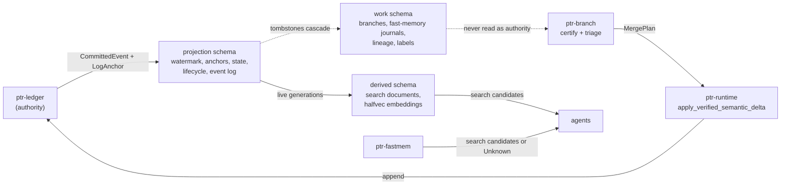

# 35 — Agentic substrate: a PostgreSQL projection, certified branches and revocable fast memory

Status: **prototype implemented** for the PostgreSQL substrate (`ptr-pg`, feature
`postgres-backend`), certified branches and their arbiter (`ptr-branch`), the
fast-weight working memory (`ptr-fastmem`), adapter lineage (`ptr-lineage`), weak
supervision (`ptr-labeling`) and the statistics kernel (`ptr-analytics`). Every
claim beyond the tests cited here is an **experiment**, listed at the end with
its falsification rule. Nothing in this document changes the authority order of
ADR-0002: the ledger stays the only authority.

Decisions: [ADR-0016](../../research/decisions/ADR-0016-postgres-projection-substrate.md),
[ADR-0017](../../research/decisions/ADR-0017-certified-agent-branches.md),
[ADR-0018](../../research/decisions/ADR-0018-revocable-fast-weight-memory.md),
[ADR-0019](../../research/decisions/ADR-0019-adapter-lineage-and-weak-supervision.md).

## What this revises, and why each part changed

The starting point was a proposal for a "Rust/Postgres agentic data platform" with
five layers: a working-memory projector holding one `vector(768)` per agent (L5), a
causal delta fabric of agents, branches, deltas and merge decisions (L4), a chain
of LoRA deltas with a forgetting-curve replay query, search and labeling tables
(L3), analytics through `pg_mooncake` and DataFusion, and Apache Iggy for events,
in nine crates. The ambition is right — one operationally simple database for an
agent platform — and every layer had a defect that would have made it either a
second authority or quietly wrong.

| Proposal | Defect | Revision | Where |
|---|---|---|---|
| Everything in one Postgres, no authority order | Postgres becomes a second authority; a restored backup or a rolled-back ledger tail is silently kept | Three schema classes; the projection verifies every record against the ledger's own anchor and is rebuilt by replay | `ptr-pg`, ADR-0016 |
| Working memory: one vector updated by a "delta rule" | A single vector is not an associative memory, and the dot product mixed key and value spaces; nothing could be revoked | Multi-head matrix state under the gated delta rule; every write attributed to one input generation; admission at every read; exact revocation by refold | `ptr-fastmem`, ADR-0018 |
| Branches, deltas and merge decisions over `entity_table`/`entity_id` | Polymorphic rows address business tables directly; merges decided by free weights; no notion of a stale read | Branches over immutable snapshots, certified against value, range and lifecycle digests; merged only as one verified semantic delta | `ptr-branch`, ADR-0017 |
| Merge "reputation" weights | An uncalibrated score can auto-merge anything | Verifier-bounded eligibility, a uniform calibration slice, finite-sample thresholds and off-policy evaluation | `ptr-branch` arbiter |
| LoRA delta chain constrained to "the null space of the sum of previous updates" | The null space of a sum is not the intersection of null spaces; chains grow without bound | Principal-angle interference per layer against its chance level; a gated lifecycle; TIES consolidation | `ptr-lineage`, ADR-0019 |
| Replay by `ORDER BY weight LIMIT n` | Deterministic, starves strata and moderately forgotten samples | FSRS-4.5 forgetting model on the training clock; stratified Gumbel-top-k sampling without replacement; held-out samples excluded by type | `ptr-lineage` |
| Label tables | Majority votes; verifier results outvotable; no calibration | Dawid-Skene with verifier vetoes, `Unknown` and `Disputed` outcomes, uniform-versus-active gold | `ptr-labeling`, ADR-0019 |
| `pg_mooncake`, DataFusion, Iggy, `ort` in the core build | MSRV and licence exposure for optional analytics | One metric vocabulary compiled per backend; mirrors and brokers are evaluation slots | `ptr-analytics`, `ptr-events` |

## Authority map



## 1. PostgreSQL in three schema classes (`ptr-pg`)

A substrate instance is three schemas derived from one prefix (`<prefix>_projection`,
`<prefix>_derived`, `<prefix>_work`). Each class has its own checksummed migration
catalog, its own `schema_migration` table and its own contract. Migrations run under
an advisory lock; an applied migration whose checksum changed (`MigrationDrift`) or
that this build does not know (`UnknownMigration`) is refused. Checksums are taken
over LF-normalised SQL, so a Windows checkout does not change a migration's
identity (`.gitattributes` also pins `*.sql` to LF). Covered by
`migrations_apply_once_and_record_their_checksums` and
`an_edited_migration_is_refused_as_drift`.

### Projection: one verified commit per transaction

The projector is the only writer. For each record it:

1. locks the watermark row `FOR UPDATE` and asks `ptr_state::classify_next` whether
   the index is the next one, a duplicate, out of order or beyond a gap — the same
   function the reference materializer and the Turso backend use;
2. for the next index, recomputes the record's anchor from the stored one with
   `ptr_ledger::integrity::chain_anchors` and compares it with the anchor the ledger
   supplied. A mismatch means the record is not the ledger's or the projection's
   prefix is not, and it is refused as `ForeignHistory`;
3. writes exactly `ptr_state::projection_entries` for the event, so no backend can
   project an event differently;
4. applies the lifecycle change keyed exactly as the runtime keys it (a capsule id,
   `constraint:<key>`, `procedure:<id>`): a new live generation, an entry in the
   append-only tombstone set, or a revision;
5. appends one row to the projection event log, records the anchor in
   `applied_commit`, advances the watermark and sends `NOTIFY` — delivered on commit
   only.

A re-delivered record is accepted as a duplicate only when its anchor equals the one
stored for its index. A revocation never changes the live generation: a generation
is admissible only when it is live **and** not tombstoned, as in the runtime.

- `replay_projects_state_and_lifecycle_exactly_as_the_reference_does` replays a log
  with every lifecycle change and compares every entry with `MaterializedState`.
- `a_redelivered_record_is_a_duplicate_and_a_different_one_is_foreign_history` and
  `a_record_that_does_not_chain_from_the_stored_anchor_is_refused` cover re-delivery
  and divergent histories.
- `a_projection_ahead_of_or_beside_the_ledger_is_refused` covers a projection ahead
  of the ledger (a discarded tail, a later backup) and one at the same index with a
  different anchor.
- `a_read_fenced_beyond_the_watermark_is_refused`: reads name a commit fence and are
  refused, not served stale, when the projection is behind.
- `append_only_tables_refuse_rewrites`: the event log, the anchors and the tombstone
  set refuse `UPDATE` and `DELETE` in the database itself.
- `consumer_offsets_only_move_forward_and_never_past_the_watermark`.
- `rebuild_drops_projection_and_derived_caches_but_keeps_working_state`: rebuild is
  drop-and-replay and reaches the same anchor.

### Derived: only live generations are ever indexed

Search documents are computed outside any projection transaction (capsule content is
not in the ledger) and keyed by capsule and generation. A writer holds the capsule's
lifecycle row `FOR SHARE` for its transaction and re-checks the tombstone set in a
statement taken after the lock; the projector updates that row before it deletes a
superseded or revoked generation's document in the same transaction. The two cannot
interleave: the write lands before the delete or sees the new generation and is
refused as `NotLive`. `a_derived_write_holding_the_lifecycle_row_is_ordered_before_the_supersede`
holds the lock from a second connection and shows the projector waiting and then
deleting the late row; `only_live_generations_are_indexed_and_superseding_drops_the_old_document`
covers the refusals.

The ordering needs every statement to take a fresh snapshot after the locks it waited
for were released, which is read committed. The projector, the cache writer, journal
appends and checkpoint stores therefore start their transactions at an explicit
`READ COMMITTED` instead of inheriting `default_transaction_isolation`: under an
operator's repeatable-read default the projector's delete would otherwise miss a row
committed while it waited
(`the_lock_ordering_holds_when_sessions_default_to_repeatable_read`).

Retrieval runs in one read-only repeatable-read snapshot:

- **Lexical:** built-in full text over a stored `tsvector` with the language-neutral
  `simple` configuration. It is the baseline, not BM25. BM25 extensions are probed
  and evaluated, never assumed: `pg_textsearch` (PostgreSQL licence) and ParadeDB
  `pg_search` (AGPL-3.0) are candidates in the lexical-search evaluation.
- **Dense:** embeddings are stored as `halfvec` (a 768-dimensional vector is 1,544
  bytes and stays inline). Each registered embedding space gets a partial HNSW index
  over the column cast to its fixed dimension, `WHERE space = '<id>'`, so one table
  holds any number of spaces. The query orders by the indexed expression alone, so
  the planner uses the index. An HNSW scan otherwise stops at `hnsw.ef_search` rows
  (40 by default) whatever the limit, so every query sets iterative scans in strict
  order and an `ef_search` of at least its limit; pgvector 0.8 is therefore the
  minimum (`vector_search_is_not_truncated_at_the_default_candidate_list`). A vector
  that is zero once rounded to half precision is refused, since it has no cosine
  distance. Registering a different definition under an existing space is refused
  (`SpaceConflict`).
- **Liveness:** every hit is joined to the lifecycle catalog of the same snapshot.
- **Fusion:** weighted reciprocal rank fusion keyed by capsule **and** generation, so
  a stale generation can never borrow the live one's rank
  (`two_generations_of_one_capsule_are_never_merged`).

`hybrid_search_returns_live_candidates_fused_by_capsule_and_generation` checks that
both modes return candidates at the lowest evidence stage and that a revocation
removes a document from both modes in the commit that revokes it.

### Work: non-authoritative state with database-enforced shape

Sealed branches with every dependency and operation, one immutable triage row per
branch, and append-only outcomes; fast-memory journals and checkpoints; the adapter catalog, its
data manifest and the replay pool; the weak-supervision store. None of it is derived
from the ledger, none of it is dropped by a rebuild, none of it is read as authority.
The database enforces the invariants a row can express: a calibration-slice branch is
an escalated eligible branch, an ineligible branch has propensity zero, a logged
triage or an outcome is never updated or deleted on its own (it goes only when its
whole branch is erased), a branch is adjudicated once, a held-out sample cannot enter
the replay pool, a consolidated
adapter has sources rather than a parent, a label schema has at least two classes.
Covered by `a_sealed_branch_round_trips_with_every_dependency_and_op`,
`triage_logs_and_outcomes_feed_the_platform_metrics` and
`working_state_constraints_hold_in_the_database`.

### Boundary rules

- Driver types never leave the adapters module; every refusal is a `PgError` with a
  stable code.
- The connection string is referenced by the name of an environment variable, never
  stored in a config file.
- The build links no TLS connector, so a non-loopback target is refused rather than
  sent credentials in the clear (`a_non_loopback_host_is_refused_without_a_tls_connector`).
  Every `hostaddr` is checked as well as every `host`, because the driver connects to
  `hostaddr` and uses `host` only as a name
  (`a_hostaddr_that_is_not_loopback_is_refused_whatever_the_host`).
- A string PostgreSQL `text` cannot hold (one containing NUL) is refused with
  `InvalidText` before anything is written. A ledger record carrying one is refused as
  `InvalidRecord`, and the PostgreSQL projection stops at it while the ledger and the
  other backends continue
  (`strings_postgresql_text_cannot_hold_are_refused_before_anything_is_written`).
- Migrations bound their DDL with `SET LOCAL lock_timeout`, so the timeout never
  leaks into the session the projector uses; a rebuild drops and recreates under the
  migration lock, so a failed lock wait never leaves the schemas dropped.
- Schema and space names are `Identifier`s (`[a-z][a-z0-9_]{0,39}`), so everything
  interpolated into DDL needs no quoting.
- The substrate never creates an extension: installing one is an operator's decision.

## 2. Certified agent branches (`ptr-branch`)

A branch is a private overlay on one immutable `SemanticSnapshot`. It declares what
its conclusions depend on: a **value digest** of every key it read (the canonical
journal bytes `ptr_semdb::canonical_input_bytes`, the same bytes neural-state
admission digests), a **range digest** of every prefix it scanned, and every
**lifecycle generation** it relied on. `Put` and `Remove` are accepted only for keys
the branch read; counter additions and set insertions and removals commute and are
rebased onto whatever the key holds at merge time. `request:` and `pod-output:` are
reserved to ingress.

Certification against a newer snapshot refuses a changed read
(`a_value_the_branch_read_that_changed_is_a_conflict_and_nothing_merges`), a phantom
under a scanned prefix (`a_key_inserted_under_a_scanned_prefix_refuses_certification`)
and a revoked or superseded relied-on generation
(`a_revoked_or_superseded_relied_on_generation_refuses_certification`). Otherwise it
returns `Clean` or `Rebased` with one `MergePlan`: an ordinary `SemanticDelta` and the
revision it was certified against. Concurrent counter additions both survive
(`two_concurrent_counter_additions_both_survive`).

A plan is committed through `Runtime::apply_verified_semantic_delta`, which
prepares the delta, hands the verifier a view of the post-state and appends only on a
`Pass` at the required level with no hard finding
(`a_certified_and_verified_branch_reaches_semantic_state_only_through_the_runtime`,
`no_score_or_shallow_level_or_hard_finding_gets_a_delta_past_verification`). A plan
certified before another commit is refused by the runtime's revision check
(`a_plan_certified_before_another_commit_is_refused_by_the_runtime`,
`a_verified_delta_against_a_moved_revision_is_refused_before_verification`).
`Runtime::generation_validity` reads a revoked generation as `Revoked` even while it
is still the live one (`a_revoked_generation_is_revoked_although_it_is_still_the_live_generation`).

Using that path is the caller's obligation, not a type-level guarantee: a `MergePlan`
exposes its delta, and the runtime's unverified `apply_semantic_delta` is public, so
nothing stops a caller from committing a plan without verification. Closing that gap
(a plan consumable only by a verifying entry point) is listed in §7.

### The arbiter: verification first, calibration second

Triage decides whether a certified plan is proposed automatically, escalated to a
person or discarded. It can move a branch towards more review, never past
verification:

- Only a `Pass` at full-semantic or deterministic level with no hard finding is
  **eligible**. A failure is discarded whatever the score
  (`a_failed_verification_discards_whatever_the_score`); disputed, unknown or shallow
  verification escalates (`disputed_unknown_or_shallow_verification_escalates_whatever_the_score`).
- A uniform **calibration slice** of eligible branches — a deterministic per-branch
  draw — is escalated for adjudication irrespective of score. Outcomes of
  auto-proposed branches are observed only through later reverts, so only this slice
  is an exchangeable sample of what the threshold decides about
  (`the_calibration_slice_escalates_high_scores_and_only_it_can_be_adjudicated`).
- The threshold is chosen on a fixed grid by conformal risk control,
  `n/(n+1) · R̂(t) + 1/(n+1) ≤ α`, which bounds the expected joint probability that
  the next eligible branch is auto-proposed and harmful
  (`a_threshold_calibrated_from_adjudicated_slices_is_used_by_the_next_policy`); or —
  recommended — by Learn-then-Test fixed-sequence testing with one-sided
  Clopper-Pearson bounds, which bounds the harm rate among auto-proposed branches with
  probability `1 − δ` (`learn_then_test_certifies_the_clean_region_and_bounds_the_harm_rate`,
  `a_certified_threshold_bounds_the_harm_rate_among_what_the_next_policy_proposes`).
- Logged propensities make IPS, SNIPS and doubly robust **off-policy evaluation** of
  a new threshold possible; a threshold below anything the log explored is refused as
  a positivity violation
  (`a_lower_threshold_than_the_log_ever_explored_is_refused_as_a_positivity_violation`,
  `evaluating_the_logging_policy_on_its_own_log_returns_its_mean_reward`).
- The slice's harm rate is estimated with a self-normalised Horvitz-Thompson rate and
  a Wilson interval on the Kish effective sample size
  (`a_calibration_slice_reweighted_by_its_rate_estimates_the_population_rate`).

## 3. Fast-weight working memory (`ptr-fastmem`)

The state is `heads` matrices `S_h ∈ R^{d_k × d_v}` updated by the gated delta rule in
its Kimi Delta Attention form and read by `o_h = S_hᵀ q_h`:

```text
S_h ← (I − β k kᵀ) · Diag(α) · S_h + β k vᵀ      k unit per head, β ∈ (0, 1]
```

`α` is a scalar (Gated DeltaNet, the default), one factor per key channel (KDA, an
ablation — random projections give channels no meaning) or absent. Gates are
journaled and must be pure functions of the write, never of the state, so a refold
without a revoked write replays exactly the gates that still apply.

Keys come from a frozen embedding through a seeded projection whose rows are
orthonormalised with modified Gram-Schmidt in `f64` (bit-identical on every
platform); values are seeded, nearly orthogonal identifier codes of the facts
written. A readout is decoded against the codes of the facts actually written into
named capsules at the lowest evidence stage, or into `Unknown` when no fact reaches
the minimum score or the best does not lead the runner-up by the minimum margin
(`an_unrelated_cue_is_unknown_rather_than_a_guess`,
`an_update_under_the_same_cue_recalls_the_newer_fact`).

Every write names its semantic input, generation and input digest. A read is admitted
only while every source is admissible
(`a_read_is_denied_while_the_state_still_depends_on_a_revoked_input`). Revoking a
source removes its writes and refolds from the last checkpoint before the first
removed write (`the_refold_restarts_from_the_last_checkpoint_before_the_revoked_write`);
because the fold is deterministic `f32` arithmetic, the result is bit-identical to a
memory that never saw the writes
(`revoking_a_source_leaves_exactly_the_state_that_never_saw_it`).

A restore needs the writes **as composed**, before key normalisation: re-admitting a
normalised key normalises it again and can change its bits. The in-process journal
(`FastMemory::writes`) holds admitted, normalised writes and is not such a journal;
the storage keeps each `WriteRequest` instead
(`a_restored_journal_folds_to_the_same_state_as_the_live_memory` restores from the
requests themselves).

In PostgreSQL the journal stores each `WriteRequest` as `f32` bit patterns, so a
restore re-admits the same bits. A tombstone deletes the revoked generation's writes,
and a supersession every other generation's, together with every checkpoint that
folded one of them, in the projector's transaction; an append from an inadmissible
source is refused under the same row lock as a search document
(`a_revocation_deletes_exactly_the_revoked_writes_and_the_checkpoints_that_folded_them`
restores from the stored journal and compares bits,
`superseding_a_source_removes_its_fast_memory_writes`,
`a_write_from_an_inadmissible_source_or_out_of_sequence_is_refused`). An append locks
the memory row and reads the journal in a statement after that lock, so two
concurrent appends cannot both pass the sequence and capacity checks
(`an_append_that_waited_for_another_sees_its_write`).

A checkpoint is bound to `binding_digest_of` its folded writes — their sequence
numbers, source keys, generations and input digests; the digest binds which writes
were folded, not their key and value bits. `put_checkpoint` recomputes it from the
stored journal prefix, holding those rows `FOR SHARE`, and refuses a mismatch;
`latest_checkpoint` recomputes it again and skips any checkpoint that no longer folds
the stored prefix, so a fold of a revoked input is never handed out
(`a_checkpoint_that_does_not_fold_the_stored_journal_is_refused_or_skipped`).

This is **exact revocation, not erasure**: copies of a deleted write may survive in
dead tuples, WAL and backups until the storage's own erasure obligations
([25](25-erasure-and-retention.md)) remove them.

## 4. Adapter lineage (`ptr-lineage`)

An adapter is a sealed, content-addressed checkpoint bound to one exact base model
and revision, with a data manifest. Registration always yields a candidate; only a
passing forgetting gate — thresholds on average and per-task forgetting, backward
transfer and public-suite regression — lets it serve (`only_a_passing_gate_lets_an_adapter_serve`).
Revoking a training input names every adapter, descendant and consolidation that
depends on it (`revoking_one_input_names_its_adapter_every_descendant_and_every_consolidation`).

Interference is the principal-angle overlap `‖Q_iᵀ Q_j‖²_F / min(r_i, r_j)` of the
column and row spaces of `ΔW = B A`, layer by layer, reported against the overlap two
random subspaces of those ranks would have. The bases are those of the product,
computed from the factors without forming it (`B A = Q M` with `Q` a basis of `col(B)`
and `M = QᵀB A`): taking `col(B)` and `row(A)` instead overstates the rank of
rank-deficient factors and can understate overlap
(`a_rank_deficient_update_is_measured_on_its_product_not_its_factors`,
`adapters_on_orthogonal_subspaces_do_not_interfere`,
`sharing_an_output_direction_is_full_output_overlap_and_names_the_culprit`). When a
lineage grows too deep or too entangled, the next step is a TIES merge of the full
updates into one consolidated adapter
(`consolidation_resets_depth_and_is_due_past_the_policy_limits`).

Replay samples carry an FSRS-4.5 memory state updated from probe losses on the
training clock, not wall time; priority grows with forgetting and difficulty, and
draws are stratified and without replacement by Gumbel-top-k
(`forgotten_samples_are_drawn_far_more_often_than_retained_ones`). A held-out sample
can never be pooled (`a_held_out_sample_can_never_enter_the_pool`), in Rust and by a
column constraint in PostgreSQL.

Until adapter promotion is a committed ledger event admitted through checkpoint
binding, no registry row decides which adapter serves.

## 5. Weak supervision (`ptr-labeling`)

Labeling functions vote a class or abstain. Verifier-backed functions only veto: they
rule classes out and are never outvoted, and a verifier class vote is refused
(`a_verifier_casting_a_class_vote_is_refused`). A Dawid-Skene model estimates each
modelled function's confusion matrix by expectation maximisation
(`the_label_model_recovers_function_accuracies_and_beats_majority_vote`) and warns
when fewer than three functions make it unidentifiable
(`fewer_than_three_modelled_functions_are_reported_as_unidentifiable`). An item
resolves to `Determined` (every other class vetoed), `Estimated` at or above the
required probability, `Unknown`, or `Disputed` when every class is vetoed
(`a_verifier_veto_overrides_a_confident_model_and_vetoing_everything_is_a_dispute`).
Gold labels record their source and whether they were sampled uniformly or
actively. Only uniform gold estimates population accuracy and calibration; on active
gold the evaluation reports accuracy on the sampled items only and withholds
calibration. Calibration (Brier, ECE) comes from `ptr-analytics`, which also provides
Krippendorff's α for multi-annotator gold; the labeling crate does not compute
agreement yet.

## 6. Metrics and change distribution

`ptr-analytics` defines each platform metric once, as a proportion over working
records, and computes its interval
(`a_metric_row_turns_into_an_interval_that_contains_its_point`); `ptr-pg` compiles
the definition to SQL over the work schema only. A columnar mirror (`pg_duckdb`, an
Iceberg mirror, DataFusion) is an evaluation slot and never feeds back into state.

The projection event log is the substrate's change feed: written in the transaction
that advances the watermark, read in commit order up to the watermark, with
per-consumer offsets that only move forward. `ptr-events` defines the bus contract —
at-least-once delivery (`an_uncommitted_record_is_delivered_again`) and backpressure
instead of loss (`a_slow_consumer_blocks_producers_instead_of_losing_records`) —
with Apache Iggy, NATS and Kafka as candidates behind it.

## 7. Deliberately not implemented

- **A PostgreSQL effect applier for business tables.** The runtime's action executor
  is synchronous and a verified dispatch carries no attempt index to use as an
  idempotency key; business tables stay behind the effect boundary (ADR-0012) until
  both exist.
- **Platform read routes in `ptr-server`.** They would expose working state without
  authentication.
- **TLS, separate projector/reader/migrator roles, row-level security, pooling and a
  logical-replication consumer.** Until TLS exists the substrate refuses remote hosts.
- **A merge plan that can only be committed through verification.** Today it is the
  caller's obligation (§2): `MergePlan` exposes its delta and the runtime's unverified
  `apply_semantic_delta` is public.
- **Strings containing NUL in the PostgreSQL substrate.** PostgreSQL `text` cannot
  hold them; they are refused with a typed error, and the PostgreSQL projection stops
  at a ledger record carrying one.
- **Adapters for the lineage and labeling tables.** The schema and its constraints
  exist and are tested; the Rust models are in-memory working models.
- **`pg_mooncake`, DataFusion, the Iggy SDK and `ort` as dependencies.** None is
  needed by a projection, and each would raise the MSRV or the licence surface of the
  core build.
- **Erasure of storage copies.** See §3.

## 8. Experiments and evaluations

| Id | Question | Hard failure |
|---|---|---|
| [L004](../../experiments/lifecycle/L004-projection-equivalence/README.md) | Is a replayed PostgreSQL projection always equal to the reference, and is every foreign history refused? | any divergence or accepted foreign history |
| [Q003](../../experiments/retrieval/Q003-postgres-hybrid/README.md) | Does generation-joined hybrid retrieval match the reference stack's recall? | any stale-generation hit |
| [S003](../../experiments/semdb/S003-certified-branches/README.md) | Do certified branches avoid lost updates and phantoms while beating serial execution? | any lost update or undetected phantom |
| [F003](../../experiments/feedback/F003-calibrated-arbiter/README.md) | Does the arbiter keep the auto-proposal harm rate at or below α? | upper bound above α on held-out adjudications |
| [M008](../../experiments/model/M008-fast-weight-memory/README.md) | Does fast memory improve update-aware recall at equal tokens? | false recall above the recency baseline |
| [L003](../../experiments/lifecycle/L003-fastmem-revocation/README.md) | Can a revoked input influence a readout after revoke, replay, restore or crash? | any bit difference or resurrected read |
| [R004](../../experiments/runtime/R004-adapter-lineage/README.md) | Does gated lineage with replay and consolidation forget less than a naive chain? | public regression beyond the gate |
| [F002](../../experiments/feedback/F002-weak-supervision/README.md) | Is the verifier-precedence label model better calibrated than majority vote? | any label contradicting a verifier veto |
| [E005](../../experiments/system/E005-agent-memory-benchmark/README.md) | Does the combined stack beat current agent-memory systems on LongMemEval and LoCoMo? | no category improvement at equal budget |

Evaluations: [relational-substrate](../../evaluations/components/relational-substrate/README.md),
[fast-weight-memory](../../evaluations/components/fast-weight-memory/README.md),
[label-model](../../evaluations/components/label-model/README.md),
[adapter-serving](../../evaluations/components/adapter-serving/README.md),
[analytics-mirror](../../evaluations/components/analytics-mirror/README.md), and
PostgreSQL candidates added to materialized-state, lexical-search,
local-vector-search and event-streaming.

## 9. Toolchain

PostgreSQL 16 or later with pgvector 0.8 or later (`halfvec` and the iterative index
scans every vector query uses). The driver is `tokio-postgres` 0.7.18 without default features,
which builds on the workspace MSRV 1.85. The integration tests need
`PTR_PG_TEST_DSN` naming a loopback server and run in CI as the `state-postgres` job
against a pgvector service container, on stable and on 1.85.
