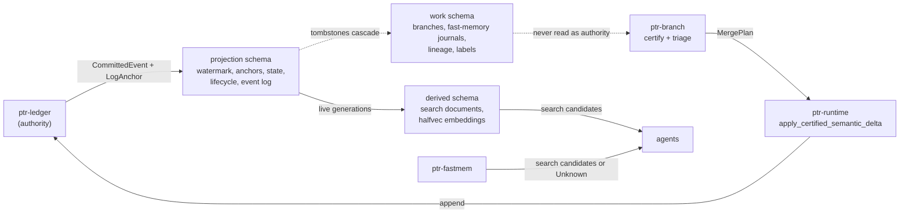

# 35 — Agentic substrate: a PostgreSQL projection, certified branches and revocable fast memory

Status: **prototype implemented** for the PostgreSQL substrate (`ptr-pg`, feature
`postgres-backend`), certified branches and their arbiter (`ptr-branch`), the
fast-weight working memory (`ptr-fastmem`), adapter lineage (`ptr-lineage`), weak
supervision (`ptr-labeling`) and the statistics kernel (`ptr-analytics`). Every
claim beyond the tests cited here is an **experiment**, listed at the end with
its falsification rule. Nothing in this document changes the authority order of
ADR-0002: the ledger stays the only authority.

Decisions: [ADR-0016](../../research/decisions/ADR-0016-postgres-projection-substrate.md),
[ADR-0017](../../research/decisions/ADR-0017-certified-agent-branches.md),
[ADR-0018](../../research/decisions/ADR-0018-revocable-fast-weight-memory.md),
[ADR-0019](../../research/decisions/ADR-0019-adapter-lineage-and-weak-supervision.md).

## What this revises, and why each part changed

The starting point was a proposal for a "Rust/Postgres agentic data platform" with
five layers: a working-memory projector holding one `vector(768)` per agent (L5), a
causal delta fabric of agents, branches, deltas and merge decisions (L4), a chain
of LoRA deltas with a forgetting-curve replay query, search and labeling tables
(L3), a business/ERP data model of SeaORM entities standing in for Odoo (L2), and
storage engines (L1): PostgreSQL with pgvector, Lance files on object storage for ML
datasets and Apache Iggy for events, with analytics through `pg_mooncake` and
DataFusion; all in nine crates. The ambition is right — one operationally simple
database for an agent platform — and every layer had a defect that would have made
it either a second authority or quietly wrong. The table below revises the main
defects; every other idea the proposal named is decided, one row each, at the end
of §7.

| Proposal | Defect | Revision | Where |
|---|---|---|---|
| Everything in one Postgres, no authority order | Postgres becomes a second authority; a restored backup or a rolled-back ledger tail is silently kept | Three schema classes; the projection verifies every record against the ledger's own anchor and is rebuilt by replay | `ptr-pg`, ADR-0016 |
| Working memory: one vector updated by a "delta rule" | A single vector is not an associative memory, and the dot product mixed key and value spaces; nothing could be revoked | Multi-head matrix state under the gated delta rule; every write attributed to one input generation; admission at every read; exact revocation by refold | `ptr-fastmem`, ADR-0018 |
| Branches, deltas and merge decisions over `entity_table`/`entity_id` | Polymorphic rows address business tables directly; merges decided by free weights; no notion of a stale read | Branches over immutable snapshots, certified against value, range and lifecycle digests; merged only as one verified semantic delta | `ptr-branch`, ADR-0017 |
| Merge "reputation" weights | An uncalibrated score can auto-merge anything | Verifier-bounded eligibility, a uniform calibration slice, finite-sample thresholds and off-policy evaluation | `ptr-branch` arbiter |
| LoRA delta chain constrained to "the null space of the sum of previous updates" | The null space of a sum is not the intersection of null spaces; chains grow without bound | Principal-angle interference per layer against its chance level; a gated lifecycle; TIES consolidation | `ptr-lineage`, ADR-0019 |
| Replay by `ORDER BY weight LIMIT n` | Deterministic, starves strata and moderately forgotten samples | FSRS-4.5 forgetting model on the training clock; stratified Gumbel-top-k sampling without replacement; held-out samples excluded by type | `ptr-lineage` |
| Label tables | Majority votes; verifier results outvotable; no calibration | Dawid-Skene with verifier vetoes, `Unknown` and `Disputed` outcomes, uniform-versus-active gold | `ptr-labeling`, ADR-0019 |
| `pg_mooncake`, DataFusion, Iggy, `ort` in the core build | MSRV and licence exposure for optional analytics | One metric vocabulary compiled per backend; mirrors and brokers are evaluation slots | `ptr-analytics`, `ptr-events` |

## Authority map


```mermaid
flowchart LR
    L["ptr-ledger\n(authority)"] -->|"CommittedEvent + LogAnchor"| P["projection schema\nwatermark, anchors, state,\nlifecycle, event log"]
    P -->|"live generations"| D["derived schema\nsearch documents,\nhalfvec embeddings"]
    P -. "tombstones cascade" .-> W["work schema\nbranches, fast-memory journals,\nlineage, labels"]
    B["ptr-branch\ncertify + triage"] -->|"MergePlan"| R["ptr-runtime\napply_certified_semantic_delta"]
    R -->|"append"| L
    W -. "never read as authority" .-> B
    D -->|"search candidates"| A["agents"]
    F["ptr-fastmem"] -->|"search candidates or Unknown"| A
```

## 1. PostgreSQL in three schema classes (`ptr-pg`)

A substrate instance is three schemas derived from one prefix (`<prefix>_projection`,
`<prefix>_derived`, `<prefix>_work`); `pg` and any prefix beginning `pg_` are refused,
since PostgreSQL reserves names beginning `pg_` for system schemas and would refuse to
create them (`a_prefix_yields_three_distinct_schemas`). `connect_with` refuses any
other set of names (`InvalidSchemaSet`), so the three are distinct and two instances
either are one or share no schema: a rebuild never drops, and a projector never
writes, another instance's schema, and the migration lock, keyed by the projection
schema's name, covers all three
(`a_schema_set_is_accepted_only_as_the_three_schemas_of_one_prefix`,
`a_schema_set_not_made_from_one_prefix_is_refused_before_it_connects`). `drop_all`,
for tests and decommissioning, drops the three schemas without taking the lock, so
its caller keeps every other session of the instance away. Each class has its own checksummed migration
catalog, its own `schema_migration` table and its own contract. Migrations run under
an advisory lock; an applied migration whose checksum changed (`MigrationDrift`) or
that this build does not know (`UnknownMigration`) is refused. Checksums are taken
over LF-normalised SQL, so a Windows checkout does not change a migration's
identity (`.gitattributes` also pins `*.sql` to LF). Covered by
`migrations_apply_once_and_record_their_checksums` and
`an_edited_migration_is_refused_as_drift`. The lock is held by a session of its own,
opened to the same checked loopback target, while the migrations run on the
substrate's session: a migration or rebuild whose future is cancelled or unwinds
releases the lock when that session closes, rather than leaving it with a session
that stays open, and a retry takes it afresh instead of re-entering it
(`a_migration_cancelled_while_holding_the_lock_does_not_block_the_next_migrator`,
`a_migration_retried_after_a_cancellation_completes_and_leaves_no_lock_held`,
`a_rebuild_cancelled_while_holding_the_lock_releases_it_and_keeps_the_schemas`).
The lock is taken with `pg_try_advisory_lock`, retried while another session holds
it, so no statement waits on it: a migration cancelled while it waits leaves no
session queued on the lock
(`a_migration_cancelled_while_waiting_for_the_lock_leaves_no_session_behind`). The
lock's session turns `idle_session_timeout` off, since it is idle while the
migrations run, and every migration and the rebuild's drop commit only after that
session has confirmed it still holds the lock; a lock lost to a terminated session
rolls the change back with `MigrationLockLost` rather than letting a second migrator
run beside it
(`the_migration_lock_outlives_an_idle_session_timeout_while_a_migration_runs`,
`a_migration_whose_lock_session_ends_rolls_back_instead_of_committing_unlocked`,
`a_rebuild_whose_lock_session_ends_keeps_the_schemas_it_was_dropping`).

### Projection: one verified commit per transaction

The projector is the only writer. For each record it:

1. locks the watermark row `FOR UPDATE` and asks `ptr_state::classify_next` whether
   the index is the next one, a duplicate, out of order or beyond a gap — the same
   function the reference materializer and the Turso backend use;
2. for the next index, recomputes the record's anchor from the stored one with
   `ptr_ledger::integrity::chain_anchors` and compares it with the anchor the ledger
   supplied. A mismatch means the record is not the ledger's or the projection's
   prefix is not, and it is refused as `ForeignHistory`;
3. writes exactly `ptr_state::projection_entries` for the event, so no backend can
   project an event differently;
4. applies the lifecycle change keyed exactly as the runtime keys it (a capsule id,
   `constraint:<key>`, `procedure:<id>`): a new live generation, an entry in the
   append-only tombstone set, or a revision;
5. appends one row to the projection event log, records the anchor in
   `applied_commit`, advances the watermark and sends `NOTIFY` — delivered on commit
   only.

A re-delivered record is accepted as a duplicate only when its anchor equals the one
stored for its index. A revocation never changes the live generation: a generation
is admissible only when it is live **and** not tombstoned, as in the runtime.

- `replay_projects_state_and_lifecycle_exactly_as_the_reference_does` replays a log
  with every lifecycle change and compares every entry with `MaterializedState`.
- `a_redelivered_record_is_a_duplicate_and_a_different_one_is_foreign_history` and
  `a_record_that_does_not_chain_from_the_stored_anchor_is_refused` cover re-delivery
  and divergent histories.
- `a_projection_ahead_of_or_beside_the_ledger_is_refused` covers a projection ahead
  of the ledger (a discarded tail, a later backup) and one at the same index with a
  different anchor.
- `a_read_fenced_beyond_the_watermark_is_refused`: reads name a commit fence and are
  refused, not served stale, when the projection is behind.
- `append_only_tables_refuse_rewrites`: the event log, the anchors and the tombstone
  set refuse `UPDATE` and `DELETE` in the database itself, and `TRUNCATE` too
  (projection migration 2,
  `tables_whose_rows_are_never_removed_on_their_own_refuse_truncate`).
- `consumer_offsets_only_move_forward_and_never_past_the_watermark`.
- `rebuild_drops_projection_and_derived_caches_but_keeps_working_state`: rebuild is
  drop-and-replay and reaches the same anchor.

### Derived: only live generations are ever indexed

Search documents are computed outside any projection transaction (capsule content is
not in the ledger) and keyed by capsule and generation. A writer holds the capsule's
lifecycle row `FOR SHARE` for its transaction and re-checks the tombstone set in a
statement taken after the lock; the projector updates that row before it deletes a
superseded or revoked generation's document in the same transaction. The two cannot
interleave: the write lands before the delete or sees the new generation and is
refused as `NotLive`. `a_derived_write_holding_the_lifecycle_row_is_ordered_before_the_supersede`
holds the lock from a second connection and shows the projector waiting and then
deleting the late row; `only_live_generations_are_indexed_and_superseding_drops_the_old_document`
covers the refusals. A generation has one content: indexing it again with the stored
`content_digest` re-embeds it, and another digest is refused as `DocumentConflict`
with the stored document kept, so a stale or erroneous indexing job cannot replace a
live generation's document
(`a_generation_is_indexed_from_one_content_and_re_embedded_only_with_it`). That the
first digest is the capsule's is its writer's obligation.

The ordering needs every statement to take a fresh snapshot after the locks it waited
for were released, which is read committed. The projector, the cache writer, journal
appends and checkpoint stores therefore start their transactions at an explicit
`READ COMMITTED` instead of inheriting `default_transaction_isolation`: under an
operator's repeatable-read default the projector's delete would otherwise miss a row
committed while it waited
(`the_lock_ordering_holds_when_sessions_default_to_repeatable_read`).

Retrieval runs in one read-only repeatable-read snapshot:

- **Lexical:** built-in full text over a stored `tsvector` with the language-neutral
  `simple` configuration. It is the baseline, not BM25. BM25 extensions are probed
  and evaluated, never assumed: `pg_textsearch` (PostgreSQL licence) and ParadeDB
  `pg_search` (AGPL-3.0) are candidates in the lexical-search evaluation.
- **Dense:** embeddings are stored as `halfvec` (a 768-dimensional vector is 1,544
  bytes and stays inline). Each registered embedding space gets a partial HNSW index
  over the column cast to its fixed dimension, `WHERE space = '<id>'`, so one table
  holds any number of spaces. `register_space` writes the catalog row and builds the
  index in one transaction, so an index that cannot be built leaves a new space
  unregistered rather than registered without it
  (`a_space_whose_index_cannot_be_built_is_left_unregistered`). The query orders by
  the indexed expression alone, so
  the planner can read the index in order
  (`the_filtered_vector_query_reads_its_space_s_hnsw_index`). An HNSW scan otherwise
  stops at `hnsw.ef_search` rows (40 by default) whatever the limit, so every query
  sets iterative scans in strict order and an `ef_search` of its limit, at least 40 and
  at most the 1,000 pgvector accepts; pgvector 0.8 is therefore the minimum
  (`vector_search_is_not_truncated_at_the_default_candidate_list`). An iterative scan
  reads on in distance order until `limit` rows pass every condition, or until it has
  visited `hnsw.max_scan_tuples` tuples (20,000 by default) or used
  `hnsw.scan_mem_multiplier` times `work_mem`; past that bound a selective project
  filter, many stale rows or a large limit return fewer hits than match, and nothing
  reports it. The hits are approximate nearest neighbours, not necessarily the
  nearest. A vector
  that is zero once rounded to half precision is refused, since it has no cosine
  distance. Registering a different definition under an existing space is refused
  (`SpaceConflict`).
- **Liveness:** each mode keeps a document only if, in the same snapshot, its
  generation is live **and** not tombstoned, so a revoked generation is never
  returned although a revocation leaves it the capsule's live generation
  (`a_document_of_a_revoked_generation_is_never_returned_although_it_is_still_live`).
  The condition is part of the limited scan, before `limit` applies, so a stale or
  revoked row the cache still holds never takes a live document's place
  (`a_stale_cache_row_never_takes_a_live_document_s_place_within_the_vector_limit`).
  In process, `retain_live` asks the lifecycle for each hit's validity, as
  `generation_validity` answers it, rather than for the capsule's live generation, and
  keeps only `Live`
  (`a_revoked_generation_is_dropped_although_it_is_still_the_live_one`,
  `search_hits_filtered_by_generation_validity_drop_a_revoked_live_generation`).
  Promotion asks the same question again: `SearchHit::observe` takes the lifecycle's
  validity answer for the hit's own capsule and generation and moves the hit to
  `Observed` only on `Live`, so a revoked generation that is still the live one is
  refused at use as well
  (`a_revoked_generation_is_never_observed_although_it_is_still_the_live_one`).
  A hit's capsule and generation are private, fixed by `SearchHit::new` and read
  through accessors, so the generation `promote_verified` promotes is the one
  `observe` asked about: a hit observed live can no longer be renamed to a revoked
  generation and then promoted
  (`a_hit_is_promoted_as_the_capsule_and_generation_the_lifecycle_answered_live_for`,
  and `compile_fail` examples on `SearchHit`). `promote_verified` does not ask the
  lifecycle again, so a revocation committed after `observe` answered is not seen.
- **Fusion:** weighted reciprocal rank fusion keyed by capsule **and** generation, so
  a stale generation can never borrow the live one's rank
  (`two_generations_of_one_capsule_are_never_merged`). Every fused score is finite:
  weights must be finite, nonnegative and sum to at most `f32::MAX`, the rank constant
  finite and nonnegative, and a list may name a capsule generation once, so no hit
  gains more than the total weight; scores are accumulated and min-max normalised in
  `f64`, where the range of any two finite scores is finite
  (`weights_whose_total_could_overflow_a_fused_score_are_refused`,
  `a_list_naming_one_capsule_generation_twice_is_refused`,
  `scores_spanning_the_whole_f32_range_normalise_into_zero_to_one`). The hybrid query
  refuses such parameters before any SQL runs
  (`invalid_search_parameters_are_refused_before_sql`).

`hybrid_search_returns_live_candidates_fused_by_capsule_and_generation` checks that
both modes return candidates at the lowest evidence stage and that a revocation
removes a document from both modes in the commit that revokes it.

### Work: non-authoritative state with database-enforced shape

Sealed branches with every dependency and operation, one immutable triage row per
branch, and append-only outcomes; fast-memory journals and checkpoints; the adapter catalog, its
data manifest and the replay pool; the weak-supervision store. None of it is derived
from the ledger, none of it is dropped by a rebuild, none of it is read as authority.
The database enforces the invariants a row can express: a calibration-slice branch is
an escalated eligible branch, an ineligible branch has propensity zero, a logged
triage or an outcome is never updated or deleted on its own (it goes only when its
whole branch is erased), a branch is adjudicated once, a held-out sample cannot enter
the replay pool, a consolidated
adapter has sources rather than a parent, a label schema has at least two classes, a
triage row logged since policies are recorded cites a recorded policy, a policy and its calibration set are
never rewritten and the set is complete when the policy commits (a sample appended
later is refused), a branch one was calibrated on cannot be deleted, not even by a
statement that writes it again under its id (the key is `ON DELETE RESTRICT`), only a model
labeling function names an adapter, and an adapter has at most one interference
report, which is complete when it commits, stays within `[0, 1]` and is never
rewritten. The size of a calibration set and of an interference report is checked
by counting it once, at commit for its header row and at the end of each statement
that adds to it, so recording a set of N rows in one statement reads O(N) rows
rather than a count per row.
Work migration 9 adds what the Rust constructors enforce and the rows did not, so a
row written around them is refused by the database. A stored branch is never
rewritten, and when its transaction commits every `Put` or `Remove` names a key it
read, every operated key has its base value and input set, a base value is recorded
only for an operated key and equals that key's read, no operation writes a reserved
namespace, a set member is non-empty and an operation carries only its kind's value
columns (`branch_rows_written_directly_keep_every_sealing_invariant`). A triage row
keeps the rules every policy shares: verification alone never auto-proposes, an
eligible branch is never discarded, outside the slice it is auto-proposed exactly when
its propensity is positive, and a slice propensity is below one
(`a_triage_row_keeps_the_rules_every_policy_shares`); a revert needs an earlier merge.
Work migration 10 adds the rules of the policy a triage row cites
(`TriagePolicy::explains` for that recorded, never rewritten policy, checked after the
table's own checks and the policy's foreign key): an eligible row carries exactly the
propensity the policy logs for its score, a slice row needs a positive rate, and
outside the slice a row is auto-proposed exactly when the threshold admits its score.
A raw row the cited policy cannot have produced, such as a slice row of a policy with
no slice, used to reach the calibration samples and every triage metric; over a grid
of rows under three policies the database now stores exactly those the policy
explains (`a_raw_triage_row_is_stored_exactly_when_its_cited_policy_explains_it`).
The trigger sees only rows written from version 10 on, so `adjudicated_samples`,
`record_policy` and `load_policy` rebuild every calibration row through
`TriageOutcome::from_parts` and recheck it against the policy it cites when they read
it, and refuse as `CorruptRow`, rather than serve as a calibration sample, an older
slice row no policy or not that policy can have produced, or one citing a version no
table recorded (`a_calibration_row_its_cited_policy_cannot_have_produced_is_refused_by_every_reader`,
`a_calibrated_policy_loads_only_when_its_rule_on_its_calibration_branches_chooses_it`);
the triage metrics still count such older rows. A
policy's calibration rate is zero or lowers `1 − rate` below one, as
`TriagePolicy::new` requires, and a policy stored before that check loads and is cited
as `CorruptRow` rather than failing a row's CHECK
(`a_calibration_rate_too_small_to_lower_the_propensity_is_refused_at_storage`).
Work migration 11 adds what migration 9 left to the loaders or checked only when the
rows it compares with happened to come first. A stored branch never grows: its reads,
scans, reliances, touched keys and operations are accepted only in the transaction
that writes its header, released and open savepoints included, so a group of rows
every deferred check accepts is refused when appended later
(`a_stored_branch_gains_no_row_in_a_later_transaction`). This binds a branch's rows
to one transaction, not to its author: a writer with the work schema's privileges can
still delete a whole branch and write other rows under its id in one transaction, as
`store_branch` writes a branch, and nothing stored tells them from sealed ones; the
keyed seal tag planned next is what would. A set operation's `in_base` is stored in
`branch_op.member_in_base`, present exactly for set operations, and the operations on
one member agree on it; a branch stored before has none, can no longer be certified
and loads as `BranchWithoutSetBase`
(`set_operations_keep_their_members_base_presence_in_storage`). The two sealing rules
that compare a digest with the digest of absence or of the empty set (no member present
in a base without its key; a `Remove` only of a key with no inputs) are left to
`load_branch`. Sealing once accepted a `Remove` of a derived key, so rows recording one
load as `BranchWithDerivedRemoval`, a branch to re-run, not as `CorruptBranch`, which
names rows no sealing produced, but only when the removal is the only sealing rule they
break (`SealedBranch::from_parts` reports a derived removal last) and no set operation
records its member's base presence, which that sealing never recorded
(`a_branch_sealed_before_derived_removals_were_refused_loads_as_one_to_re_run`); beside
either, the rows are `CorruptBranch`, whichever operation comes first
(`a_derived_removal_beside_rows_no_sealing_produced_loads_as_a_corrupt_branch`). A
journal row satisfies `validate_write` for its memory's configuration, decoded from its
little-endian `f32` cells (finite key cells and no all-zero head, finite values within
`MAX_VALUE_MAGNITUDE`, decay factors in `(0, 1]`), over a set of cells exactly where
the Rust check draws the line
(`journal_cells_are_stored_exactly_when_validate_write_admits_them`); a journal holds
at most its memory's `max_writes` rows, counted after a no-change update of the
memory row that orders appends at every isolation level (a writer at repeatable read
that could not see a concurrent append fails with a serialization error)
(`a_journal_holds_at_most_its_memory_s_max_writes_rows_from_any_writer`); and no write
takes a sequence number at or above `i64::MAX`, the journal's limit (`JOURNAL_SEQ_LIMIT`).
`restore_memory` restores every memory with that limit (`FastMemory::with_sequence_limit`),
as a `FastMemory` takes no number at or above `u64::MAX`, so a journal ending at
`i64::MAX - 1` restores to a memory that refuses its next write as `SequenceExhausted`
before folding it, rather than one that folds a write no row can hold; sequence numbers
are the caller's, gaps included, so such a registration takes no further write however
few rows it holds. Both journal loaders refuse a row at `i64::MAX` written before the
check as a corrupt row
(`a_restored_memory_never_takes_a_sequence_number_its_journal_refuses`). Work
migration 12 keeps that true across revocation. A `FastMemory` keeps every number it
took (`FastMemory::revoke` leaves its next number where it was), but revocation
deletes journal rows, so an append checked against the journal's last row, or a
memory restored from it, took a revoked write's number again, and a journal ending at
`i64::MAX - 1` took further writes once its last write was revoked. Each memory now
keeps a sequence high-water mark (`fastmem_memory.last_seq`), the largest number ever
journaled for it: a journal row's number must exceed it and becomes it, read under the
no-change update that orders appends, and the mark never falls, the only column of a
registration that changes. `append_write` refuses a number at or below it, and
`restore_memory` numbers the next write above it
(`FastMemory::with_sequence_high_water`), as the live memory does, so a revoked write's
number is never journaled or handed out again, and a registration whose journal
reached `i64::MAX - 1` takes no further write whatever is revoked since
(`a_revoked_write_s_sequence_number_is_never_journaled_or_handed_out_again`). A memory
registered before the migration starts from its journal's last number, `i64::MAX - 1`
for a journal holding a row at `i64::MAX`; the numbers of writes revoked before it were
not kept
(`a_journal_written_before_its_high_water_mark_was_kept_keeps_the_numbers_it_held`).
A registration whose state exceeds `MAX_STATE_CELLS`, which migration 9's NOT VALID
check leaves in place and every loader refuses, keeps mark zero: PostgreSQL checks
NOT VALID constraints on every row an UPDATE writes, so rewriting it failed the
upgrade, and migration 12 was corrected before release to skip it
(`a_work_schema_holding_a_registration_beyond_the_state_bound_still_upgrades`).
`load_journal` returns the rows alone, and a memory restored from them numbers its next
write after the last. A
registered adapter is retired, never deleted, so its data manifest and its id stay
(`a_registered_adapter_is_retired_never_deleted`). Every table whose rows are never
removed on their own refuses `TRUNCATE`, which fires no row trigger
(`tables_whose_rows_are_never_removed_on_their_own_refuse_truncate`). A check made when
a row is written against another row (an adapter's parent or source, a write's memory,
a probe's sample, a vote's function and schema, a gold label's schema) refuses the row
when that row is missing instead of leaving it to the foreign key, which is checked at
the end of the statement and so accepted a parent written later in the same statement
(`a_row_checked_against_another_is_refused_when_that_row_comes_later_in_its_statement`).
Work migration 13 closes three rules that held only for writers that did not race or
nest their writes or undo them within one statement. An update that changes a replay sample leaves its last probe at or after
every probe stored for it, where it was compared only with the row it replaced, and
a probe locks its sample's row before it is checked, so a probe and a sample update
of one sample, or two probes of it, wait for each other at read committed instead of
each checking against what the other has not committed
(`a_sample_s_last_probe_never_falls_behind_a_probe_stored_for_it`). Migration 13
also had every probe update its sample's row without change when its transaction
committed, which `check_replay_clock` let through unchecked; nothing compared the
sample with the probe, so a probe past the sample's last probe committed with the
sample left behind it. Work migration 14 replaces that update with a deferred check:
a probe's transaction commits only once its sample's last probe is at or after every
probe stored for the sample, and every update of a sample is checked, one that
leaves the row as it was included
(`a_probe_commits_only_once_its_sample_s_last_probe_reaches_it`). The check keeps the
order at repeatable read, where a row a committed transaction only locked is locked
and updated again without error: a probe past the last probe commits only with an
update of the row by its own transaction, which fails a writer whose snapshot
predates it with a serialization error, and a probe at the last probe itself leaves
nothing such a writer could contradict. Deferred to commit and writing no row, it
lets a statement that records a probe and updates its sample be stored however it
nests the two, each write checked as it would be in a statement of its own
(`a_statement_that_records_a_probe_may_then_update_its_sample`); a no-change update
from the probe's `BEFORE` trigger, or from one fired at the end of the probe's
statement when a function that the `UPDATE` of the sample calls writes the probe,
left the row changed by the current command, which PostgreSQL refuses with SQLSTATE
27000. A later statement of the probe's transaction may still delete the sample, and
the probe with it, and a writer that sets the check immediate with `SET CONSTRAINTS`
has it run at the end of each statement
(`a_probe_a_function_writes_inside_an_update_of_its_sample_is_stored`). Stored rows
are not checked: a sample a version 13 transaction left behind its probe is caught
up by its next write
(`a_sample_version_13_left_behind_its_probe_catches_up_with_its_next_write`).
And an append-only row used to be deletable by any DELETE issued below another trigger
(`pg_trigger_depth() > 1`, meant for the cascade from its branch or sample), so a
trigger the writer created removed a policy's calibration row or an adjudication that
could then be written again with the opposite verdict; now a row of a branch or
sample is deleted only once its parent row is gone, and policies, calibration sets,
interference reports, adapter sources and data manifests are never deleted
(`a_row_that_goes_only_with_its_parent_is_never_deleted_by_a_trigger`). A branch's
rows going with it left one path to an adjudication of a calibration branch: the
calibration row's foreign key was `NO ACTION`, checked at the end of the statement,
so one statement that deleted the branch, then each of its rows, and wrote the
branch again under its id passed, and the opposite verdict could then be written
under the policy. The key is now `ON DELETE RESTRICT`, which refuses the delete
whatever the statement writes after it
(`a_calibration_branch_deleted_and_written_again_in_one_statement_is_refused`). The
keys naming a label schema (from items and snapshots) and a labeling function (from
votes) were `NO ACTION` too, and schemas and functions refused only `UPDATE`, so one
statement could delete a schema and write it again with its classes cut or
reordered, or a function as a verifier: the stored votes and gold labels then named
other classes, and a verifier held class votes. Those keys are `ON DELETE RESTRICT`
as well; a parent nothing names, or one deleted together with every row naming it,
still goes
(`a_label_schema_or_function_a_row_names_is_never_deleted_and_written_again`). The same
migration fixes the search path of every function in the work schema to
`pg_catalog, pg_temp`. No function fixed its own before, and a PL/pgSQL body, or a
SQL body that is not `BEGIN ATOMIC`, is parsed under the search path of the session
that fires it, so a writer with an operator of its own earlier on its path could
have that operator decide a trigger's comparison or an `is_finite` CHECK: a text
`=` that never holds let an adjudication of a calibration branch be deleted and
written again, float `<` and `>` let a sample's clock run back and a probe precede
a stored one, and a float `<>` that always holds let a NaN loss through
`replay_probe_finite`. A writer that is no superuser, owns a schema and creates
those operators there is now refused each time
(`operators_a_writer_puts_first_on_its_search_path_decide_no_work_check`). The
setting belongs to each function; a later `CREATE OR REPLACE FUNCTION` that omits
it drops it, which the test catches
(`every_work_function_resolves_names_under_a_fixed_search_path_whatever_the_caller_s`).
A fast memory's state fits `MAX_STATE_CELLS`, its registration and journal rows are
never rewritten, and a write has the key, value and decay lengths its configuration
admits (`fast_memory_rows_keep_the_shape_their_configuration_admits`). An adapter
registers as a candidate on its parent's base and changes only its status, along its
lifecycle; a consolidated adapter commits with at least one source, only a
consolidated adapter has sources, each on its base, and sources and data manifests go
only with their adapter, so the edges erasure follows cannot be lost
(`a_consolidated_adapter_has_sources_on_its_base_and_only_it_has_them`). Nothing
refused an `INSERT`, though: a later transaction could add an input to the manifest
erasure starts from, or a source to a registered consolidation, and make two registered
consolidations each other's source, a cycle `Lineage::register` cannot construct. Work
migration 15 accepts a source or a manifest entry only in the transaction that
registers its adapter, in any statement or savepoint of it. That transaction is stamped
on the adapter (`adapter.registered_xact`) by a trigger, whatever the `INSERT` gives,
and no update changes the stamp, since an update may change only the status; a branch
header's `xmin` serves for its rows because a header is never updated, but an
adapter's row is updated along its lifecycle, and an update that changed nothing gave a
later transaction its `xmin`. Nor does the stamp alone name the transaction: a
transaction id means something only in the cluster that assigned it, and a restore
(`pg_dump` writes a table's rows before its triggers) or a logical-replication
subscriber keeps the stamp as data, so in a cluster whose counter was behind it the
transaction later given that id passed for the registering one. An adapter is
registered by a transaction only when its stamp is that transaction's id and that
transaction wrote its row (its `xmin`, in any savepoint), which no logical copy carries
over, whichever cluster it goes to, and the one transaction whose id a copied stamp
repeats cannot update the adapter to give the row its `xmin`
(`an_adapter_stored_with_another_cluster_s_stamp_gains_no_row_in_the_transaction_that_repeats_it`);
a physical copy keeps the transaction counter with the rows. A source is also refused when it descends from its
consolidation, through parents and sources, so adapters registered together form no
cycle either
(`an_adapter_s_sources_and_data_manifest_are_written_only_in_the_transaction_that_registers_it`).
An adapter registered before the migration carries no stamp and gains no row
(`an_adapter_registered_before_work_version_15_gains_no_source_or_input`). The
migration records, for every other foreign key of the work schema (two between the
same tables told apart by their columns), whether its rows are sealed (a branch's),
counted (a calibration set, an interference report's layers), appendable by design
(triage rows of a branch or citing a policy, outcomes, a branch's calibration rows,
interference reports of an adapter of any status, a later consolidation's sources
naming a registered adapter, fast-memory journals and checkpoints, replay probes, the
weak-supervision store) or a column of a row never rewritten (an adapter's parent, a
layer's worst overlap, a model labeling function's adapter), and a test holds that
list to the schema's foreign keys one by one, columns included
(`work_migration_15_gives_a_reason_for_every_other_foreign_key_of_the_work_schema`). Replay rows
are finite, where `stability > 0` alone admitted NaN and infinity, and the training
clock never runs back (`replay_rows_are_finite_and_the_training_clock_never_runs_back`).
A label schema has at least two distinct, non-empty, non-NULL classes indexed from
one and is never updated
(`a_label_schema_needs_two_distinct_non_empty_classes_and_is_never_rewritten`); a
labeling function has a non-empty name and is never updated (since migration 13
neither is deleted while a row names it, above), only a verifier vetoes
and only other kinds vote a class, and every vote and gold label names a class of its
schema (`only_a_verifier_vetoes_and_every_vote_names_a_class_of_its_schema`). The
checks are added NOT VALID, so a schema holding older rows still upgrades and the
loaders keep refusing those rows; the tests that tamper with stored rows write them
as a store from before version 9 could.
A touched key's input-set digest is a whole digest; a branch stored
before input sets were recorded has none, and loading it is refused because it cannot
be certified and must be re-run.
`store_branch` takes only a `SealedBranch`, which exists only once
`SealedBranch::from_parts` has checked every sealing invariant (§2), and rechecks
them before writing (`InvalidBranch`); `load_branch` rebuilds every stored branch
through that constructor, so rows changed after they were stored, to write raw
request text or a Pod output, to overwrite a key the branch did not read, or to
break the bookkeeping of touched keys, come back as `CorruptBranch` naming the
`BranchError`, never as a branch to certify
(`a_branch_writing_a_reserved_namespace_is_never_stored_and_tampered_rows_never_load`).
Rows that keep every sealing invariant load as a branch whoever wrote them: a
branch deleted and written again whole, or rows written with the triggers disabled,
load like sealed ones (work migration 11 above).
It reads the header and every child table in one read-only repeatable-read
snapshot, so a branch deleted while it loads, whose cascade removes its reads,
digests and operations, comes back whole or as `None`, never assembled from rows
read on both sides of the delete
(`a_branch_deleted_while_it_loads_comes_back_whole_or_not_at_all`).
`record_triage` loads the cited policy in the transaction that writes the row and
refuses, as `InvalidTriage`, a version no policy is recorded under and a row that
policy cannot have produced (`TriagePolicy::explains`): for the row's eligibility and
score, a decision, slice flag or propensity its threshold and calibration rate do not
give. A triage no policy produces at all, such as one whose score is not a
probability, never reaches it: `TriageOutcome::from_parts` refuses to build it
(`a_policy_explains_every_triage_it_produces_and_nothing_else`,
`a_triage_is_logged_only_under_a_policy_that_can_have_produced_it`), and the database
refuses such a row written around it (work migration 10). What neither can see is the
verification report and the calibration draw, so a row's eligibility and a slice
branch's draw remain the caller's word. `record_outcome` writes a revert only
after the branch's merge and at a greater commit index, reading the merge and
inserting the revert in one statement, and refuses any other as `InvalidOutcome`
(`a_revert_is_recorded_and_counted_only_after_the_merge_it_reverts`).
Rows relying on two generations of one target, which the primary key already
refuses, are `CorruptBranch` (`ConflictingReliance`) rather than collapsed to either
(`a_stored_branch_relying_on_two_generations_of_one_target_is_refused_on_load`).
Covered by `a_sealed_branch_round_trips_with_every_dependency_and_op`,
`touched_input_sets_survive_a_round_trip_and_a_branch_sealed_before_them_is_refused`,
`triage_logs_and_outcomes_feed_the_platform_metrics`,
`working_state_constraints_hold_in_the_database`,
`triage_policies_record_their_calibration_and_hold_out_everything_else`,
`a_calibration_set_is_complete_when_its_policy_commits_and_never_grows`,
`a_calibration_set_and_an_interference_report_are_counted_once_not_once_per_row`,
`policy_rows_that_break_a_rule_level_or_size_constraint_are_refused`,
`a_work_schema_holding_triage_rows_upgrades_and_keeps_their_unrecorded_policies`,
`a_labeling_function_names_an_adapter_only_as_a_model`,
`interference_reports_are_stored_once_as_measured` and
`an_empty_interference_report_or_one_for_an_unknown_adapter_stores_nothing`.

### Boundary rules

- Driver types never leave the adapters module; every refusal is a `PgError` with a
  stable code.
- The connection string is referenced by the name of an environment variable, never
  stored in a config file.
- The build links no TLS connector, so a non-loopback target is refused rather than
  sent credentials in the clear (`a_non_loopback_host_is_refused_without_a_tls_connector`).
  Every `hostaddr` is checked as well as every `host`, because the driver connects to
  `hostaddr` and uses `host` only as a name
  (`a_hostaddr_that_is_not_loopback_is_refused_whatever_the_host`).
- A string PostgreSQL `text` cannot hold (one containing NUL) is refused with
  `InvalidText` before anything is written. A ledger record carrying one is refused as
  `InvalidRecord`, and the PostgreSQL projection stops at it while the ledger and the
  other backends continue
  (`strings_postgresql_text_cannot_hold_are_refused_before_anything_is_written`).
- Migrations bound their DDL with `SET LOCAL lock_timeout`, so the timeout never
  leaks into the session the projector uses; a rebuild drops and recreates under the
  migration lock, so a failed lock wait never leaves the schemas dropped.
- Schema and space names are `Identifier`s (`[a-z][a-z0-9_]{0,39}`, never a keyword
  PostgreSQL 16 to 18 reserves), so everything interpolated into DDL needs no quoting
  (`keywords_postgresql_reserves_are_refused_as_identifiers`,
  `every_keyword_the_server_reserves_is_refused_as_an_identifier`).
- The substrate never creates an extension: installing one is an operator's decision.

## 2. Certified agent branches (`ptr-branch`)

A branch is a private overlay on one immutable `SemanticSnapshot`. It declares what
its conclusions depend on: a **value digest** of every key it read (the canonical
journal bytes `ptr_semdb::canonical_input_bytes`, the same bytes neural-state
admission digests), a **range digest** of every prefix it scanned, an **input-set
digest** of every key it touches (which keys its dependency entry names, the empty
set included), and every **lifecycle generation** it relied on — one per target:
relying on a second generation of a target is refused when declared, since two are
never live together and keeping only the later one would certify conclusions drawn
from a superseded one
(`a_second_generation_of_a_relied_on_target_is_refused_when_declared`). `Put` and
`Remove` are accepted only for keys the branch read, and `Remove` only of a key that
is not derived: a merged removal drops the key's dependency entry with its value, and
a branch changes values, not the dependency graph
(`a_derived_key_cannot_be_removed_so_a_merge_never_drops_its_dependency_set`).
Counter additions and set insertions and removals are rebased onto whatever the key
holds at merge time. Set operations on one member do not commute with each other, so
each records whether its member was in the base's set (`in_base`, which staging sets;
`staging_records_whether_a_set_member_was_in_the_base_whatever_the_operation_carried`).
A branch reads what merging it onto its unchanged base would leave: a derived key it
does not write is absent once it changes one of the key's inputs, directly or
transitively, because the merge evicts it
(`a_branch_read_shows_a_derived_key_its_own_write_to_an_input_evicts`). A prefix scan
shows the same view, every key under the prefix as a read of it shows it: the
branch's own inserts, updates and removals applied and the keys its changes evict
left out. The range digest the scan records is of the base all the same, and it is
what certification checks
(`a_prefix_scan_shows_the_branch_s_own_work_while_its_range_digest_stays_the_base`). A counter
addition or set operation never builds on such a value: staging refuses one on a key
the branch reads as evicted, whatever the key holds, and, in the other order, a write
that would change an input of a key the branch has changed only commutatively
(`EvictedOperand`, recording nothing); a `Put` of the recomputed value is what the
branch stages instead, and operations after it apply to it
(`a_commutative_operation_never_builds_on_a_derived_value_the_branch_s_own_change_evicts`).
Nor does one build on a derived key the base holds no value for, evicted by an earlier
change to its inputs or never computed: it reads as absent, as a key never written
does, but an addition would start from zero and the merge would publish the result as
derived from inputs it was not computed from, so staging refuses it too
(`EvictedOperand` naming no input) and a `Put` of the recomputed value is again the way
through (`a_commutative_operation_on_a_derived_key_evicted_before_the_base_is_refused`).
An operation is checked before anything is recorded, so a refused one leaves no
read of its key's inputs behind to refuse the branch later
(`a_refused_commutative_operation_leaves_no_read_of_its_inputs_behind`), and a set
whose encoding is longer than the journal's `MAX_DELTA_BYTES` is refused rather than
encoded with truncated lengths
(`a_set_the_journal_cannot_carry_is_refused_rather_than_truncated`). Staging checks
the set alone: a merge whose whole delta, with its keys, types and framing, is longer
than that limit is certified, then refused when its plan is digested for approval
and when it is applied, never truncated and never committed
(`a_merge_delta_the_journal_cannot_carry_is_refused_at_approval_and_commit_not_truncated`).
`request:` and `pod-output:` are reserved to ingress.

A `SealedBranch` has private fields and is built only by `Branch::seal` and
`SealedBranch::from_parts`, the constructor storage rebuilds branches with; sealing
goes through it too. It refuses parts that sealing an open branch could not have
produced, however well their digests match the store: an operation on a
reserved key (`a_hand_built_branch_that_writes_a_reserved_namespace_is_refused_by_the_constructor`),
a `Put` or `Remove` of a key the branch did not read
(`a_hand_built_put_or_remove_of_an_unread_key_is_refused_by_the_constructor`), a set
operation with an empty member, a key an operation touches without its base value
or input set
(`an_operated_key_without_a_recorded_base_value_or_input_set_is_refused_by_the_constructor`),
a base value or input set for a key no operation touches
(`a_base_value_or_input_set_for_a_key_no_operation_touches_is_refused_by_the_constructor`),
a touched key whose base value differs from its read, since both digest the same
base value
(`a_touched_base_value_that_differs_from_the_read_of_the_same_key_is_refused_by_the_constructor`),
a `Remove` whose recorded input set is not empty
(`a_hand_built_remove_of_a_derived_key_is_refused_by_the_constructor`), and set
operations on one member that record different base presences, or one that records
its member present where the key was absent
(`hand_built_set_operations_that_misstate_their_member_at_the_base_are_refused_by_the_constructor`);
any other base presence is taken as declared, since the base value hides behind its
digest. Refusals name the first broken invariant in operation order, except that a
derived removal is reported only when no other invariant is broken: sealing once
produced such removals and broke nothing else, so a store can tell that branch from
parts no sealing produced
(`a_derived_removal_is_reported_only_when_the_parts_break_no_other_invariant`).
A branch relies on one generation per target by type. Digests keep public
constructors: a digest commits to data anyone who can read it can compute, so it
authenticates nothing, and declaring the digest of a value one could read declares
no more than reading it; what a sealed branch may write is bounded by these
invariants and by certification, not by keeping a digest hard to make.

Certification against a newer snapshot refuses a changed read
(`a_value_the_branch_read_that_changed_is_a_conflict_and_nothing_merges`), a phantom
under a scanned prefix (`a_key_inserted_under_a_scanned_prefix_refuses_certification`),
a touched key whose input set changed even though every value it read is unchanged
(`a_touched_key_whose_input_set_changed_conflicts_even_when_every_value_it_read_is_unchanged`):
a merge keeps the target's dependency set, so a value must not stand under inputs it
was not computed from; a revoked or superseded relied-on generation
(`a_revoked_or_superseded_relied_on_generation_refuses_certification`); and set
operations that would undo a concurrent change of their member: when a branch's last
operation on a member leaves it as the base had it and the target has it the other
way, merging would delete a concurrent insert or resurrect a concurrent removal, so
it is a conflict on the set's key
(`a_set_operation_that_would_undo_a_concurrent_change_of_its_member_is_a_conflict`).
Operations that move a member away from its base presence rebase, and a concurrent
change in the same direction is kept
(`concurrent_set_operations_that_move_a_member_the_same_way_both_merge`).
Certification rechecks every sealing invariant before it consults the target rather
than trusting the constructor, so a branch that somehow skipped it is still refused:
a write to a reserved key
(`certification_refuses_a_reserved_write_even_from_a_branch_that_skipped_the_constructor`),
a `Put` or `Remove` of an unread key, which would merge as a blind overwrite, and a
touched key without its base value, which could not tell `Rebased` from `Clean`, or
without its input set
(`certification_refuses_every_other_broken_sealing_invariant_on_its_own`). An unread
input of a touched key is a conflict: the input set hides behind its digest, so only
the target, whose set matches it, can name the inputs
(`a_sealed_branch_that_breaks_what_staging_guarantees_is_refused_when_rebuilt_or_certified`).
Otherwise it returns `Clean` or `Rebased` with one `MergePlan`: an ordinary
`SemanticDelta`, the revision it was certified against and the generations the branch
relied on. Concurrent counter additions both survive
(`two_concurrent_counter_additions_both_survive`). The delta writes a touched key
whose value does not change when it changes a key that one is derived from, since a
commit evicts a derived key whose inputs change unless it writes it
(`an_unchanged_write_of_a_derived_key_whose_input_the_plan_changes_is_published_not_evicted`).
A touched key whose operations all commute is refused as `EvictedOperand` when the plan
changes a key it is derived from in the target's dependency graph, since its operations
were applied to a value that change evicts
(`certification_refuses_a_commutative_operation_on_a_key_its_own_plan_evicts`), and,
naming no input, when the target holds no value for it although its input set there is
not empty: a commit evicted it, after the base or before it, and its operations would
start from absence. That holds when every value the branch read and every input set
are as the base had them, as after an input changed and changed back, or after an
input of an input changed while the input was recomputed to its value
(`a_commutative_operation_never_builds_on_a_derived_value_a_concurrent_commit_evicts`).
Staging judges by the base, so a branch it accepted still meets these refusals after
such a concurrent eviction, when the target's graph links two keys where the base's did
not, or when its commutative operations leave an input as the base holds it but change
the target's, for example when the target holds the same count under another payload
source, which the merged value replaces with `OP_SOURCE`
(`certification_refuses_a_staged_operation_whose_input_changes_only_against_the_target`);
a branch rebuilt from parts staging would not produce meets them too.
A `MergePlan` has private fields with read accessors, so nothing can change it after
certification, and `MergePlan::digest`, what a person approves, covers the branch id,
the expected revision, the delta, the dependency digest (reads, scans, relied
generations, input sets and set operations' base presences) and the ordered rebased
keys (`the_plan_digest_changes_with_which_keys_were_rebased`).

A plan is committed through `Runtime::apply_certified_semantic_delta` with exactly
the `expected`, `delta` and `relied` that `MergePlan::into_parts` yields. It prepares
the delta, hands the verifier a view of the post-state, its values and its
dependency sets (`a_verifier_sees_and_can_refuse_the_dependency_set_a_delta_would_install`),
and appends only on a `Pass` at the required level with no hard finding
(`a_certified_and_verified_branch_reaches_semantic_state_only_through_the_runtime`,
`no_score_or_shallow_level_or_hard_finding_gets_a_delta_past_verification`). A plan
certified before another semantic commit, a committed delta that changes semantic
state, is refused by the runtime's revision check
(`a_plan_certified_before_another_commit_is_refused_by_the_runtime`,
`a_verified_delta_against_a_moved_revision_is_refused_before_verification`).
Nothing else moves the semantic revision: lifecycle, verifier, snapshot and effect
records leave it where it is. So immediately before it appends, in the same call,
the runtime asks `generation_validity` about every relied generation again and
refuses one that is not live as `StaleReliance` (`PTR_RUNTIME_STALE_RELIANCE`), a
no-op included, with nothing appended
(`a_revocation_or_supersession_after_certification_refuses_the_commit_and_appends_nothing`,
`a_certified_delta_is_refused_while_a_generation_it_relied_on_is_not_live_and_appends_nothing`).
The revision and the relied generations are the plan's only freshness fences: a new
hard constraint, a capsule the branch did not rely on or a verifier attestation
committed after certification refuses nothing, and only the caller's verifier can
take it into account at commit time
(`a_commit_that_moves_neither_the_revision_nor_a_relied_generation_does_not_refuse_the_plan`).
An effect record is no freshness check either, but while an effect attempt is
neither settled nor reconciled the runtime refuses every commit, a plan's included,
with `ExecutionFenced`; the gate is runtime-wide, not about the plan, and once the
attempt is reconciled the same plan commits
(`an_unsettled_effect_attempt_fences_the_plan_until_it_is_reconciled`).
`Runtime::generation_validity` reads a revoked generation as `Revoked` even while it
is still the live one (`a_revoked_generation_is_revoked_although_it_is_still_the_live_generation`).

Using that path is the caller's obligation, not a type-level guarantee: the runtime
does not depend on `ptr-branch`, `MergePlan::into_parts` yields the delta, and
the runtime's `apply_verified_semantic_delta` (which checks no generation) and
unverified `apply_semantic_delta` are public, so nothing stops a caller from
committing a plan without verification or without its relied generations
(`a_plan_committed_without_its_relied_generations_is_not_stopped_by_the_runtime`). Closing
that gap (a plan consumable only by a verifying entry point) is listed in §7.

### The arbiter: verification first, calibration second

Triage decides whether a certified plan is proposed automatically, escalated to a
person or discarded. It can move a branch towards more review, never past
verification:

- Only a `Pass` at full-semantic or deterministic level with no hard finding is
  **eligible**. A failure is discarded whatever the score
  (`a_failed_verification_discards_whatever_the_score`); disputed, unknown or shallow
  verification escalates (`disputed_unknown_or_shallow_verification_escalates_whatever_the_score`).
- A uniform **calibration slice** of eligible branches — a deterministic per-branch
  draw — is escalated for adjudication irrespective of score. Outcomes of
  auto-proposed branches are observed only through later reverts, so only this slice
  is an exchangeable sample of what the threshold decides about
  (`the_calibration_slice_escalates_high_scores_and_only_it_can_be_adjudicated`).
  A `TriageOutcome` has private fields and is built only by the policy or by
  `TriageOutcome::from_parts`, which refuses parts no policy produces for any report,
  score and draw (`ImpossibleOutcome`: a score or propensity that is not a
  probability, a positive propensity that is `1 − r` for no rate `r`, an ineligible
  triage that is auto-proposed, in the slice or has a nonzero propensity, an eligible
  one that is discarded, a slice triage that is not escalated or has propensity one,
  an eligible one outside the slice auto-proposed with propensity zero or escalated
  with a positive one), and `adjudicate` checks those rules again and refuses any
  triage outside the slice (`NotCalibrationSlice`). A calibration sample therefore
  never hides a harmful branch behind a NaN score, which no grid threshold admits,
  nor comes from an auto-proposed triage
  (`a_triage_is_rebuilt_from_parts_exactly_when_some_policy_produces_it`,
  `triage_parts_no_policy_produces_are_refused_naming_the_rule_they_break`,
  `no_calibration_sample_hides_harm_behind_a_score_no_triage_sees`). Which policy
  made a triage is not part of it: `explains` checks the one a log cites.
- The threshold is chosen on a fixed grid by conformal risk control,
  `n/(n+1) · R̂(t) + 1/(n+1) ≤ α`, which bounds the expected joint probability that
  the next eligible branch is auto-proposed and harmful
  (`a_threshold_calibrated_from_adjudicated_slices_is_used_by_the_next_policy`); or —
  recommended — by Learn-then-Test fixed-sequence testing with one-sided
  Clopper-Pearson bounds, which bounds the harm rate among auto-proposed branches with
  probability `1 − δ` (`learn_then_test_certifies_the_clean_region_and_bounds_the_harm_rate`,
  `a_certified_threshold_bounds_the_harm_rate_among_what_the_next_policy_proposes`).
  Each bound bisects the binomial tail, summed on its shorter side from a saddle-point
  probability, so its cost grows with the spread `√(n p (1 − p))` of the admitted count,
  not with the count
  (`a_clopper_pearson_bound_on_millions_of_trials_with_one_failure_solves_the_closed_form`,
  `binomial_tails_of_millions_of_trials_match_references_computed_at_fifty_digits`).
  The sequence starts at the first threshold its own bound can pass with no harm,
  a choice made on the scores alone
  (`learn_then_test_starts_where_its_own_bound_can_first_pass`).
- A threshold is a finite score in `[0, 1]` in every policy, one rebuilt from storage
  included: NaN would never auto-propose and a negative threshold always would, so
  either is refused
  (`a_threshold_outside_the_unit_interval_is_refused_wherever_a_policy_is_built`).
  A calibration rate is zero or lowers the logged propensity `1 − rate` below one:
  for a positive rate of at most `2^-54` it rounds to one, a slice triage would be
  logged as if escalating it were impossible, and the policy, storage and off-policy
  evaluation would disagree about it, so every policy refuses such a rate
  (`a_calibration_rate_too_small_to_lower_the_propensity_is_refused_wherever_a_policy_is_built`).
- Logged propensities make IPS, SNIPS and doubly robust **off-policy evaluation** of
  a new threshold possible; a threshold below anything the log explored is refused as
  a positivity violation, a log with a nonfinite reward, a score that is not a finite
  number in `[0, 1]` (checked before any target probability is computed from it), a
  record no policy can produce (`ImpossibleTriage`: an ineligible record that is
  auto-proposed or has a nonzero propensity, which was reweighted by one, or an
  eligible one that is discarded, auto-proposed with propensity zero or escalated with
  propensity one; `LoggedTriage` names no policy, so whether its propensity is the one
  its policy logs is `explains`'s to check at write time) or a
  propensity so small that its importance weight is infinite is refused rather than
  estimated, and an estimate
  is never returned unless it is finite: SNIPS and the effective sample size are
  computed on weights divided by the largest, and the doubly robust estimate on
  weights divided by the largest and residuals halved and divided by the log's
  length before they are multiplied, so large finite weights do not overflow them,
  and whatever still overflows is refused. The doubly robust estimate consults its
  reward model exactly once per record and action and uses the logged action's
  prediction in both the direct term and the residual, so the two cancel even for a
  stochastic or stateful model
  (`doubly_robust_consults_the_reward_model_once_per_record_and_action_and_reuses_the_logged_prediction`,
  `a_lower_threshold_than_the_log_ever_explored_is_refused_as_a_positivity_violation`,
  `evaluating_the_logging_policy_on_its_own_log_returns_its_mean_reward`,
  `a_nonfinite_logged_reward_is_refused_by_every_off_policy_estimate`,
  `a_logged_score_that_is_not_a_probability_is_refused_before_any_reweighting`,
  `a_logged_triage_no_policy_can_produce_is_refused_before_any_reweighting`,
  `every_triage_a_policy_produces_is_accepted_by_both_off_policy_estimates`,
  `off_policy_estimates_of_extreme_but_valid_logs_are_finite`,
  `an_infinite_importance_weight_or_a_nonfinite_estimate_is_refused`,
  `doubly_robust_scales_before_it_multiplies_so_a_finite_estimate_is_returned`).
- The slice's harm rate is estimated with a self-normalised Horvitz-Thompson rate and
  a Wilson interval on the Kish effective sample size, which contains the estimate even
  when no or every audited branch was harmful
  (`a_calibration_slice_reweighted_by_its_rate_estimates_the_population_rate`,
  `a_weighted_rate_with_no_successes_or_only_successes_contains_its_estimate`).
- Every policy is **recorded** with its version, its rule and levels, and exactly
  which adjudicated calibration-slice branches chose its threshold; triage rows logged
  from work version 5 on cite it by a foreign key, which is not validated against
  older rows: those keep the versions they named, which no table recorded
  (`a_work_schema_holding_triage_rows_upgrades_and_keeps_their_unrecorded_policies`).
  A row is logged only if the policy it cites can have produced it
  (`TriagePolicy::explains`, checked by `record_triage` and by the database for a
  row written around it; §1).
  A policy's harm rate may only be estimated on adjudications it was not calibrated on
  (`PolicyRecord::held_out`), the disjointness F003 needs. Disjointness is not
  sufficient: the calibration subset, rule and levels must be fixed before the
  held-out outcomes are looked at, as F003's pre-registration requires, and nothing
  in the record can check that. A policy calibrated on a branch nobody adjudicated, or
  whose rule, rerun on the stored adjudications of its calibration branches, chooses
  another threshold, is refused
  (`a_recorded_policy_names_its_calibration_branches_and_holds_out_the_rest`,
  `a_recorded_policy_refuses_what_would_make_its_evaluation_dishonest`,
  `triage_policies_record_their_calibration_and_hold_out_everything_else`,
  `a_policy_is_recorded_only_when_its_rule_on_the_stored_adjudications_chooses_it`).
  `record_policy` reads the calibration branches, their triage rows and verdicts in
  one statement that holds them `FOR SHARE` until the policy commits, so no branch
  is erased and written again with another verdict between the rerun and the
  commit; a branch erased while that statement waits for it is not read, and the
  policy is refused
  (`record_policy_holds_the_rows_it_reruns_its_rule_on_until_it_commits`,
  `a_calibration_branch_rewritten_while_its_policy_is_recorded_refuses_the_policy`).
  Every calibration row it and `adjudicated_samples` read is rechecked against the
  policy it cites, so a row stored before work migration 10 that its policy cannot
  have produced is refused as `CorruptRow`, never used as a sample (§1).
  The database holds a policy to the size of its calibration set and to nothing
  else, so a writer going around `record_policy` could store an arbitrary permissive
  threshold under a calibrated rule, or name branches that are no calibration
  evidence. `load_policy` therefore checks it all again: it reads the policy, its
  calibration rows and each calibration branch's triage row, verdict and cited policy
  in one statement, and returns a calibrated policy only when every calibration branch
  is an adjudicated calibration-slice branch whose row its cited policy explains and
  the rule, rerun at the policy's levels on exactly those branches, chooses the stored
  threshold; any other is `CorruptRow`. For a policy `record_policy` wrote, every
  calibration branch was adjudicated before the policy committed and no verdict is
  rewritten, so adjudications made later are not its evidence and do not change what
  loads. The database does not record whether a verdict came before or after a policy,
  though: a policy written around `record_policy` that names a branch nobody has
  adjudicated yet is refused until that branch is adjudicated, and then loads if the
  rule, rerun on that later verdict, chooses its threshold
  (`a_calibrated_policy_loads_only_when_its_rule_on_its_calibration_branches_chooses_it`).

## 3. Fast-weight working memory (`ptr-fastmem`)

The state is `heads` matrices `S_h ∈ R^{d_k × d_v}` updated by the gated delta rule in
its Kimi Delta Attention form and read by `o_h = S_hᵀ q_h`:

```text
S_h ← (I − β k kᵀ) · Diag(α) · S_h + β k vᵀ      k unit per head, β ∈ (0, 1]
```

`α` is a scalar (Gated DeltaNet, the default), one factor per key channel (KDA, an
ablation — random projections give channels no meaning) or absent. Gates are
journaled and must be pure functions of the write, never of the state, so a refold
without a revoked write replays exactly the gates that still apply.

A key head is divided by its largest magnitude before its norm is taken, so no square
underflows or overflows `f32` at any scale: every head that is not all zero is stored
with unit norm, and an all-zero head is refused
(`a_head_normalises_to_the_same_unit_key_at_every_power_of_two_scale`). With value
cells bounded by `MAX_VALUE_MAGNITUDE` at admission, every fold of admitted writes
stays finite and decodable
(`keys_whose_squares_underflow_fold_to_a_finite_decodable_state_in_every_refold`).

Keys come from a frozen embedding through a seeded projection whose rows are
orthonormalised with modified Gram-Schmidt in `f64` (bit-identical on every
platform); each coordinate is summed in `f64` and rounded once, and one beyond `f32`'s
range is refused rather than returned infinite
(`a_projection_beyond_f32_is_refused_and_one_whose_partial_sums_overflow_is_not`).
Values are seeded, nearly orthogonal identifier codes of the facts written. A readout
is decoded against the codes of the facts actually written into named capsules at the
lowest evidence stage, or into `Unknown` when no fact reaches the minimum score or the
best does not lead the runner-up by the minimum margin
(`an_unrelated_cue_is_unknown_rather_than_a_guess`,
`an_update_under_the_same_cue_recalls_the_newer_fact`). A memory is bound to the
`IdentifierCodebook` (seed and code length) its values are codes of when it is
created or restored, its readouts carry that codebook and expose their values only
read-only, `fact_codes` derives candidates from it, and a fact code from any other
codebook, whose scores would be crosstalk of the right length, is refused
(`CodebookMismatch`) rather than scored
(`a_fact_code_from_another_codebook_is_refused_before_scoring`,
`a_readout_decodes_only_against_the_codebook_its_memory_was_written_with`).
A decoded hit names a capsule, so `IdentifierCodebook::fact` refuses a `constraint:`
or `procedure:` target (`ReservedTarget`) by the same test `fact_codes` filters sources
with, and `decode_readout` refuses a fact naming one: the runtime reports such a
target's generation as live, so a lifecycle check at use would not catch it
(`a_constraint_or_procedure_target_is_refused_as_an_explicit_fact_candidate`). A memory
created or restored with the digest of its key projection (`FastMemory::with_projection`,
`FastMemory::restore_with_projection`) reads only queries that state that digest
(`Query::project`, or `Query::with_projection` for a raw projected vector) and refuses
a query of the right shape from another projection, or one stating none, as
`ProjectionMismatch` rather than reading crosstalk
(`a_memory_bound_to_a_key_projection_reads_only_queries_that_state_it`). A memory from
`FastMemory::new` or `FastMemory::restore` states no projection and reads a query of
its head shape from any projection. `PgSubstrate::restore_memory` restores a memory
bound to the `projection_digest` its registration records
(`a_restored_memory_decodes_only_against_the_codebook_its_registration_records`).
A memory takes no sequence number at or above its limit, `u64::MAX` unless
`FastMemory::with_sequence_limit` lowered it, and refuses the write that would take
one before folding it, so a store whose column holds fewer numbers restores with its
own limit and the memory never folds a write the store cannot journal
(`a_memory_with_a_sequence_limit_refuses_the_write_that_would_reach_it_before_folding`).
A memory never takes a number twice, revoked or not, and one restored from a journal
whose last writes were revoked would number its next write after the last row it
holds, so `FastMemory::with_sequence_high_water` numbers it above the largest number
its store ever journaled for it, as the live memory numbers it; `PgSubstrate::restore_memory`
restores with the mark its registration keeps
(`a_memory_restored_below_its_store_s_high_water_mark_numbers_its_next_write_above_it`).

Every write names its semantic input, generation and input digest. A read is admitted
only if every source is admissible according to the caller's lifecycle view when the
read is made (`a_read_is_denied_while_the_state_still_depends_on_a_revoked_input`).
The decision is only as current as that view: a revocation that commits after it was
taken is not seen (an external authority can only be consulted before a synchronous
read), so decoded candidates must still pass the lifecycle check at use. PostgreSQL
answers a whole source set in one statement with the projection commit index it was
taken at (`source_admission`), so a caller binds a read decision to one lifecycle
snapshot and can tell whether a revocation it learns of came before or after it
(`a_source_set_is_judged_from_one_snapshot_at_the_commit_it_names`); asking
`is_admissible` source by source takes one snapshot per source and names none. Revoking a
source removes its writes and refolds from the last checkpoint before the first
removed write (`the_refold_restarts_from_the_last_checkpoint_before_the_revoked_write`);
because the fold is deterministic `f32` arithmetic, the result is bit-identical to a
memory that never saw the writes
(`revoking_a_source_leaves_exactly_the_state_that_never_saw_it`).

A restore needs the writes **as composed**, before key normalisation: re-admitting a
normalised key normalises it again and can change its bits. The in-process journal
(`FastMemory::writes`) holds admitted, normalised writes and is not such a journal;
the storage keeps each `WriteRequest` instead
(`a_restored_journal_folds_to_the_same_state_as_the_live_memory` restores from the
requests themselves).

In PostgreSQL the journal stores each `WriteRequest` as `f32` bit patterns, so a
restore re-admits the same bits. A tombstone deletes the revoked generation's writes,
and a supersession every older generation's, together with every checkpoint that
folded one of them, in the projector's transaction. Only older ones: activation never
lowers a generation, and a rebuilt projection replaying an earlier activation over
working state that outlived the rebuild leaves a later generation's writes to the
record that supersedes or revokes it
(`a_rebuild_replaying_an_earlier_activation_keeps_the_later_generation_s_journal`). An
append from an inadmissible
source is refused under the same row lock as a search document
(`a_revocation_deletes_exactly_the_revoked_writes_and_the_checkpoints_that_folded_them`
restores from the stored journal and compares bits,
`superseding_a_source_removes_its_fast_memory_writes`,
`a_write_from_an_inadmissible_source_or_out_of_sequence_is_refused`). An append locks
the memory row and reads the journal in a statement after that lock, so two
concurrent appends cannot both pass the sequence and capacity checks
(`an_append_that_waited_for_another_sees_its_write`). Every loader, the registration
read by an append or a checkpoint included, refuses a stored configuration outside
`check_config`'s ranges as a corrupt row: the table bounds each dimension but not
their product
(`a_stored_configuration_fast_memory_refuses_is_a_corrupt_row_in_every_loader`).
`restore_memory` reads the registration and the journal in one snapshot and restores
the memory bound to the codebook whose seed the registration records and to its key
projection digest, so a memory loaded from PostgreSQL decodes against no other
codebook and reads no query stating another projection
(`a_restored_memory_decodes_only_against_the_codebook_its_registration_records`).
Neither it nor `load_journal` rechecks a journal row's source lifecycle, which
`append_write` checks and the database does not: a write journaled around
`append_write` for a generation revoked since is restored and folded, and the read
decides admission (`FastMemory::read_admitted`, answered from `source_admission`) and
refuses it
(`a_revoked_write_journaled_around_append_write_restores_and_is_refused_when_read`).

A checkpoint is bound to `binding_digest_of` the writes it claims to fold — their
sequence numbers, source keys, generations and input digests; the digest binds which
writes were folded, not their key and value bits. `put_checkpoint` recomputes it from
the stored journal prefix, holding those rows `FOR SHARE`, and refuses a mismatch;
`latest_checkpoint` recomputes it again and skips any checkpoint whose binding no longer
matches the stored prefix, so a checkpoint whose binding names a revoked write is never
handed out (`a_checkpoint_that_does_not_fold_the_stored_journal_is_refused_or_skipped`).
It also rechecks what `put_checkpoint` checked against the registration: a matching
checkpoint whose decoded state has another configuration than the memory's, written
around `put_checkpoint`, is refused as `CorruptRow`, not handed out
(`a_checkpoint_whose_state_has_another_shape_than_its_memory_is_a_corrupt_row`).
Neither refolds the journal to check the state cells: that they are the fold of the
bound writes is the writer's obligation, met by storing `FastMemory::state` with
`FastMemory::binding_digest` of the same memory. `FastMemoryCheckpoint`'s fields are
private, so every checkpoint is one `latest_checkpoint` read back with these checks,
and none can be paired with another state or binding digest after it is read. A digest recomputed from the stored
journal beside a state folded before a revocation would pass both checks.

This is **exact revocation, not erasure**: copies of a deleted write may survive in
dead tuples, WAL and backups until the storage's own erasure obligations
([25](25-erasure-and-retention.md)) remove them.

## 4. Adapter lineage (`ptr-lineage`)

An adapter is a sealed, content-addressed checkpoint bound to one exact base model
and revision, with a data manifest. Its record carries the checkpoint's artifact id
and SHA-256 and the training-data fingerprint as the trainer supplies them;
`ptr-lineage` holds neither weights nor inputs, never reads those digests and checks
none of them, and erasure follows the manifest exactly as declared
(`a_record_s_digests_and_manifest_are_registered_as_given_and_never_checked`).
Registration always yields a candidate; only a
passing forgetting gate — thresholds on average and per-task forgetting, backward
transfer and public-suite regression — lets it serve (`only_a_passing_gate_lets_an_adapter_serve`).
Those summaries never overflow for finite scores: each is infinite only when its
exact value exceeds `f64::MAX`, never NaN
(`summaries_of_extreme_finite_scores_do_not_overflow`). Nor does anything underflow on
the way to their value: differences and sums of scores are rounded as `f64` rounds
them with an unbounded exponent range and each mean is rounded once, so a summary is
zero only when its exact value is at most half of `5e-324`. A task's forgetting is its
exact change, so a task scored `5e-324` and finally zero is forgotten by `5e-324` and
fails a gate that allows no forgetting; averaged over three tasks that forgetting is a
third of `5e-324`, and the average forgetting and backward transfer round it to zero,
as the `f64` quotient does, leaving the per-task limit to see it
(`summaries_of_subnormal_scores_lose_nothing_before_they_are_rounded_once`).
A gate report can only come from the gate (its fields are private), and it binds the
verdict to the adapter id it was evaluated for, not to the scores, which the caller
must have measured on that adapter (`a_passing_report_cannot_gate_another_adapter`).
Revoking a training input names every adapter, descendant and consolidation that
depends on it (`revoking_one_input_names_its_adapter_every_descendant_and_every_consolidation`).

Interference is the principal-angle overlap `‖Q_iᵀ Q_j‖²_F / min(r_i, r_j)` of the
column and row spaces of `ΔW = B A`, layer by layer, reported against the overlap two
random subspaces of those ranks would have; each side of a layer reports the chance
level of the comparison that produced its overlap, not the largest over all earlier
adapters, so the two can be compared
(`a_layer_reports_the_chance_level_of_the_comparison_that_produced_each_overlap`).
The bases are those of the product, never `col(B)` and `row(A)`, which overstate the
rank of rank-deficient factors and can understate overlap
(`a_rank_deficient_update_is_measured_on_its_product_not_its_factors`,
`adapters_on_orthogonal_subspaces_do_not_interfere`,
`sharing_an_output_direction_is_full_output_overlap_and_names_the_culprit`). Both come
from one Gram-Schmidt over the product's columns and rows, with the rank tolerance
relative to the largest of them. Where the factors are smaller than the product
(`(d_out + d_in) r < d_out d_in`), it runs on the coordinates of those columns and rows
in orthonormal bases of `col(B)` and `row(A)`, in `O((d_out + d_in) r²)` time and
`O((d_out + d_in) r)` memory, provided no factor entry is more than `2^400` below the
largest of its factor and the product's largest column and row are at most `2^8` below
the size their terms would give them without cancellation; the bases then agree with
those of the formed product up to rounding, not bit for bit
(`bases_from_the_factors_are_those_of_the_formed_product_whatever_the_shape_or_rank`,
`bases_come_from_the_factors_only_where_the_factors_are_smaller_than_the_product`), and
measuring a 2048 × 3072 rank-4 layer peaks below a sixteenth of the product's size
(`the_bases_of_a_large_layer_are_computed_without_forming_its_product`). Otherwise the
product is formed (`O(d_out d_in r)`, as `delta_weight` does), and factorizations whose
products are computed as the same matrix give the same bases. That is where factors
cancel: `B = [MAX, MAX; MIN_POSITIVE, 0]` and `A = [1; -1]` multiply to
`MIN_POSITIVE e2`, which a factor rescaled or rank-truncated on its own scale loses,
and fail both checks
(`update_bases_keep_a_component_that_cancellation_makes_the_whole_product_depend_on`,
`factors_that_cancel_or_spread_too_far_are_measured_on_their_formed_product`).
Bases, norms and interference ratios do not depend on the scale of the factors. Bases
and norms are computed on matrices divided by powers of two; interference effects, the
products bases are taken from, and every product `delta_weight` forms that `f64` cannot
provably form exactly (a running sum that overflows, or a term that underflows), are
computed with an exponent range `f64` does not bound, rounding every step as `f64`
does and the result once, so an entry far below the largest of its matrix keeps its
effect, large terms that cancel leave the small one that decides the entry, and terms
that each round to zero in `f64` still make the subnormal entry they sum to, which
`delta_weight`, the bases and a TIES merge all keep. The last step of an entry, its
product when it has one nonzero term and its last sum otherwise, is rounded to `f64`
once, not to 53 bits and again to the subnormal grid, so an entry of one term is the
`f64` product: `(1 + 2^-52) 2^-537 · (1 - 2^-53) 2^-538` is `5e-324`, not the zero
that `2^-1075`, its 53-bit rounding, rounds to
(`an_entry_of_one_term_is_the_f64_product_whatever_its_magnitude`,
`an_entry_of_several_terms_is_their_sum_rounded_once`). Finite updates of any
magnitude are measured, and only a product entry or ratio that is itself beyond
`f64::MAX` is refused
(`update_subspaces_are_measured_whatever_the_scale_of_the_factors`,
`activation_interference_does_not_depend_on_the_scale_of_updates_or_inputs`,
`activation_interference_keeps_an_input_or_factor_entry_far_below_the_largest_of_its_matrix`,
`a_product_entry_whose_large_terms_cancel_keeps_the_small_term_that_decides_it`,
`a_product_entry_whose_terms_underflow_is_the_sum_they_make_with_an_unbounded_exponent_range`). When a
lineage grows too deep or too entangled, the next step is a TIES merge of the full
updates into one consolidated adapter
(`consolidation_resets_depth_and_is_due_past_the_policy_limits`); consolidation is
also due when an overlap cannot be compared with the limit or lies outside `[0, 1]`,
where no measured overlap lies, and a report holding an overlap that is NaN or outside
`[0, 1]` is within no limit
(`consolidation_is_due_when_an_overlap_or_its_limit_cannot_be_compared`,
`consolidation_is_due_when_an_overlap_lies_outside_the_unit_interval`,
`a_report_with_a_nan_overlap_is_not_within_any_limit`,
`a_report_with_an_overlap_outside_the_unit_interval_is_not_within_any_limit`). A merge of finite updates is
finite: the sign election and the mean are computed without an overflowing running
sum, and the elected sign is that of the in-order sum with an unbounded exponent
range, even when large entries cancel exactly and a far smaller one decides it
(`ties_merges_entries_near_the_largest_finite_value_without_overflow`,
`the_elected_sign_is_that_of_the_true_sum_when_a_running_sum_would_overflow`,
`an_entry_too_small_to_survive_rescaling_still_decides_the_sign_when_the_large_ones_cancel`);
the mean is that sum divided by the count and rounded once, so below the normal range
it is the `f64` mean of the entries it averages
(`summaries_of_subnormal_scores_lose_nothing_before_they_are_rounded_once`).
A report names the candidate it was measured for
(`a_report_names_the_candidate_it_was_measured_for`) and has one row per layer: an
adapter, candidate or earlier, that updates a layer twice is refused before anything is
measured (`an_adapter_that_updates_a_layer_twice_is_refused_before_anything_is_measured`).
Activation interference compares two updates of one layer only; a different layer name
or output size is refused
(`activation_interference_compares_two_updates_of_one_layer_only`). An interference
report is stored with the candidate, one row per layer under one header row per adapter, so a promotion
or consolidation decision can be audited against the evidence it was made on; a report
naming another adapter, a second report for the adapter (rather than merged into
the first) and an empty one are refused, the first and the last before anything is
written (`interference_reports_are_stored_once_as_measured`,
`an_empty_interference_report_or_one_for_an_unknown_adapter_stores_nothing`,
`an_interference_report_measured_for_another_adapter_is_refused_before_anything_is_written`).
That check catches a report passed with the wrong adapter, not a forged one: the
report's fields are public, so one relabelled or built by hand is stored as the
adapter it names, and recording only what `measure_interference` measured is the
caller's obligation. The same holds for the overlaps, chance levels and worst adapter
of a report built or loaded by hand; `ptr-lineage` reads only its overlaps, and treats
one that is NaN or outside `[0, 1]` as unmeasured.

Replay samples carry an FSRS-4.5 memory state updated from probe losses on the
training clock, not wall time; priority grows with forgetting and difficulty, and
draws are stratified and without replacement by Gumbel-top-k
(`forgotten_samples_are_drawn_far_more_often_than_retained_ones`). Probes, draws and
priorities refuse a nonfinite model time, at which every sample would look retained
(`a_draw_or_priority_at_a_nonfinite_model_time_is_refused`), and one before a sample's
last probe. A second probe at the model time of a recorded one is refused as a repeat
of the same measurement, as the store's key on sample and model time refuses it
(`a_second_probe_at_the_model_time_of_the_last_one_is_refused_and_changes_nothing`). A
priority refuses a hand-built memory state with a nonfinite or out-of-range
difficulty, a stability that is not finite and positive or a nonfinite last probe,
rather than returning a NaN, infinite or negative priority
(`a_priority_of_a_hand_built_state_the_pool_could_not_hold_is_refused`), and a
minimum stability above the initial one is refused, so a lapse never raises a
sample's stability
(`a_minimum_stability_above_the_initial_one_is_refused_so_a_lapse_never_raises_stability`).
A held-out sample
can never be pooled (`a_held_out_sample_can_never_enter_the_pool`), in Rust and by a
column constraint in PostgreSQL.

Until adapter promotion is a committed ledger event admitted through checkpoint
binding, no registry row decides which adapter serves.

## 5. Weak supervision (`ptr-labeling`)

Labeling functions vote a class or abstain. Verifier-backed functions only veto: they
rule classes out and are never outvoted, and a verifier class vote is refused
(`a_verifier_casting_a_class_vote_is_refused`). Function names are non-empty and
distinct, since a function listed twice would have its votes counted twice as
independent evidence (`labeling_function_names_must_be_non_empty_and_distinct`). A
Dawid-Skene model estimates each
modelled function's confusion matrix by expectation maximisation
(`the_label_model_recovers_function_accuracies_and_beats_majority_vote`) and warns
when fewer than three functions make it unidentifiable
(`fewer_than_three_modelled_functions_are_reported_as_unidentifiable`). Its smoothing
keeps every prior and confusion probability positive: a smoothing too small for that
at the number of items is refused, and one up to `f64::MAX` is normalized without
overflow, so every fitted probability is finite
(`a_smoothing_too_small_to_keep_every_probability_positive_is_refused`,
`a_smoothing_near_the_largest_finite_value_fits_finite_uniform_probabilities`). An item
resolves to `Determined` (every other class vetoed), `Estimated` at or above the
required probability, `Unknown`, or `Disputed` when every class is vetoed
(`a_verifier_veto_overrides_a_confident_model_and_vetoing_everything_is_a_dispute`).
A fitted model is bound to the vote matrix it was fitted on by the SHA-256 digest of
the matrix's schema, functions and votes, and resolving it against any other matrix,
even one of the same shape, is refused (`MatrixMismatch`) rather than combining that
matrix's vetoes and votes with posteriors of other items
(`a_model_is_refused_with_any_matrix_but_the_one_it_was_fitted_on`).
Everything a fitted model holds (priors, confusion matrices, posteriors, iteration
count and warnings) is private, set only by the fit and lent out read only, so the
posteriors `resolve` combines with the matrix's vetoes are the ones the fit computed
for the matrix the digest names: a caller cannot substitute another fit's, or any
other distributions, while the digest stays (compile_fail doctests on `LabelModel`,
`a_label_model_lends_out_one_posterior_per_item_and_one_confusion_entry_per_function`).
A posterior that is not a probability distribution over the schema is still refused
before anything is resolved or scored, as a guard against a defect in the fit and,
for `evaluate`, which takes any posteriors, against a caller's input
(`resolution_refuses_a_posterior_that_is_not_a_distribution_over_the_schema`,
`evaluation_refuses_a_posterior_that_is_not_a_distribution_whatever_the_sampling`);
every entry must lie in `[0, 1]` on its own, whatever the `1e-6` tolerance on the total
(`a_posterior_entry_above_one_is_refused_whatever_the_tolerance_on_the_total`). Shares
over the classes the verifiers left are computed only from posterior mass of at least
`f64::MIN_POSITIVE`: below it, posteriors stored as subnormals have lost their ratio to
underflow, and the item is `Unknown` even where the model's exact posterior would
reach the required probability
(`posterior_mass_left_below_the_smallest_normal_f64_resolves_to_unknown`).
`resolve` returns a `Resolution` that pairs each item's outcome with the posterior it
was resolved from: the model's posterior renormalized over the classes no verifier
vetoed, or uniform over them where no share is computed
(`a_resolution_pairs_every_outcome_with_the_posterior_it_was_resolved_from`).
Annotation ranking takes only a `Resolution`, so outcomes and posteriors cannot be
mispaired, reordered or truncated
(`annotation_ranking_takes_outcomes_and_posteriors_only_from_one_resolution`). It puts
disputed items first, never proposes a determined one, and ranks every other item on
its posterior after vetoes, never on the model's raw posterior, so the model's mass on
a vetoed class neither hides an unresolved item nor spends the budget on a resolved one
(`annotation_ranks_an_item_on_its_posterior_after_vetoes_not_on_the_model_s`).
Gold labels record their source and whether they were sampled uniformly or
actively. An evaluation set holds one resolved gold label per item
(`an_evaluation_set_holds_one_gold_label_per_item`), and a gold class outside the
schema is refused before anything is scored
(`a_gold_class_outside_the_schema_is_refused_before_any_vote_is_scored`).
Only uniform gold estimates population accuracy and calibration; on active
gold the evaluation reports accuracy on the sampled items only and withholds
calibration. Calibration (Brier, ECE) comes from `ptr-analytics`, which applies the
same check to every caller's predicted distributions, each entry in `[0, 1]` on its own
whatever the `1e-6` tolerance on the total
(`an_entry_above_one_is_refused_although_the_total_is_within_tolerance`), and also
provides Krippendorff's α for multi-annotator gold; the labeling crate does not compute
agreement yet. A model labeling function can name the adapter that produced its votes
(refused on any other kind, in Rust and by a column constraint), and each function's
class votes, never its abstentions or vetoes, are scored against uniform gold with a
Wilson interval, so labeling quality is measured per adapter
(`only_a_model_function_may_be_attributed_to_an_adapter`,
`per_function_accuracy_is_attributed_to_the_adapter_and_brackets_the_truth`,
`per_function_accuracy_scores_only_class_votes_on_the_gold_items_it_names`).

## 6. Metrics and change distribution

`ptr-analytics` defines each platform metric once, as a proportion over working
records, and computes its interval, which contains its point even at no or all
successes (`a_metric_row_turns_into_an_interval_that_contains_its_point`,
`a_wilson_interval_contains_its_point_with_no_successes_or_only_successes`); `ptr-pg` compiles
the definition to SQL over the work schema only. `RevertShare` counts merged branches
later reverted; it is a descriptive operational signal, not a harm rate (reverts are
decided by people who noticed something), and the calibrated harm rate remains
`AdjudicatedHarmRate`. Any metric can be restricted to the last so many days, from
that many times 24 hours before the query's `now()` up to `now()` itself: a record
stamped later, explicitly or on a clock that has since moved back, is in no such
window, and zero days counts nothing, not even a record stamped at the query's own time
(`a_window_of_days_counts_no_record_stamped_after_the_query_and_zero_days_count_nothing`).
A day is 24 hours of elapsed time whatever the session's time zone, which the substrate
does not set; a calendar day there is not 24 hours long across a change of its offset
(`a_window_of_days_is_that_many_times_24_hours_whatever_the_session_time_zone`). Each
counts a branch once and is windowed on one timestamp per branch, that of the record
that puts the branch into its denominator: the triage for `AutoProposeShare` and
`EscalationShare`; the first recorded outcome for `ConflictRate`, whose numerator
counts those branches with a conflict among their outcomes, so a branch that
conflicted before the window and was discarded inside it is in neither count; the
adjudication for `AdjudicatedHarmRate`; and the merge for `RevertShare`, whose
numerator counts those merges reverted by the time of the query whenever the revert
was stamped
(`every_metric_windows_a_branch_once_on_the_record_that_enters_its_denominator`,
`revert_share_counts_merged_branches_later_reverted_within_a_window`). A revert
counts only at a commit index after its merge's: `record_outcome` refuses any other,
and a row written around it is not counted as reverting a merge it precedes
(`a_revert_is_recorded_and_counted_only_after_the_merge_it_reverts`). Likewise the
numerator of `AutoProposeShare` counts eligible branches only, as its denominator
does, so an ineligible auto-proposal stored before work migration 9's NOT VALID check
is in neither count and the share never exceeds one
(`an_ineligible_auto_proposal_stored_before_its_check_is_in_neither_count_of_its_share`).
A columnar mirror (`pg_duckdb`, an Iceberg mirror, DataFusion) is an evaluation slot
and never feeds back into state.

The projection event log is the substrate's change feed: written in the transaction
that advances the watermark, read in commit order up to the watermark, with
per-consumer offsets that only move forward. `ptr-events` defines the bus contract —
at-least-once delivery (`an_uncommitted_record_is_delivered_again`) and backpressure
instead of loss (`a_slow_consumer_blocks_producers_instead_of_losing_records`) —
with Apache Iggy, NATS and Kafka as candidates behind it.

## 7. Deliberately not implemented

- **A PostgreSQL effect applier for business tables.** The runtime's action executor
  is synchronous and a verified dispatch carries no attempt index to use as an
  idempotency key; business tables stay behind the effect boundary (ADR-0012) until
  both exist.
- **Platform read routes in `ptr-server`.** They would expose working state without
  authentication.
- **TLS, separate projector/reader/migrator roles, row-level security, pooling and a
  logical-replication consumer.** Until TLS exists the substrate refuses remote hosts.
- **A merge plan that can only be committed through verification.** Today it is the
  caller's obligation (§2): `MergePlan::into_parts` yields its delta, and the
  runtime's `apply_verified_semantic_delta`, which checks no relied generation, and
  its unverified `apply_semantic_delta` are public.
- **Strings containing NUL in the PostgreSQL substrate.** PostgreSQL `text` cannot
  hold them; they are refused with a typed error, and the PostgreSQL projection stops
  at a ledger record carrying one.
- **Adapters for the rest of the lineage catalog and for the labeling tables.**
  Interference reports have one (§4); for the adapter catalog, its sources and data
  manifest, the replay pool and the weak-supervision store the schema and its
  constraints exist and are tested, and the Rust models are in-memory working models.
- **`pg_mooncake`, DataFusion, the Iggy SDK and `ort` as dependencies.** None is
  needed by a projection, and each would raise the MSRV or the licence surface of the
  core build.
- **Erasure of storage copies.** See §3.

### Every other idea of the proposal, decided

The revision table at the top covers the proposal's main defects. Every other idea
it named is decided here, one row each, so that nothing is assumed to be covered.
**adopt-now** is implemented and tested; **adopt-later** is decided and waits for its
trigger, and where a component will own it, that component lists it as missing or as
a next milestone; **defer** stays undecided until its trigger; **reject** stands
unless its trigger holds; **replaced** names what PTR does instead. Rows refer to one
another by idea.

| Idea | Decision | What is decided and where it lives, or why not | Reopen when |
|---|---|---|---|
| **L1, L2, the ORM and the causal graph** | | | |
| Consolidate every earlier building block | replaced | Replaced by the revision table and this table. What the revision table does not cover (the L2 business model, Lance datasets from L1, UCDG and the Turbopuffer principles) is decided here rather than assumed covered; LanceDB appears elsewhere only as a search-store candidate (`TECH_STACK.md`). | An idea of the proposal turns up with no row here. |
| UCDG inside L4 | defer | The text that defined UCDG is not available: the proposal names it only in its layer diagram, and its L4 schema has no UCDG table. The layer that held it is replaced by certified branches (ADR-0017), and causal order stays with the ledger (`ptr-pg` lists it as a non-responsibility). What a graph over PTR's causal structures may be is the next row. | The definition is recovered and names a relation those structures do not express. |
| UCDG as a causal graph of deltas | defer | Four structures record causality: the ledger's chain of `SemanticDeltaCommitted` records, the acyclic dependency sets of each `SemanticDelta`, what a `SealedBranch` declares (reads, scans, touched keys' input sets, relied-on generations) and `Lineage::affected_by`. None records, for a committed delta, the earlier commits whose writes it read. A graph over them is never a second record of causal order: over ledger records it is a projection rebuilt by replay (ADR-0008); over branch declarations or adapter lineage it is non-authoritative work state (ADR-0016). | The definition is recovered and needs a graph of deltas and their causal predecessors that the revision chain and the declared dependencies do not answer. |
| L2: SeaORM entities for a business model | reject | PTR owns no business tables to model: they are the external world, written only through the effect boundary (ADR-0016, ADR-0012), and even the applier that would write them is deferred above. PTR's own work-schema rows are typed by the domain crates and mapped with hand-written SQL inside `ptr-pg`'s adapters. | ADR-0016 is superseded so that PTR owns business tables. |
| An Odoo equivalent | reject | Out of scope: an ERP, Odoo or another, is an external system whose tables PTR changes only as effects through the effect boundary (INVARIANT 7), with the business-table applier deferred above. `ptr-pg` lists business-table effects as a non-responsibility. | PTR is required to own business data (ADR-0016 superseded). |
| A `core-orm` crate | reject | Rejected with the L2 model. Working-state types belong to `ptr-branch`, `ptr-fastmem`, `ptr-lineage` and `ptr-labeling`, none of which depends on a database crate; `ptr-pg` alone maps them to SQL, and its driver types never leave its adapters module (ADR-0016, §1 boundary rules). | ADR-0016 is superseded so that PTR owns a business entity model. |
| SeaORM as the ORM | reject | Only `ptr-pg` talks to PostgreSQL, and its guarantees are stated in SQL that an ORM would hide: schema names chosen per instance at run time, transactions pinned to `READ COMMITTED`, `FOR SHARE`/`FOR UPDATE` ordering between the projector and the cache writers, and a migration lock held on a session of its own (§1). With no business entities there is also nothing to map. | PTR comes to own a business entity model (ADR-0016 superseded). |
| sqlx for database access | replaced | Replaced by `tokio-postgres` without default features, used only in `ptr-pg` behind `postgres-backend` (§9). SQL names per-instance schemas chosen at run time, so compile-time checked query macros would not apply; the relational-substrate evaluation compares servers, not drivers. | TLS, pooling or role separation (deferred above) is built and `tokio-postgres` cannot provide it on MSRV 1.85; the driver is then reopened in the relational-substrate evaluation. |
| Step 1: `core-orm` and the L2 DDL first | reject | The step existed so that `entity_table`/`entity_id` rows had tables to reference. Branches depend on semantic keys and lifecycle generations of one immutable snapshot instead (§2), so nothing needs a business-table foundation. | None while ADR-0016 stands. |
| "The Odoo replacement is covered" | reject | PTR does not replace an ERP. The Axum router in `ptr-server` (`GET /health`, `POST /v1/requests`) is PTR's control plane for `ApiRequest`, not a set of ERP controllers, and platform read routes are deferred above. Business data stays in external systems, reached through the effect boundary. | PTR is required to own business data (ADR-0016 superseded). |
| Lance files on object storage for ML datasets | defer | Datasets are zip bundles of JSONL records (the two imported bundles are under 1 MB), registered by SHA-256 and described by dataset cards; adapter weights are content-addressed `ptr-storage` artifacts, and `ptr-storage` is a scaffold with no OpenDAL backend or verify-on-read. LanceDB is a candidate of the local-vector-search and multimodal-search-store slots only. Any later format keeps the SHA-256 identity and the card. | A dataset outgrows a bundle or training needs streamed columnar reads, once `ptr-storage` has a production backend with verify-on-read; or the local-vector-search evaluation selects LanceDB, or the multimodal slot does once it has an evaluation. |
| "The Turbopuffer principles are covered" | defer | The text that defined them is not available; the proposal only names them. Dense retrieval is pgvector `halfvec` HNSW in PostgreSQL, one partial index per embedding space over live generations only (§1); object storage is a `ptr-storage` scaffold for artifacts; scale-out search is the deferred distributed-search slot. | The definition is recovered. An object-storage-first or tiered index is then evaluated in the distributed-search slot once Q003 or a measured corpus shows that one PostgreSQL instance is not enough. |
| **Agents, branches and deltas (L4)** | | | |
| An `agent` table | replaced | Replaced by `PrincipalId`: an agent is the principal its execution session admitted, from a peer the transport authenticated (`AdmissionPolicy`, doc 29). An effect attempt made through an admitted session takes the session's principal, which the runtime validated when it created the session, as a string rather than a `PrincipalId` (`LedgerEvent::EffectAttempted.principal`, `VerifiedDispatch`); `PtrRuntime::commit` and replay check an attempt's key but not its principal, so an attempt written through them records any string, the empty one included (`only_an_attempt_made_through_an_admitted_session_records_a_validated_principal`). Nothing ties a `PrincipalId` to either. Branches (`branch.author`) and fast memories (`fastmem_memory.principal`) record the `PrincipalId` their caller passes: `Branch::open` and `FastMemoryRecord` accept any, so recording the admitted principal is the caller's obligation until they are opened only through an entry point that takes it from the session (missing in `ptr-branch` and `ptr-pg`). `Grouping::ByPrincipal` groups metrics by what they record. A table of names would add identity the host never admitted. There is no `lora_chain_id`: an adapter belongs to a domain, not to an agent (ADR-0019), and no registry row decides which adapter serves (§4). | Durable principal records are defined by the `auth-identity` slot or the open principal/session identity decision of `ptr-types`. An agent-specific adapter would also need R004 or E005 evidence that per-agent adapters beat per-domain ones, and promotion as a ledger event. |
| Role-specialised agents (`agent.role`) | replaced | Replaced by grants and typed capabilities. What a principal may do is its host-installed `ExecutionGrant`s over exact `ActionScope`s; specialised functions such as OCR are Pods addressed by typed capability (ADR-0011), and adapters are specialised by `domain`. No role label is stored, since no admission, certification or triage check would read one. | A check has to depend on an agent's function and its grants cannot express it; or F003, broken down by principal, shows harm rates whose intervals do not overlap with each principal past the Learn-then-Test minimum, and policies are then stratified per principal first, under the conditions of the per-entity-type policies row. |
| Branch hierarchy (`parent_id`) | reject | A branch is a private overlay on one committed snapshot, and nothing it stages is visible to another branch, so no branch forks from another: certification checks its digests against committed snapshots only (§2). Its ancestry is `base_revision` on the ledger's revision chain. Work that builds on another branch waits for it to merge or re-runs on the new snapshot. | A certification rule for dependencies on uncommitted operations exists and S003 shows that waiting for a parent branch to merge costs throughput. |
| Index `branch_parent_idx` | reject | Rejected with the branch hierarchy: there is no parent column. A branch is loaded by id (`load_branch`), and its ancestry is `base_revision`. | The branch hierarchy is reopened. |
| Index `branch_status_idx` | defer | Status is split into the immutable triage decision and append-only outcomes, both constrained in the database. `adjudicated_samples` and `RevertShare` already select branches by outcome, and windowed metrics filter on when the triage or outcome was recorded (§6); each reads every matching row, and no measurement yet shows that costing anything. | Branch leases, expiry and garbage collection are built (their listing query adds the index it needs), or a relational-substrate measurement at a stated volume shows `adjudicated_samples`, a windowed metric or the lease listing scanning. |
| Semantic operation descriptor (`semantic_op`) | defer | An operation's kind is its merge semantics (`Put`, `Remove`, `Add`, `SetInsert`, `SetRemove`), a value's meaning is its payload type and source, and the verifier judges the post-state (§2). A descriptive kind that neither certification nor verification reads is not stored. A business operation with its own merge rule, such as repricing, becomes a typed merge operator if those are added (missing in `ptr-branch`); the free-text reason is the branch intent. | S003 shows `Put` conflicts on keys whose domain update commutes, which would justify a typed merge operator for that update. |
| Agent-stated intent per delta | adopt-later | A sealed branch may carry one optional intent written by its agent, stored with the branch in the work schema (one per branch, since a branch merges as one delta). It is shown to whoever reviews an escalated or calibration-slice branch; certification, triage and verification never read it, so it cannot outweigh verification (INVARIANT 11). F003 fixes before its first adjudication whether adjudicators see it. | F003's adjudication protocol is written, or the first review surface for escalated branches is built. |
| Merge rationale | adopt-later | As a structured reason, not free text. A triage logged since policies are recorded cites a `triage_policy` row and carries every input of that policy's rule except the calibration draw (eligibility, slice flag, score and propensity), so its decision and propensity can be recomputed from the two rows and compared. `record_triage` compares them when the row is logged and refuses a row the cited policy cannot have produced (`TriagePolicy::explains`, `a_triage_is_logged_only_under_a_policy_that_can_have_produced_it`), and work migration 10 refuses one written around it (`a_raw_triage_row_is_stored_exactly_when_its_cited_policy_explains_it`); the verification report and the calibration draw are not stored, so eligibility and a slice branch's draw remain the caller's word. Still to be stored are the reason for a verification-decided triage (status, level, hard-finding codes) and for a certification refusal (the keys of `BranchError::Conflict`, the targets of `LifecycleChanged`, the key of `UnreadTarget`); `branch_outcome` keeps only a label. Readable text is rendered from these fields, so it cannot disagree with them. | The first review surface that shows why a branch was escalated or refused, or an F003 analysis that breaks escalations down by verification cause. |
| Delta embeddings for similarity search | defer | Nothing uses precedent: triage reads the verification report, the score and a calibration draw, and precedent weights were replaced by calibration. Revocation does not reach branch operations in the work schema, so embeddings of them could return content from a revoked input. If a need appears, an embedding of a committed delta enters the derived schema only under its contract: it names the generations its merged branch relied on, the projector deletes it in the transaction that tombstones or supersedes any of them, a rebuild drops it, and a hit stays a candidate (ADR-0008, ADR-0016, INVARIANT 17). | A named consumer, and an ablation in F003 or S003 showing that retrieving similar committed changes improves adjudication accuracy or lowers the conflict rate. |
| HNSW cosine index on delta embeddings | defer | Deferred with delta embeddings. The mechanism exists for search documents (§1): `halfvec` embeddings, one partial HNSW cosine index per registered space and iterative strict-order scans, in PostgreSQL with no separate vector store; a delta index would reuse it. | Delta embeddings are adopted. |
| Index `delta_entity_idx` over `entity_table`/`entity_id` | reject | Branches and deltas do not address business tables, which only the effect boundary writes (ADR-0012, ADR-0016). Changes to a semantic key are in the ledger's committed deltas; the projection records revision positions, not payloads, and every backend projects exactly `ptr_state::projection_entries` (§1). | A consumer (audit or adjudication) needs every committed change to one key; `projection_entries` then gains (key, revision) positions, which the projector writes and a rebuild replays. |
| **Arbiter policies** | | | |
| Table `arbiter_policy` | adopt-now | Adopted as `triage_policy` and `triage_policy_sample` (work migration 0005; §1 and §2): typed columns instead of `policy_weights` (rule `manual`, `conformal_risk_control` or `learn_then_test`; threshold, NULL when nothing is auto-proposed; calibration rate; α and δ where the rule has them; `calibration_size`; `created_at`) and the calibration branches by name. `branch_triage.policy_version` is a foreign key to it. `ptr-branch` defines `PolicyRecord` and `ThresholdRule`; `ptr-pg` stores and reads them (`record_policy`, `load_policy`). Tests: `triage_policies_record_their_calibration_and_hold_out_everything_else`, `a_policy_is_recorded_only_when_its_rule_on_the_stored_adjudications_chooses_it`, `a_calibration_set_is_complete_when_its_policy_commits_and_never_grows`, `policy_rows_that_break_a_rule_level_or_size_constraint_are_refused`, `a_calibrated_policy_loads_only_when_its_rule_on_its_calibration_branches_chooses_it`, `a_work_schema_holding_triage_rows_upgrades_and_keeps_their_unrecorded_policies`. | Implemented. |
| Versioned policies with a training watermark | adopt-now | Adopted as recorded calibration sets rather than a time watermark. Each recalibration is a new policy version that names the branches its threshold was chosen from (`PolicyRecord::calibrated_on`): adjudicated calibration-slice branches only, never merges or reverts; a manual policy names none. F003 estimates a policy's harm only on adjudications outside that set (`PolicyRecord::held_out` over `adjudicated_samples`), so disjointness is exact. Disjointness is not sufficient (§2), so F003 pre-registers the rule that picks the set, for example every adjudication observed before the policy's `created_at`, which anyone can recompute from the stored rows. No weights are updated incrementally. Tests: `a_recorded_policy_names_its_calibration_branches_and_holds_out_the_rest`, `a_recorded_policy_refuses_what_would_make_its_evaluation_dishonest`. | Implemented. |
| Policies scoped per entity type | defer | A triage policy is global: one `triage_policy` version applies to every eligible branch. Scoping by `entity_table` is rejected, since branches address semantic keys and business tables stay behind the effect boundary. Per-key-namespace policies would each need their own calibration slice with at least ⌈ln δ / ln(1−α)⌉ admitted adjudications (59 at α = δ = 0.05, `certify_threshold`), a rule for branches that touch several namespaces, and stratified estimators, which `ptr-analytics` lacks. F003 reports the harm rate per key namespace as a descriptive breakdown. | F003 per key namespace shows harm rates whose intervals do not overlap, with each namespace past the Learn-then-Test minimum. |
| **Fast-memory links (L5)** | | | |
| `wmp_state.branch_id` | reject | A fast memory is scoped by principal and thread and admits only committed, live, untombstoned input generations (`append_write` refuses any other source as `NotLive`); a branch is a private candidate with no generation and no authority (ADR-0017). A branch reference would suggest that branch-private state can enter a memory, or tie a derived memory to a working row outside the lifecycle. Each write links to committed state through the input generation it names (ADR-0018, INVARIANT 17). | A memory has to share a branch's lifetime, for example once branch leases exist, and then only as its scope, never as a write source. |
| Timestamps on `wmp_state` | defer | No fast-memory row is updated, and journal and checkpoint rows are deleted only when their source is tombstoned or superseded (§3), so `updated_at` would track nothing. Journal order is `seq`, and a write's time reaches the fold only through its journaled decay factors, so no fold, restore, revocation check or experiment reads a creation time. Other work tables keep wall-clock stamps as audit data (`sealed_at`, `decided_at`, `observed_at`, `created_at`, `recorded_at`). | A retention schedule (none exists, doc 25) or an operational query needs the age of a memory or write; `created_at` is then added as audit data, never an input to a gate or a fold. |
| Delta-to-memory link (`wmp_projection_event.delta_id`) | replaced | Replaced by the write's source: each fast-memory write names the lifecycle input it was derived from (`SourceRef`: key, generation, input digest), stored as `source_key`, `source_generation` and `input_digest` and indexed for revocation. The commit that published the generation is its lifecycle event on the projection event log; `live_generation` records only the target's latest lifecycle change. A write never cites a semantic delta, which publishes a revision, not a generation, and so has no tombstone or supersession that could revoke the write. | Memory sources are widened beyond lifecycle generations, which first needs a revocation event for the new kind of source (INVARIANT 17). |
| Every content change also updates working memory | reject | Branch operations are speculative and have no generation, and a memory admits only committed, live generations, so staging a change never writes a memory; an agent sees its own staged changes through `Branch::read`. A merged delta publishes a revision, not a generation, so it is no source either. The admissible form is a writer that composes memory writes from committed lifecycle changes read from the projection event log. | The admissible writer is built when M008 shows an update-aware recall gain at equal tokens and the memory is declared as a neural-state binding in `ptr-runtime` (missing in `ptr-fastmem`). |
| **Adapter lineage (L3)** | | | |
| `orthogonality_proof` JSONB column | adopt-now | Adopted as typed tables (work migration 0007; §4): `adapter_interference_report`, one header row per adapter with its layer count and `recorded_at`, and `adapter_interference`, one row per layer with the output and input overlap, their chance levels and the worst earlier adapter, as `ptr-lineage`'s `InterferenceReport` holds them. `PgSubstrate::record_interference` stores a report once, only under the adapter it names (`InterferenceReport::candidate`, which `measure_interference` sets; the public field proves no provenance), complete when it commits and never rewritten, and `load_interference` reads it back, refusing a report whose layers are not its recorded count; every other rule `record_interference` applies is the table's and binds any writer. The null-space projection is not stored: the null space of a sum is not the intersection of the null spaces. Tests: `interference_reports_are_stored_once_as_measured`, `an_empty_interference_report_or_one_for_an_unknown_adapter_stores_nothing`, `an_interference_report_measured_for_another_adapter_is_refused_before_anything_is_written`, `a_calibration_set_and_an_interference_report_are_counted_once_not_once_per_row`. | Implemented. |
| Per-layer overlap score as JSON proof | adopt-now | Adopted as typed rows, not JSON: each `LayerInterference` becomes one `adapter_interference` row under its report's header, so the per-layer evidence behind `ConsolidationPolicy`'s overlap limit can be queried next to the adapter catalog. `ptr-lineage` keeps no serialization dependency, and no work-schema table uses `jsonb`. Tests as in the previous row. | Implemented. |
| Index `lora_adapter_chain_idx` | defer | `parent` and `adapter_source` replace the ordered `(chain_id, sequence_no)` chain, so the index has nothing to cover; the only secondary index serves erasure lookups by input, and interference reports are read by primary key. Indexes for the lineage walks (children by `parent`, consolidations by `source`, adapters by base model, revision and domain) come with the adapter for the rest of the lineage catalog. | That adapter exists and its query plans show sequential scans on a realistically sized catalog. |
| Table `lora_training_run` | adopt-later | With the first adapter actually trained (the default backend is `dry-run`): one work-schema row per run naming the training chain (the identity replay rows are keyed by), the adapter produced, the run manifest's `input_fingerprint_sha256` and the adapter's `data_fingerprint` (different digests: the first covers code, configuration, hardware and dataset artifact, the second the exact training input with replay ids), the trigger, the replay and new sample counts, wall-clock and model time at start and end, and the gate result. Training stays outside `ptr-lineage`; `TrainingRunId` and `TrainingChainId` are open in the training-evaluation family. | An R004 run, or a selected training backend that trains adapters. |
| Training triggers: scheduled, drift, manual | adopt-later | A run starts on a recorded event: a revoked input that `Lineage::affected_by` traces to a serving adapter; a stated number of newly admitted examples since the training consumer's last offset; measured drift, meaning the serving adapter's accuracy as a model labeling function (`function_accuracy`) on uniform gold absent from its data manifest has an interval whose upper bound falls below a stated level; or a manual request. A calendar schedule is not a trigger, because replay runs on the training clock (§4); a scheduler may only poll these conditions. | A training backend that trains adapters is selected and R004 has run. |
| Replay versus new sample mix per run | adopt-later | Two columns of the run record: samples drawn from the replay pool and new examples. The data fingerprint fixes the exact input set but not which part `ReplayPool::sample` drew, and R004 compares against uniform replay at equal compute, so until the record exists each R004 run reports both counts in its `run.json`. | The first adapter training run (R004). |
| Index `replay_sample_chain_idx` | adopt-later | In a different form: `replay_sample` and `replay_probe` name the training chain whose weights and clock their memory state and probe losses were measured on (the chain the run record names), and that chain leads their key, which also gives the per-chain filter. Base model and revision are not enough: concurrent chains on one base model, like R004's arms, advance separate clocks, and a probe at an earlier model time is refused (`a_probe_earlier_than_the_last_one_is_refused_and_changes_nothing`). `stratum` stays the diversity dimension of one draw. | The `ptr-pg` adapter for the replay tables, before it reads or writes a replay row. |
| New training examples from last week's delta events | adopt-later | With the training consumer of `ptr-events`, reading `semantic.delta_committed` by consumer offset, not by calendar window. The event carries only the commit index and revision, so the delta is read from the ledger at that commit and admitted only through the branch recorded as merged there (next row). Offsets are dropped by a rebuild, so examples are keyed by commit index and none is admitted twice. Each enters the data manifest of the adapter trained on it with the generations its branch relied on, so revoking one, or reverting the delta, reaches the adapter through `Lineage::affected_by`; the guarantee is only as complete as the branch's declaration. | `ptr-events` bridges the projection event log and connects its training consumer (its next milestones), and a backend trains adapters. |
| Only accepted outcomes enter training | adopt-later | In PTR's outcome terms: an agent decision becomes a supervised example only if its branch was `merged` with a commit index and has no `reverted` or `adjudicated_harmful` outcome; failure trajectories enter only as labelled negatives for preference or RL data. Each example names the model or adapter that produced it (`DATA_GOVERNANCE.md`). A later revert or harmful adjudication is handled like a revoked input: `Lineage::affected_by` names the adapters to retire or retrain. | The training consumer that sources examples from committed deltas is built (previous row). |
| A `lora-chain` crate that owns training triggers | reject | Rejected as placement: deciding when a run starts belongs to training orchestration, which is separate from the Rust runtime (`training/`). Training is a non-responsibility of `ptr-lineage`, which supplies the signals a trigger reads (`ConsolidationPolicy::consolidation_due`, `Lineage::affected_by`, `ReplayPool::needing_audit`). The trigger policy is the training-triggers row. | The split between training and the runtime changes. |
| The LoRA cycle as a weekly cron job | reject | The cycle (replay draw, training, interference check, gate) runs when an event trigger fires, not weekly. Replay priorities move on the training clock (§4), so a calendar cadence either retrains with nothing new or waits while a revocation or measured drift is pending; consolidation already has an event trigger (`consolidation_due`). A scheduler may poll the trigger conditions, but the calendar never starts a run. | R004 or a production lineage shows the event triggers leaving a lineage untrained while its data or measured quality changes. |
| **Labeling (L3)** | | | |
| Link the labeling layer to L4 and L5 | adopt-now | Adopted for the adapter chain only: a model labeling function may name the adapter that produced its votes (`labeling_function.adapter`, work migration 0006; §5), and with the data manifest and `Lineage::affected_by` a revoked training input is traced to the votes it influenced. Labels reference neither branches, whose harm labels are `branch_outcome` rows, nor fast memory, which yields search candidates, not votes (a foreign key into its journal would block or cascade the deletes revocation performs). An agent's judgement is a function of kind `Agent`, attributed to the admitted `PrincipalId` that cast it once a runner records votes. `label_item` still names no input generation. Tests: `only_a_model_function_may_be_attributed_to_an_adapter`, `a_labeling_function_names_an_adapter_only_as_a_model`. | Implemented. |
| `prediction.lora_adapter_id` | adopt-now | Adopted as attribution per function, since PTR stores votes per labeling function, not predictions: `labeling_function.adapter` references the work-schema adapter catalog and is refused on any kind but `model`, by a column constraint and by `VoteMatrix::new`; `LabelingFunction::model` builds such a function, and `label_vote` rows inherit the adapter through it. A retrained adapter votes under a new function. Tests as in the previous row. | Implemented. |
| Step 5: link labeling to adapters | adopt-now | The link is `labeling_function.adapter` and the measurement `function_accuracy` (previous and next rows). Feeding the measurement into a training-run record is the adapter-evaluation row below. | Implemented. |
| Labeling quality per LoRA adapter | adopt-now | `function_accuracy` reports, for every labeling function, the share of its class votes on uniform gold that name the gold class, with a Wilson interval from `ptr-analytics`, and the adapter a model function is attributed to (`FunctionAccuracy`; §5). Abstentions and vetoes are not scored, and actively sampled gold, which over-represents hard items, is refused. It complements the Dawid-Skene confusion matrices, which need no gold, and is computed in Rust because the metric vocabulary covers triage and outcome records only. Tests: `per_function_accuracy_is_attributed_to_the_adapter_and_brackets_the_truth`, `per_function_accuracy_scores_only_class_votes_on_the_gold_items_it_names`, `per_function_accuracy_refuses_an_actively_sampled_or_misaligned_gold_set`, `per_function_accuracy_refuses_an_invalid_z_whatever_the_votes`. | Implemented. |
| Labeling quality in `lora_training_run.eval_metrics` | adopt-later | Once adapter evaluation runs are recorded (`EvaluationRun`, `MetricRecord`, open in the training-evaluation family) and R004 runs, an adapter's `function_accuracy` on a label schema is recorded as a metric of its evaluation run and may serve as that task's score in the forgetting gate's accuracy matrix. Only uniform gold whose items are absent from the adapter's data manifest counts; otherwise the adapter is scored on its own training data. There is no `eval_metrics` JSON column. | The training-evaluation family defines `EvaluationRun` and `MetricRecord`, and R004 runs with such a gold set. |
| A labeling-function runner | adopt-later | Outside `ptr-labeling`, which models supplied votes and lists running functions as a non-responsibility. A runner in a separate component executes verifier functions through `ptr-verifier` and model functions through `ptr-model-api`, records the adapter of each model function, the admitted `PrincipalId` behind each agent function and the input generation of each item, and writes `label_vote` rows. Which component owns it is an open decision of `ptr-labeling`. | The first label schema whose votes must be computed from PTR's own verifiers, adapters or agents, for example F002 on data that ships no votes. |
| **Analytics** | | | |
| KPI: deltas per agent accepted versus reverted last week | adopt-now | Adopted as `Metric::RevertShare`, merged branches later reverted over merged branches, and a window on every `MetricSpec` (`Window::LastDays`), which `metric_sql` compiles against the merge's `observed_at` (§6). Grouped `ByPrincipal` over seven days it gives, per agent, the branches merged in the last seven days and how many of those have been reverted so far; a revert this week of an older merge is not counted, and recent merges have had less time to be reverted. A merge is one verified semantic delta. The share runs on PostgreSQL and is descriptive, not the calibrated harm rate (`AdjudicatedHarmRate`). Tests: `revert_share_counts_merged_branches_later_reverted_within_a_window`, `every_metric_windows_a_branch_once_on_the_record_that_enters_its_denominator`, `every_metric_grouping_and_window_compiles_against_the_work_schema_only`. | Implemented. |
| No load conflict between analytics and transactions | defer | The only analytical load is metric SQL over branch triage and outcome rows in the work schema. The projector never writes those rows (its only work-schema writes are fast-memory deletes), and the metric queries take no row locks; whether they compete for server resources has not been measured. Isolation would come from a reader role and pool, a logical-replication consumer or a columnar mirror, each deferred above. | The relational-substrate evaluation measures concurrent metric queries raising projector or branch-write latency at a stated volume, or a metric query misses a stated budget. |
| Periodic Parquet export for very large scans | defer | No metric scans history at that scale, and retention and event-log partitioning are open questions. An export is another retained copy, which the erasure audit sees only if it is folded in (doc 25). If reopened it has two sources: committed history from the event log by offset, keyed by commit index and following the ledger's retention floor; and the branch triage and outcome records the metrics read, which are work state and not on the log, exported keyed by branch and removed when their branch is erased. Neither feeds back into state. | A retention or partitioning decision moves rows that analysis still needs out of PostgreSQL, or a measured history scan misses its budget. |
| Parquet on object storage as a cold tier | defer | Deferred with the export whose files it would hold. The object-storage slot holds content-addressed immutable artifacts and has only an in-memory store; Parquet files sealed as such artifacts would fit it, so the obstacle is readiness, not principle. | The export is reopened and an object-storage backend has passed its evaluation. |
| DataFusion over Parquet without PostgreSQL | defer | DataFusion stays out of the core build (above) and is a to-evaluate analytics-mirror candidate, and the archive it would read is deferred. If reopened it compiles the same `MetricSpec` to `MetricRow`s in a crate or feature outside the core build, so a metric's meaning stays in `ptr-analytics`; it reads no capsule content past the tombstone set and never feeds back into state. | The export and cold tier are reopened, and the analytics-mirror evaluation shows DataFusion returning the same `MetricRow`s as the PostgreSQL SQL for every metric on a shared fixture, within MSRV 1.85 or isolated from the core build. |
| Three-tier analytical access path | replaced | Replaced by one metric vocabulary compiled per backend (§6): `ptr-analytics` defines each `MetricSpec`, and `ptr-pg` compiles it to SQL over the work schema, the fresh row-store path. A columnar or archive engine is an analytics-mirror candidate that compiles the same specification and never feeds back into state. No path is chosen by data volume. | A second backend passes the analytics-mirror evaluation; the rule for choosing one per query is decided then. |

## 8. Experiments and evaluations

| Id | Question | Hard failure |
|---|---|---|
| [L004](../../experiments/lifecycle/L004-projection-equivalence/README.md) | Is a replayed PostgreSQL projection always equal to the reference, and is every foreign history refused? | any divergence or accepted foreign history |
| [Q003](../../experiments/retrieval/Q003-postgres-hybrid/README.md) | Does generation-joined hybrid retrieval match the reference stack's recall? | any stale-generation hit |
| [S003](../../experiments/semdb/S003-certified-branches/README.md) | Do certified branches avoid lost updates and phantoms while beating serial execution? | any lost update or undetected phantom |
| [F003](../../experiments/feedback/F003-calibrated-arbiter/README.md) | Does the arbiter keep the auto-proposal harm rate at or below α? | upper bound above α on held-out adjudications |
| [M008](../../experiments/model/M008-fast-weight-memory/README.md) | Does fast memory improve update-aware recall at equal tokens? | false recall above the recency baseline |
| [L003](../../experiments/lifecycle/L003-fastmem-revocation/README.md) | Can a revoked input influence a readout after revoke, replay, restore or crash? | any bit difference or resurrected read |
| [R004](../../experiments/runtime/R004-adapter-lineage/README.md) | Does gated lineage with replay and consolidation forget less than a naive chain? | public regression beyond the gate |
| [F002](../../experiments/feedback/F002-weak-supervision/README.md) | Is the verifier-precedence label model better calibrated than majority vote? | any label contradicting a verifier veto |
| [E005](../../experiments/system/E005-agent-memory-benchmark/README.md) | Does the combined stack beat current agent-memory systems on LongMemEval and LoCoMo? | no category improvement at equal budget |

L004 and L003 are completed for PostgreSQL 18 (2026-09-27, at dcfbb3e): over five seeds each, with crashes,
commits the server failed and races, no projection diverged from the reference, no foreign history was
accepted, no refold differed by a bit and no revoked input was read; every planted defect of their mutation
lists was detected (17 of 17 and 16 of 16). Their seed records, mutation checks and aggregates all ran at
that commit, and an earlier run at ad2f8d1 also passed. Results and limitations are in each experiment's
`results/`. `scripts/check_research_gates.py` fails CI on a completed experiment whose archived `run.json`
or `mutations.json` ran at code, aggregation scripts or mutation plan HEAD has changed without a
`results/STALE.toml` marker naming them and the first change (`test_results_of_other_code_fail_without_a_marker`,
`test_a_dishonest_or_incomplete_marker_is_refused`), and on a marker beside current results. A marker names
a commit at which every stale file has the code it ran, so seed records and a mutation check run at
different commits with the same code are covered by one marker
(`test_a_marker_may_name_any_commit_where_every_stale_file_has_the_code_it_ran`,
`test_a_marker_refuses_a_commit_where_a_stale_file_had_other_code`). The first change is one that descends
from the results: a base-branch commit merged in never counts, and the merge that brings its change to the
results' line does, so one marker holds on a pull request's head, on the merge CI checks and on the base
branch afterwards (`test_a_base_branch_commit_merged_in_does_not_move_the_first_change`,
`test_a_change_reaching_the_results_only_through_a_merge_is_stale_since_that_merge`). The gate also fails a
`run.json` that is not one aggregate with the `metrics.json` whose SHA-256 it names and the `mutations.json`
whose summary it carries (`test_run_json_beside_other_metrics_is_refused`,
`test_mutation_evidence_run_json_does_not_carry_is_refused`); a `run.json` aggregated before it named that
SHA-256, as the archived L003 and L004 ones were, passes only while it is stale and beside the `metrics.json`
committed with it (`test_an_unbound_stale_run_json_passes_only_beside_the_metrics_committed_with_it`). The
aggregators publish the pair so that an interruption leaves no `run.json` beside other metrics
(`test_an_interrupted_publish_leaves_no_run_json_beside_other_metrics`) and refuse a checkout holding
provenance files HEAD does not hold, untracked ones included
(`test_a_checkout_holding_provenance_files_head_does_not_is_not_aggregated`), a crate linked or cloned into
`crates/` among them (`test_an_untracked_crate_git_does_not_look_into_in_the_checkout_is_refused`); a mutation
run whose rebuild of the unmutated harness fails writes no record
(`test_a_mutation_run_whose_clean_rebuild_fails_writes_no_record`).

Evaluations: [relational-substrate](../../evaluations/components/relational-substrate/README.md),
[fast-weight-memory](../../evaluations/components/fast-weight-memory/README.md),
[label-model](../../evaluations/components/label-model/README.md),
[adapter-serving](../../evaluations/components/adapter-serving/README.md),
[analytics-mirror](../../evaluations/components/analytics-mirror/README.md). Lexical-search,
local-vector-search and event-streaming gain PostgreSQL candidates, and materialized-state's existing
PostgreSQL candidate is now evaluated against the PostgreSQL suite.

## 9. Toolchain

PostgreSQL 16 or later with pgvector 0.8 or later (`halfvec` and the iterative index
scans every vector query uses). The driver is `tokio-postgres` 0.7.18 without default features,
which builds on the workspace MSRV 1.85. The integration tests need
`PTR_PG_TEST_DSN` naming a loopback server and run in CI as the `state-postgres` job
against a pgvector service container, on stable and on 1.85.
